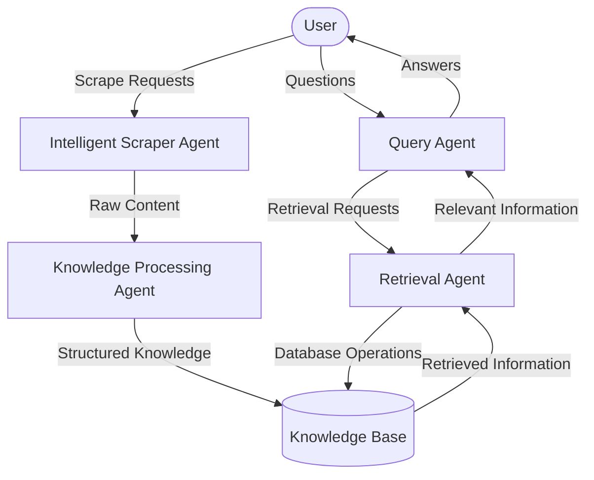

# Multi-Agent System for Intelligent Web Scraping and Knowledge Management

A sophisticated multi-agent system built with LangGraph and LangChain for intelligent web scraping, knowledge processing, and information retrieval.

## System Architecture



## Overview

This system consists of four specialized intelligent agents that work together to extract, process, store, and retrieve knowledge from the web. Each agent is implemented as a LangGraph workflow, allowing for complex decision-making and adaptable behavior.

## Technical Stack

### Frontend & Backend
- **Next.js (v14+)**: Server components architecture for efficient UI rendering and API handling
  - App Router for optimized routing and server component integration
  - React Server Components for improved performance
  - Server Actions for secure API endpoint handling
  - Edge Runtime support for enhanced performance
  - Streaming responses for progressive UI updates during agent execution

### Database & Storage
- **Supabase**
  - **pgvector extension**: Provides vector storage and similarity search capabilities
  - **PostgreSQL tables**: Store document metadata, entity relationships, and system state
  - **Row-Level Security (RLS)**: Enforce access controls on the database level
  - **Real-time subscriptions**: Enable live updates for agent progress indicators
  - **Storage buckets**: Store original documents and binary data

### Vector Store Implementation
- Custom vector store implementation for pgvector using LangChain's VectorStore interface
- Optimized indexing strategies using HNSW (Hierarchical Navigable Small World) for approximate nearest neighbor search
- Multi-dimensional filtering with hybrid search capabilities (combining semantic and keyword search)

### Agent Framework
- **LangGraph**: For building complex agent workflows with state management
  - StateGraph for defining agent state and transitions
  - Channels for inter-agent communication
  - Conditional branching based on agent decisions
  - Persistence layer for resumable agent executions

- **LangChain**:
  - DocumentLoaders for content ingestion
  - Text splitters for adaptive chunking strategies
  - Embeddings for vectorization (supporting multiple models)
  - Retrieval strategies (semantic, keyword, hybrid)
  - Output parsers for structured communication

### LLM Integration
- Modular LLM integration supporting multiple providers
- Streaming responses for real-time agent updates
- Prompt templates for each agent node with specific system instructions
- Function calling for structured agent outputs
- LCEL (LangChain Expression Language) for composable chains

### Agent Communication Protocol
- JSON Schema-defined message formats for inter-agent communication
- Event-driven architecture using message queue patterns
- WebSocket server for real-time updates to the frontend
- Typed state interfaces ensuring type safety between agent transitions

### Optimizations
- Batched embedding generation for efficient vector processing
- Caching layers for LLM calls and embeddings
- Background worker processes for long-running scraping tasks
- Rate limiting and backoff strategies for API calls
- Parallel processing for multi-strategy retrieval

### Deployment Architecture
- Docker containerization for consistent deployment
- Vercel deployment for the Next.js application
- Supabase managed services for database and vector storage
- Queue management for background processing tasks
- State persistence for long-running agent tasks

## Additional Requirements

### User Interface Components
- **Dashboard**: Real-time visualization of agent activities and system status
- **Knowledge Explorer**: Interactive interface to browse and search the knowledge graph
- **Scraping Control Panel**: Configure and monitor scraping jobs
- **Query Interface**: Natural language query input with citation-supported answers
- **Admin Panel**: System configuration and performance monitoring

### Authentication & Authorization
- **NextAuth.js**: For secure authentication with multiple providers
- **Role-based access control**: Admin, editor, and viewer permissions
- **API key management**: For programmatic access to the system
- **Session management**: Secure token handling and refresh mechanisms

### Monitoring & Observability
- **Prometheus & Grafana**: For system metrics and performance monitoring
- **OpenTelemetry**: For distributed tracing across agent workflows
- **Logging infrastructure**: Structured logging with context preservation
- **Error tracking**: Automated error detection and reporting
- **Agent execution visualization**: Tracing tool for debugging agent workflows

### Testing Infrastructure
- **Unit testing**: For individual components with Jest
- **Integration testing**: For agent interactions with TestContainers
- **E2E testing**: With Playwright for UI workflows
- **LLM evaluation harness**: For testing and evaluating agent outputs
- **Regression testing**: To prevent previously fixed issues from recurring

### Security Measures
- **Input validation**: Sanitization of all user inputs
- **Rate limiting**: To prevent abuse of the system
- **Content filtering**: For scraper outputs to ensure safety
- **Dependency scanning**: Automated vulnerability checks
- **Encryption**: For sensitive data at rest and in transit

### Scalability Components
- **Queue management system**: For handling high volumes of scraping and processing tasks
- **Horizontal scaling**: For the agent execution environment
- **Redis cache**: For sharing state between distributed components
- **CDN integration**: For serving static assets and cached responses
- **Database connection pooling**: For efficient database resource utilization

### Developer Experience
- **TypeScript**: End-to-end type safety across the application
- **Schema validation**: Using Zod for runtime type checking
- **API documentation**: Using OpenAPI/Swagger
- **Storybook**: For UI component development and documentation
- **CI/CD pipeline**: For automated testing and deployment

### Ethical & Compliance Considerations
- **Robot.txt compliance**: Respectful web scraping following site policies
- **Rate limiting for external sites**: To avoid overloading scraped websites
- **Privacy controls**: For handling PII in the knowledge base
- **Attribution system**: For tracking the source of information
- **Content moderation**: To prevent harmful content from being processed or stored

## Implementation Details

### Database Schema

```
Documents
- id: uuid
- content: text
- metadata: jsonb
- embedding: vector(1536)
- created_at: timestamp

Entities
- id: uuid
- name: text
- type: text
- properties: jsonb
- sources: uuid[]
- embedding: vector(1536)

Relationships
- id: uuid
- source_id: uuid (FK to Entities)
- target_id: uuid (FK to Entities)
- type: text
- properties: jsonb
- confidence: float

ScrapingJobs
- id: uuid
- status: text
- base_url: text
- configuration: jsonb
- results: jsonb
- created_at: timestamp
- updated_at: timestamp
```

### API Routes

- `/api/scrape`: Initiate scraping jobs
- `/api/query`: Submit queries to the system
- `/api/jobs/:id`: Get status of long-running jobs
- `/api/knowledge`: Direct access to knowledge base (with appropriate filters)

## Agents

### Intelligent Scraper Agent

The Scraper Agent makes dynamic decisions about what content to extract from websites, optimizing for value and relevance.

**Key Features:**
- Analyzes pages for information density and relevance
- Evaluates outgoing links to determine optimal navigation paths
- Maintains a priority queue of URLs based on expected value
- Intelligently extracts content based on page structure and content type
- Avoids low-value pages and duplicated information

### Knowledge Processing Agent

The Knowledge Processing Agent transforms raw web content into structured, interconnected knowledge using content-adaptive processing.

**Key Features:**
- Analyzes content type and characteristics to determine optimal processing strategies
- Intelligently extracts domain-specific entities and relationships
- Discovers relationships between concepts to build a knowledge graph
- Applies content-appropriate chunking and embedding strategies
- Validates the quality and integration of extracted knowledge

### Query Agent

The Query Agent translates natural language questions into effective knowledge base queries by understanding semantic intent.

**Key Features:**
- Analyzes query intent and complexity
- Decomposes complex queries into logical sub-questions with dependencies
- Plans optimal retrieval strategies for each query component
- Synthesizes comprehensive answers from multiple sources
- Provides citations and evaluates answer completeness

### Retrieval Agent

The Retrieval Agent employs multiple search methods simultaneously to find the most relevant information in the knowledge base.

**Key Features:**
- Dynamically selects and combines vector search, keyword matching, entity retrieval, and graph traversal
- Executes retrieval strategies in parallel for maximum effectiveness
- Intelligently ranks and merges results from different methods
- Evaluates information completeness and relevance
- Returns comprehensive result packages including text, entities, and relationships

## Agent Communication

Agents communicate through structured JSON messages passed via a message bus architecture, ensuring loose coupling and flexibility. Each agent exposes a well-defined API that accepts specific request formats and returns standardized responses.

Communication is implemented using LangGraph's state management and channel system, with each agent built as a LangGraph workflow with well-defined input and output states.

## Implementation

Each agent is implemented as a LangGraph workflow with:

- Comprehensive state tracking
- Specialized nodes for different processing stages
- Conditional execution paths based on intelligent analysis
- Asynchronous processing capabilities
- Integration with vector stores, knowledge graphs, and other storage systems

## Use Cases

This multi-agent system can be applied to:

- Research automation
- Knowledge base construction
- Competitive intelligence gathering
- Technical documentation analysis
- Question-answering systems
- And more...

## Getting Started

[Development in progress]

## Learn More

For detailed documentation on each agent, see:
- [Intelligent Scraper Agent](./docs/scrapper-agent.md)
- [Knowledge Processing Agent](./docs/knowledge-processing-agent.md)
- [Query Agent](./docs/query-agent.md)
- [Retrieval Agent](./docs/retrieval-agent.md)
- [System Overview](./docs/main.md)
