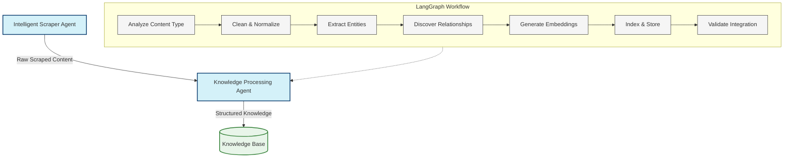

# Idea: Knowledge Processing Agent using LangGraph

## Overview

This idea focuses on implementing an intelligent Knowledge Processing Agent using LangGraph and LangChain. This agent transforms raw scraped content into structured, interconnected knowledge that can be effectively stored and retrieved.

Unlike traditional ETL pipelines with fixed rules, this agent uses large language models to make intelligent decisions about how to process, structure, and connect information based on its semantic understanding of the content.

## Architecture



## Core Components

### 1. Agent State

The agent maintains a comprehensive state that tracks all aspects of the knowledge processing:

```typescript
interface KnowledgeAgentState {
  // Input
  rawContent: ScraperOutput;                // Content from scraper
  processingGoal: string;                   // Knowledge processing objective
  
  // Processing state
  contentAnalysis: {                        // Analysis of content
    contentType: string;                    // E.g., "technical article", "product listing"
    domainSpecific: boolean;                // Whether content is domain-specific
    complexity: number;                     // 0-1 score of content complexity
    structuredDataTypes: string[];          // Types of structured data found
  };
  
  // Entities and relationships
  extractedDocuments: ProcessedDocument[];  // Transformed documents
  entities: Entity[];                       // Extracted entities
  relationships: Relationship[];            // Relationships between entities
  
  // Processing batches
  embeddingBatches: DocumentBatch[];        // Batches for embedding generation
  
  // Metrics and progress
  processingMetrics: {                      // Processing metrics
    documentCount: number;                  // Number of documents
    entityCount: number;                    // Number of entities
    relationshipCount: number;              // Number of relationships 
    processingStage: string;                // Current stage
    validationScore: number;                // 0-1 quality score
  };
  
  // Output
  structuredKnowledge: KnowledgeOutput;     // Final knowledge output
}

interface Entity {
  id: string;                           
  type: string;                         // Entity type (person, concept, etc.)
  name: string;                         // Primary name/identifier
  properties: Record<string, any>;      // Entity properties
  sources: string[];                    // Source documents
  confidence: number;                   // 0-1 confidence score
}

interface Relationship {
  source: string;                       // Source entity id
  target: string;                       // Target entity id
  type: string;                         // Relationship type
  properties: Record<string, any>;      // Relationship properties
  sources: string[];                    // Source documents
  confidence: number;                   // 0-1 confidence score
}

interface ProcessedDocument {
  id: string;
  title: string;
  content: string;                      // Cleaned content
  metadata: Record<string, any>;        // Document metadata
  embedding?: number[];                 // Vector embedding
  chunks: DocumentChunk[];              // Content chunks
}
```

### 2. LangGraph Workflow

The knowledge processor is implemented as a LangGraph workflow with specialized nodes:

```typescript
const knowledgeWorkflow = new StateGraph<KnowledgeAgentState>({
  channels: {
    contentAnalysis: new Channel(),
    extractedEntities: new Channel(),
    relationships: new Channel()
  }
})
  // Define nodes
  .addNode("analyzeContent", analyzeContentType)
  .addNode("cleanNormalize", cleanAndNormalizeContent)
  .addNode("extractEntities", identifyEntities)
  .addNode("buildRelationships", discoverRelationships)
  .addNode("createEmbeddings", generateEmbeddings)
  .addNode("indexContent", storeInKnowledgeBase)
  .addNode("validateKnowledge", validateKnowledgeIntegration)
  
  // Define edges
  .addEdge("analyzeContent", "cleanNormalize")
  .addEdge("cleanNormalize", "extractEntities")
  .addEdge("extractEntities", "buildRelationships")
  .addEdge("buildRelationships", "createEmbeddings")
  .addEdge("createEmbeddings", "indexContent")
  .addEdge("indexContent", "validateKnowledge")
  .addEdge("validateKnowledge", "FINAL");

// Compile the graph into a runnable
const knowledgeProcessor = knowledgeWorkflow.compile();
```

## Intelligent Processing Features

### 1. Content Analysis

```typescript
async function analyzeContentType(state: KnowledgeAgentState, context: AgentContext): Promise<KnowledgeAgentState> {
  // Use LLM to analyze the content type and characteristics
  const analysisPrompt = PromptTemplate.fromTemplate(`
    You are an expert content analyst. Analyze this content and determine its characteristics.
    
    CONTENT SAMPLE:
    {contentSample}
    
    Provide a detailed analysis with the following:
    1. Content type (article, product listing, documentation, etc.)
    2. Domain specificity (is this general knowledge or domain-specific?)
    3. Complexity score (0-1)
    4. Main topics covered
    5. Types of structured data present (tables, lists, code blocks, etc.)
    6. Special processing considerations
    
    Format your response as JSON.
  `);
  
  const analysisChain = analysisPrompt.pipe(llm).pipe(JsonOutputParser);
  
  // Select representative samples from raw content
  const contentSample = selectRepresentativeSamples(state.rawContent);
  
  const analysis = await analysisChain.invoke({
    contentSample: contentSample
  });
  
  // Update state with analysis results
  state.contentAnalysis = {
    contentType: analysis.contentType,
    domainSpecific: analysis.domainSpecificity === "domain-specific",
    complexity: analysis.complexityScore,
    structuredDataTypes: analysis.structuredDataTypes
  };
  
  return state;
}
```

### 2. Intelligent Entity Extraction

```typescript
async function identifyEntities(state: KnowledgeAgentState, context: AgentContext): Promise<KnowledgeAgentState> {
  // Adapt entity extraction based on content type
  let entityExtractionPrompt;
  
  if (state.contentAnalysis.domainSpecific) {
    // For domain-specific content, use specialized extraction
    entityExtractionPrompt = PromptTemplate.fromTemplate(`
      You are an expert in ${state.contentAnalysis.contentType} content analysis.
      
      Extract all domain-specific entities from this content:
      {documentContent}
      
      For each entity, provide:
      1. Entity type (be specific to this domain)
      2. Entity name/identifier
      3. Properties relevant to this entity type
      4. Confidence score (0-1)
      
      IMPORTANT: For ${state.contentAnalysis.contentType}, pay special attention to:
      ${getSpecialEntitiesForContentType(state.contentAnalysis.contentType)}
      
      Format your response as a JSON array of entity objects.
    `);
  } else {
    // For general content, use standard extraction
    entityExtractionPrompt = PromptTemplate.fromTemplate(`
      Extract all entities from this content:
      {documentContent}
      
      Include people, organizations, concepts, locations, products, and other relevant entities.
      
      For each entity, provide:
      1. Entity type
      2. Entity name/identifier
      3. Properties
      4. Confidence score (0-1)
      
      Format your response as a JSON array of entity objects.
    `);
  }
  
  const entityExtractionChain = entityExtractionPrompt.pipe(llm).pipe(JsonOutputParser);
  
  // Process each document
  const entities: Entity[] = [];
  
  for (const document of state.extractedDocuments) {
    const extractedEntities = await entityExtractionChain.invoke({
      documentContent: document.content
    });
    
    // Process and deduplicate entities
    for (const entity of extractedEntities) {
      const entityId = generateEntityId(entity.type, entity.name);
      
      // Check if entity already exists
      const existingEntityIndex = entities.findIndex(e => e.id === entityId);
      
      if (existingEntityIndex >= 0) {
        // Merge with existing entity
        entities[existingEntityIndex] = mergeEntities(
          entities[existingEntityIndex],
          {
            ...entity,
            id: entityId,
            sources: [document.id]
          }
        );
      } else {
        // Add new entity
        entities.push({
          ...entity,
          id: entityId,
          sources: [document.id]
        });
      }
    }
  }
  
  // Update state
  state.entities = entities;
  state.processingMetrics.entityCount = entities.length;
  
  return state;
}
```

### 3. Relationship Discovery

```typescript
async function discoverRelationships(state: KnowledgeAgentState, context: AgentContext): Promise<KnowledgeAgentState> {
  // Use LLM to discover relationships between entities
  const relationshipPrompt = PromptTemplate.fromTemplate(`
    You are an expert knowledge graph builder.
    
    ENTITIES:
    {entities}
    
    DOCUMENT CONTENT:
    {documentContent}
    
    Identify all relationships between these entities. Consider:
    1. Hierarchical relationships (is-a, part-of)
    2. Functional relationships (works-with, enables)
    3. Temporal relationships (precedes, follows)
    4. Causal relationships (causes, prevents)
    5. Domain-specific relationships
    
    For each relationship, provide:
    1. Source entity ID
    2. Target entity ID
    3. Relationship type (be specific)
    4. Properties of the relationship
    5. Confidence score (0-1)
    
    Format your response as a JSON array of relationship objects.
  `);
  
  const relationshipChain = relationshipPrompt.pipe(llm).pipe(JsonOutputParser);
  
  // Process each document to find relationships
  const relationships: Relationship[] = [];
  
  for (const document of state.extractedDocuments) {
    // Get entities mentioned in this document
    const documentEntities = state.entities.filter(
      entity => entity.sources.includes(document.id)
    );
    
    if (documentEntities.length < 2) {
      continue; // Need at least 2 entities to form a relationship
    }
    
    const discoveredRelationships = await relationshipChain.invoke({
      entities: JSON.stringify(documentEntities),
      documentContent: document.content
    });
    
    // Process and deduplicate relationships
    for (const relationship of discoveredRelationships) {
      const relationshipId = `${relationship.source}-${relationship.type}-${relationship.target}`;
      
      // Check if relationship already exists
      const existingRelIndex = relationships.findIndex(r => 
        r.source === relationship.source && 
        r.target === relationship.target &&
        r.type === relationship.type
      );
      
      if (existingRelIndex >= 0) {
        // Merge with existing relationship
        relationships[existingRelIndex] = mergeRelationships(
          relationships[existingRelIndex],
          {
            ...relationship,
            sources: [document.id]
          }
        );
      } else {
        // Add new relationship
        relationships.push({
          ...relationship,
          sources: [document.id]
        });
      }
    }
  }
  
  // Update state
  state.relationships = relationships;
  state.processingMetrics.relationshipCount = relationships.length;
  
  return state;
}
```

### 4. Adaptive Embedding Generation

```typescript
async function generateEmbeddings(state: KnowledgeAgentState, context: AgentContext): Promise<KnowledgeAgentState> {
  // Prepare documents for embedding
  const embeddingModel = new OpenAIEmbeddings();
  
  // Determine optimal chunking strategy based on content type
  const chunkSize = determineOptimalChunkSize(state.contentAnalysis);
  const chunkOverlap = determineOptimalOverlap(state.contentAnalysis);
  
  for (let i = 0; i < state.extractedDocuments.length; i++) {
    const document = state.extractedDocuments[i];
    
    // Create chunks based on content type
    const textSplitter = getTextSplitterForContentType(
      state.contentAnalysis.contentType,
      chunkSize,
      chunkOverlap
    );
    
    const chunks = await textSplitter.splitText(document.content);
    
    // Create document chunks with metadata
    document.chunks = chunks.map((chunkText, index) => ({
      id: `${document.id}-chunk-${index}`,
      content: chunkText,
      metadata: {
        ...document.metadata,
        chunk_index: index,
        document_id: document.id
      }
    }));
    
    // Add to embedding batches (for efficient processing)
    state.embeddingBatches.push({
      documentId: document.id,
      chunks: document.chunks
    });
  }
  
  // Process embedding batches
  for (const batch of state.embeddingBatches) {
    const texts = batch.chunks.map(chunk => chunk.content);
    const embeddings = await embeddingModel.embedDocuments(texts);
    
    // Assign embeddings to chunks
    for (let i = 0; i < batch.chunks.length; i++) {
      batch.chunks[i].embedding = embeddings[i];
    }
    
    // Find document and update its chunks
    const docIndex = state.extractedDocuments.findIndex(doc => doc.id === batch.documentId);
    if (docIndex >= 0) {
      state.extractedDocuments[docIndex].chunks = batch.chunks;
    }
  }
  
  return state;
}
```

### 5. Knowledge Validation

```typescript
async function validateKnowledgeIntegration(state: KnowledgeAgentState, context: AgentContext): Promise<KnowledgeAgentState> {
  // Use LLM to validate the quality of the knowledge extraction
  const validationPrompt = PromptTemplate.fromTemplate(`
    You are an expert knowledge quality assessor.
    
    ORIGINAL CONTENT SAMPLES:
    {contentSamples}
    
    EXTRACTED KNOWLEDGE:
    Entities: {entitySamples}
    Relationships: {relationshipSamples}
    
    Evaluate the quality of knowledge extraction:
    1. Completeness (0-1): Were all important entities and relationships extracted?
    2. Accuracy (0-1): Are the extracted entities and relationships correct?
    3. Relevance (0-1): Is the extracted knowledge relevant to the content?
    4. Missing elements: What important information was missed?
    5. Improvement suggestions: How could the extraction be improved?
    
    Format your response as JSON.
  `);
  
  const validationChain = validationPrompt.pipe(llm).pipe(JsonOutputParser);
  
  // Select samples for validation
  const contentSamples = selectRepresentativeSamples(state.rawContent);
  const entitySamples = sampleEntities(state.entities, 10);
  const relationshipSamples = sampleRelationships(state.relationships, 10);
  
  const validation = await validationChain.invoke({
    contentSamples: contentSamples,
    entitySamples: JSON.stringify(entitySamples),
    relationshipSamples: JSON.stringify(relationshipSamples)
  });
  
  // Calculate overall validation score
  const validationScore = (
    validation.completeness +
    validation.accuracy +
    validation.relevance
  ) / 3;
  
  // Update state
  state.processingMetrics.validationScore = validationScore;
  
  // If validation score is too low, we might want to flag this for review
  if (validationScore < 0.7) {
    state.structuredKnowledge.metadata.qualityWarning = {
      score: validationScore,
      missingElements: validation.missingElements,
      improvementSuggestions: validation.improvementSuggestions
    };
  }
  
  return state;
}
```

## Utility Functions

```typescript
// Select representative samples from raw content
function selectRepresentativeSamples(rawContent) {
  // Implementation that selects diverse content samples
  // This would use clustering or other techniques to ensure coverage
}

// Generate a consistent entity ID
function generateEntityId(entityType, entityName) {
  return `${entityType.toLowerCase()}-${slugify(entityName)}`;
}

// Merge two entities, preserving the highest confidence values
function mergeEntities(entity1, entity2) {
  return {
    ...entity1,
    properties: { ...entity1.properties, ...entity2.properties },
    sources: [...new Set([...entity1.sources, ...entity2.sources])],
    confidence: Math.max(entity1.confidence, entity2.confidence)
  };
}

// Merge two relationships
function mergeRelationships(rel1, rel2) {
  return {
    ...rel1,
    properties: { ...rel1.properties, ...rel2.properties },
    sources: [...new Set([...rel1.sources, ...rel2.sources])],
    confidence: Math.max(rel1.confidence, rel2.confidence)
  };
}

// Get the optimal text splitter for a content type
function getTextSplitterForContentType(contentType, chunkSize, chunkOverlap) {
  switch(contentType) {
    case 'technical documentation':
      return new MarkdownTextSplitter({ chunkSize, chunkOverlap });
    case 'code':
      return new RecursiveCharacterTextSplitter({
        chunkSize,
        chunkOverlap,
        separators: ['\n\n', '\n', ' ', '']
      });
    default:
      return new RecursiveCharacterTextSplitter({
        chunkSize,
        chunkOverlap
      });
  }
}

// Determine optimal chunk size based on content analysis
function determineOptimalChunkSize(contentAnalysis) {
  if (contentAnalysis.complexity > 0.8) {
    return 512; // Smaller chunks for complex content
  } else if (contentAnalysis.contentType === 'code') {
    return 1000; // Larger chunks for code to maintain context
  }
  return 1024; // Default
}
```

## API and Integration

```typescript
// Main API for using the knowledge processor
async function processKnowledge({
  rawContent,
  processingGoal = "Create a comprehensive knowledge base"
}: {
  rawContent: ScraperOutput;
  processingGoal?: string;
}): Promise<KnowledgeOutput> {
  // Initialize the agent state
  const initialState: KnowledgeAgentState = {
    rawContent,
    processingGoal,
    contentAnalysis: {
      contentType: "",
      domainSpecific: false,
      complexity: 0,
      structuredDataTypes: []
    },
    extractedDocuments: preprocessDocuments(rawContent),
    entities: [],
    relationships: [],
    embeddingBatches: [],
    processingMetrics: {
      documentCount: 0,
      entityCount: 0,
      relationshipCount: 0,
      processingStage: "initialized",
      validationScore: 0
    },
    structuredKnowledge: { 
      entities: [], 
      relationships: [], 
      documents: [],
      metadata: {} 
    }
  };
  
  // Execute the LangGraph
  const { structuredKnowledge } = await knowledgeProcessor.invoke(initialState);
  
  return structuredKnowledge;
}

// Preprocess documents from raw content
function preprocessDocuments(rawContent: ScraperOutput) {
  return rawContent.data.map((item, index) => ({
    id: `doc-${index}`,
    title: item.title || `Document ${index}`,
    content: item.content || "",
    metadata: {
      url: item.url,
      scraped_at: item.timestamp,
      ...item.metadata
    },
    chunks: []
  }));
}
```

## Key Intelligence Features

1. **Content-Adaptive Processing**
   - Analyzes content type and characteristics
   - Adapts processing strategies based on content
   - Uses different extraction techniques for different domains

2. **Dynamic Entity Recognition**
   - Extracts standard and domain-specific entities
   - Assigns confidence scores to extractions
   - Deduplicates and merges entity information

3. **Smart Relationship Discovery**
   - Identifies connections between entities
   - Understands different relationship types
   - Builds a semantic knowledge graph

4. **Intelligent Chunking and Embedding**
   - Adapts chunking strategy to content type
   - Optimizes for retrieval effectiveness
   - Preserves context in embeddings

5. **Knowledge Quality Validation**
   - Evaluates extraction quality against original content
   - Identifies information gaps
   - Provides improvement suggestions

## Implementation Strategy

### Phase 1: Core Framework
- Setup LangGraph state management
- Implement document preprocessing
- Create basic entity extraction

### Phase 2: Intelligence Layer
- Add content type analysis
- Implement adaptive entity extraction
- Build relationship discovery

### Phase 3: Embedding and Storage
- Create chunking strategies
- Implement embedding generation
- Build knowledge base storage

### Phase 4: Validation and Refinement
- Add knowledge validation
- Implement quality metrics
- Create feedback mechanisms

## Technical Components

1. **Dependencies**
```json
{
  "dependencies": {
    "@langchain/core": "^0.3.0",
    "@langchain/langgraph": "^0.2.0",
    "@langchain/openai": "^0.5.0",
    "langchain": "^0.1.1",
    "pgvector": "^0.1.0"
  }
}
```

2. **Key Utilities**
- StateGraph: For implementing the knowledge workflow
- OpenAIEmbeddings: For generating vector embeddings
- TextSplitters: For intelligent document chunking
- Output parsers: For structured LLM outputs

## Benefits of This Approach

1. **Higher Knowledge Quality**: Adapts to content type for better extraction
2. **Content Understanding**: Processes information based on meaning, not just patterns
3. **Adaptability**: Works with diverse content types without custom rules
4. **Relationship Focus**: Creates a connected knowledge graph, not just isolated facts
5. **Self-Assessment**: Validates its own outputs for quality

## Challenges and Considerations

1. **LLM Costs**: Multiple analysis steps increase operating expenses
2. **Processing Time**: Sophisticated analysis takes longer than simple extraction
3. **Error Handling**: Need to manage potential LLM hallucinations
4. **Scalability**: Processing large content sets requires optimization
5. **Complexity**: More sophisticated system to maintain and debug

## Conclusion

This Knowledge Processing Agent represents a significant advancement over traditional ETL pipelines by using LangGraph and LLMs to make intelligent, content-aware decisions throughout the processing workflow. Rather than applying fixed rules, it adapts its processing strategy to the specific characteristics of the content, resulting in higher-quality knowledge extraction.

The agent creates a true semantic layer over raw content, transforming unstructured information into a structured, connected knowledge graph that preserves meaning and relationships. This enables more effective retrieval, reasoning, and application of the knowledge. 