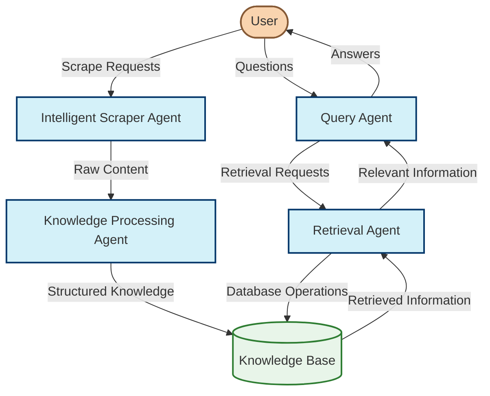

# Idea: Multi-Agent System Overview

## System Architecture

This document provides a concise overview of the multi-agent system for intelligent web scraping and knowledge management.

## Agent Descriptions

### Intelligent Scraper Agent

The Intelligent Scraper Agent makes dynamic decisions about what content to extract from websites, optimizing for value and relevance. It analyzes pages for information density, evaluates outgoing links to determine navigation paths, and maintains a priority queue to focus on the most promising content. Using LangGraph, it avoids low-value pages and duplicated information while efficiently extracting valuable content, significantly improving scraping efficiency compared to traditional crawlers that follow predefined patterns. [See detailed design in [Idea: Intelligent Scraper Agent](./scrapper-agent.md)]

### Knowledge Processing Agent

The Knowledge Processing Agent transforms raw web content into structured, interconnected knowledge using content-adaptive processing. Rather than applying fixed extraction rules, it analyzes content type and characteristics to determine optimal processing strategies. The agent intelligently extracts domain-specific entities, discovers relationships between concepts, applies content-appropriate chunking, and validates the quality of extracted knowledge. This approach creates a semantic knowledge graph that preserves meaning and connections rather than isolated data points. [See detailed design in [Idea: Knowledge Processing Agent](./knowledge-processing-agent.md)]

### Query Agent

The Query Agent translates natural language questions into effective knowledge base queries by understanding semantic intent rather than just matching keywords. It analyzes question complexity and, when needed, decomposes complex queries into logical sub-questions with dependencies. For each query component, it plans optimal retrieval strategies before coordinating with the Retrieval Agent to gather information. The agent then synthesizes comprehensive answers from multiple sources, provides citations, and evaluates the completeness and accuracy of its own responses. [See detailed design in [Idea: Query Agent](./query-agent.md)]

### Retrieval Agent

The Retrieval Agent employs multiple search methods simultaneously to find the most relevant information in the knowledge base. Unlike traditional search functions that use a single approach, this agent dynamically selects and combines vector search, keyword matching, entity retrieval, and graph traversal based on query characteristics. It executes these strategies in parallel, intelligently ranks and merges results from different methods, and evaluates information completeness and relevance, providing a comprehensive package of text passages, entities, and relationships. [See detailed design in [Idea: Retrieval Agent](./retrieval-agent.md)]

## Agent Communication

The agents communicate through structured JSON messages passed via a message bus architecture, ensuring loose coupling and flexibility. Each agent exposes a well-defined API that accepts specific request formats and returns standardized responses. The Scraper Agent sends extracted content to the Knowledge Agent in a raw content package with metadata. The Query Agent communicates with the Retrieval Agent using retrieval request objects that specify search parameters, filters, and strategy preferences. The Retrieval Agent returns structured result packages containing text chunks, entities, and relationships. All inter-agent communication is asynchronous, allowing agents to operate independently and in parallel, with message queues handling backpressure when one agent processes requests faster than another can consume them.

This communication is implemented using LangGraph's state management and channel system. Each agent is built as a LangGraph workflow with well-defined input and output states. LangGraph's StateGraph and Channel abstractions enable agents to pass complex structured data between nodes in their workflows, maintain execution state, and handle the asynchronous nature of the inter-agent communication. The TypeScript interfaces defined for each agent's state ensure type safety and consistent data exchange formats across the system. 