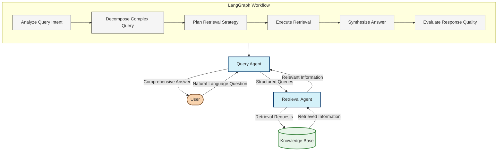

# Idea 11: Query Agent using LangGraph

## Overview

This idea focuses on implementing an intelligent Query Agent using LangGraph and LangChain. This agent transforms natural language questions into effective knowledge base queries, and coordinates the retrieval of relevant information to answer user questions.

Unlike traditional search interfaces that rely on keyword matching, this agent uses large language models to understand the semantic intent behind queries, decompose complex questions, and determine the best retrieval strategy.

## Architecture



## Core Components

### 1. Agent State

The agent maintains a comprehensive state that tracks all aspects of the query processing:

```typescript
interface QueryAgentState {
  // Input
  rawQuery: string;                     // Original user question
  conversationHistory: Message[];       // Previous interactions
  
  // Query analysis
  queryAnalysis: {                      // Analysis of query
    intent: string;                     // Question intent
    topics: string[];                   // Main topics in question
    entityReferences: EntityRef[];      // Entities referenced
    complexityScore: number;            // 0-1 complexity score
    temporalAspects: {                  // Time-related aspects
      timeReferences: string[];         // Referenced time periods
      requiresRecency: boolean;         // Needs recent information
    };
  };
  
  // Query decomposition
  subQueries: SubQuery[];               // Decomposed questions
  
  // Retrieval planning
  retrievalPlan: {                      // Plan for information retrieval
    strategies: RetrievalStrategy[];    // Strategies to use
    requiredSources: string[];          // Essential sources to check
    filters: Record<string, any>;       // Metadata filters
  };
  
  // Retrieval results
  retrievedInformation: {               // Information from knowledge base
    chunks: RetrievedChunk[];           // Retrieved text chunks
    entities: Entity[];                 // Retrieved entities
    relationships: Relationship[];      // Retrieved relationships
  };
  
  // Answer generation
  generatedAnswer: {                    // Generated answer
    text: string;                       // Answer text
    confidence: number;                 // Confidence score
    citations: Citation[];              // Source citations
    followupQuestions: string[];        // Suggested follow-ups
  };
  
  // Evaluation
  responseEvaluation: {                 // Quality evaluation
    completeness: number;               // 0-1 completeness score
    accuracy: number;                   // 0-1 accuracy score
    relevance: number;                  // 0-1 relevance score
    feedback: string;                   // Improvement feedback
  };
}

interface SubQuery {
  id: string;
  text: string;                         // Sub-question text
  purpose: string;                      // Why this is needed
  requiredInformation: string[];        // Information needed
  dependsOn: string[];                  // Dependencies on other sub-queries
}

interface RetrievalStrategy {
  type: 'semantic' | 'keyword' | 'entity' | 'hybrid';
  parameters: Record<string, any>;      // Strategy parameters
  priority: number;                     // Execution priority
}

interface RetrievedChunk {
  text: string;                         // Retrieved text
  score: number;                        // Relevance score
  source: string;                       // Source document
  metadata: Record<string, any>;        // Chunk metadata
}

interface Citation {
  text: string;                         // Cited text
  source: string;                       // Source document
  url?: string;                         // Source URL if available
}
```

### 2. LangGraph Workflow

The query agent is implemented as a LangGraph workflow with specialized nodes:

```typescript
const queryWorkflow = new StateGraph<QueryAgentState>({
  channels: {
    queryAnalysis: new Channel(),
    subQueries: new Channel(),
    retrievalPlan: new Channel(),
    retrievedInfo: new Channel()
  }
})
  // Define nodes
  .addNode("analyzeQuery", analyzeQueryIntent)
  .addNode("decomposeQuery", breakDownComplexQuery)
  .addNode("planRetrieval", createRetrievalStrategy)
  .addNode("executeRetrieval", retrieveInformation)
  .addNode("synthesizeAnswer", generateComprehensiveAnswer)
  .addNode("evaluateResponse", assessAnswerQuality)
  
  // Define edges
  .addEdge("analyzeQuery", "decomposeQuery")
  .addEdge("decomposeQuery", "planRetrieval")
  .addEdge("planRetrieval", "executeRetrieval")
  .addEdge("executeRetrieval", "synthesizeAnswer")
  .addEdge("synthesizeAnswer", "evaluateResponse")
  .addEdge("evaluateResponse", "FINAL");

// Compile the graph into a runnable
const queryProcessor = queryWorkflow.compile();
```

## Intelligent Query Processing

### 1. Query Intent Analysis

```typescript
async function analyzeQueryIntent(state: QueryAgentState, context: AgentContext): Promise<QueryAgentState> {
  // Use LLM to analyze the query intent and characteristics
  const analysisPrompt = PromptTemplate.fromTemplate(`
    You are an expert in understanding user questions. Analyze this query and determine its characteristics.
    
    QUERY: {query}
    
    CONVERSATION HISTORY:
    {conversationHistory}
    
    Provide a detailed analysis with the following:
    1. Primary intent (e.g., factual information, explanation, comparison)
    2. Main topics and concepts referenced
    3. Entity references (specific people, organizations, concepts, etc.)
    4. Complexity score (0-1) - how complex is this query
    5. Temporal aspects:
       - Specific time periods mentioned
       - Whether recent/current information is required
       
    Format your response as JSON.
  `);
  
  const analysisChain = analysisPrompt.pipe(llm).pipe(JsonOutputParser);
  
  const analysis = await analysisChain.invoke({
    query: state.rawQuery,
    conversationHistory: formatConversationHistory(state.conversationHistory)
  });
  
  // Update state with analysis results
  state.queryAnalysis = {
    intent: analysis.primaryIntent,
    topics: analysis.mainTopics,
    entityReferences: analysis.entityReferences.map(ref => ({
      type: ref.type,
      name: ref.name,
      context: ref.context
    })),
    complexityScore: analysis.complexityScore,
    temporalAspects: {
      timeReferences: analysis.temporalAspects.timeReferences,
      requiresRecency: analysis.temporalAspects.requiresRecency
    }
  };
  
  return state;
}
```

### 2. Query Decomposition

```typescript
async function breakDownComplexQuery(state: QueryAgentState, context: AgentContext): Promise<QueryAgentState> {
  // Skip decomposition for simple queries
  if (state.queryAnalysis.complexityScore < 0.4) {
    // For simple queries, create a single sub-query that matches the original
    state.subQueries = [{
      id: "main",
      text: state.rawQuery,
      purpose: "Answer the main question",
      requiredInformation: state.queryAnalysis.topics,
      dependsOn: []
    }];
    return state;
  }
  
  // Use LLM to decompose complex queries
  const decompositionPrompt = PromptTemplate.fromTemplate(`
    You are an expert in breaking down complex questions into simpler components.
    
    COMPLEX QUERY: {query}
    
    QUERY ANALYSIS:
    {queryAnalysis}
    
    Break down this complex query into smaller, logically connected sub-questions that would help answer the main question.
    
    For each sub-question:
    1. Provide the text of the sub-question
    2. Explain why this sub-question is necessary
    3. List what information is needed to answer it
    4. Identify any dependencies on other sub-questions
    
    Order the sub-questions in a logical sequence, considering dependencies.
    Format your response as a JSON array of sub-question objects.
  `);
  
  const decompositionChain = decompositionPrompt.pipe(llm).pipe(JsonOutputParser);
  
  const subQuestions = await decompositionChain.invoke({
    query: state.rawQuery,
    queryAnalysis: JSON.stringify(state.queryAnalysis)
  });
  
  // Update state with decomposed sub-queries
  state.subQueries = subQuestions.map((sq, index) => ({
    id: `sq-${index}`,
    text: sq.text,
    purpose: sq.purpose,
    requiredInformation: sq.requiredInformation,
    dependsOn: sq.dependsOn || []
  }));
  
  return state;
}
```

### 3. Retrieval Strategy Planning

```typescript
async function createRetrievalStrategy(state: QueryAgentState, context: AgentContext): Promise<QueryAgentState> {
  // Use LLM to design an optimal retrieval strategy
  const strategyPrompt = PromptTemplate.fromTemplate(`
    You are an expert in knowledge retrieval strategies.
    
    QUERY: {query}
    
    SUB-QUESTIONS:
    {subQueries}
    
    QUERY ANALYSIS:
    {queryAnalysis}
    
    Design an optimal retrieval strategy to answer this query. Consider:
    1. Which retrieval methods would be most effective (semantic search, keyword search, entity-based retrieval, hybrid)
    2. What filters or constraints should be applied
    3. What sources must be included
    4. How to prioritize information retrieval
    
    For each sub-question, specify the best retrieval approach.
    Format your response as a JSON object with strategies for each sub-question.
  `);
  
  const strategyChain = strategyPrompt.pipe(llm).pipe(JsonOutputParser);
  
  const retrievalPlan = await strategyChain.invoke({
    query: state.rawQuery,
    subQueries: JSON.stringify(state.subQueries),
    queryAnalysis: JSON.stringify(state.queryAnalysis)
  });
  
  // Process and normalize the retrieval strategies
  const strategies: RetrievalStrategy[] = [];
  
  // Extract strategies for each sub-query
  for (const subQuery of state.subQueries) {
    const subQueryPlan = retrievalPlan[subQuery.id];
    if (subQueryPlan) {
      strategies.push(...subQueryPlan.strategies.map(strategy => ({
        type: normalizeStrategyType(strategy.type),
        parameters: {
          ...strategy.parameters,
          subQueryId: subQuery.id,
          query: subQuery.text
        },
        priority: strategy.priority || 1
      })));
    }
  }
  
  // Sort strategies by priority
  strategies.sort((a, b) => b.priority - a.priority);
  
  // Update state
  state.retrievalPlan = {
    strategies,
    requiredSources: retrievalPlan.requiredSources || [],
    filters: retrievalPlan.filters || {}
  };
  
  return state;
}

// Normalize strategy type to one of our supported types
function normalizeStrategyType(type: string): 'semantic' | 'keyword' | 'entity' | 'hybrid' {
  type = type.toLowerCase();
  if (type.includes('semantic') || type.includes('vector')) return 'semantic';
  if (type.includes('keyword') || type.includes('text')) return 'keyword';
  if (type.includes('entity') || type.includes('graph')) return 'entity';
  if (type.includes('hybrid') || type.includes('combined')) return 'hybrid';
  return 'semantic'; // Default to semantic
}
```

### 4. Retrieval Execution

```typescript
async function retrieveInformation(state: QueryAgentState, context: AgentContext): Promise<QueryAgentState> {
  // Execute the retrieval strategies using the Retrieval Agent
  const retrievalAgent = context.agents.getAgent('retrievalAgent');
  const retrievedResults = [];
  
  // Execute each strategy
  for (const strategy of state.retrievalPlan.strategies) {
    const result = await retrievalAgent.retrieve({
      type: strategy.type,
      parameters: {
        ...strategy.parameters,
        filters: state.retrievalPlan.filters,
        requiredSources: state.retrievalPlan.requiredSources
      }
    });
    
    retrievedResults.push(result);
  }
  
  // Merge and deduplicate results
  const mergedResults = mergeRetrievalResults(retrievedResults);
  
  // Update state
  state.retrievedInformation = {
    chunks: mergedResults.chunks,
    entities: mergedResults.entities,
    relationships: mergedResults.relationships
  };
  
  return state;
}

// Merge results from multiple retrieval strategies
function mergeRetrievalResults(results) {
  // Combine chunks, removing duplicates and sorting by relevance
  const chunkMap = new Map();
  const entityMap = new Map();
  const relationshipMap = new Map();
  
  // Process chunks
  results.forEach(result => {
    result.chunks.forEach(chunk => {
      const key = `${chunk.source}-${chunk.text.substring(0, 100)}`;
      if (!chunkMap.has(key) || chunkMap.get(key).score < chunk.score) {
        chunkMap.set(key, chunk);
      }
    });
    
    // Process entities
    result.entities.forEach(entity => {
      if (!entityMap.has(entity.id)) {
        entityMap.set(entity.id, entity);
      }
    });
    
    // Process relationships
    result.relationships.forEach(rel => {
      const key = `${rel.source}-${rel.type}-${rel.target}`;
      if (!relationshipMap.has(key)) {
        relationshipMap.set(key, rel);
      }
    });
  });
  
  return {
    chunks: Array.from(chunkMap.values())
      .sort((a, b) => b.score - a.score)
      .slice(0, 20), // Limit to top 20 chunks
    entities: Array.from(entityMap.values()),
    relationships: Array.from(relationshipMap.values())
  };
}
```

### 5. Answer Synthesis

```typescript
async function generateComprehensiveAnswer(state: QueryAgentState, context: AgentContext): Promise<QueryAgentState> {
  // Use LLM to synthesize a comprehensive answer
  const answerPrompt = PromptTemplate.fromTemplate(`
    You are an expert in answering questions based on retrieved information.
    
    QUERY: {query}
    
    SUB-QUESTIONS: 
    {subQueries}
    
    RETRIEVED INFORMATION:
    {retrievedInfo}
    
    Based on the retrieved information, provide a comprehensive answer to the query.
    
    Important guidelines:
    1. Only use information from the retrieved content
    2. If the information is incomplete, acknowledge limitations
    3. Provide citations for key facts [Source: ID]
    4. Format your answer clearly and logically
    5. Suggest 2-3 relevant follow-up questions
    
    Your response should be a JSON object with:
    - answer: the comprehensive response
    - confidence: your confidence score (0-1)
    - citations: array of source citations
    - followupQuestions: array of suggested follow-up questions
  `);
  
  const answerChain = answerPrompt.pipe(llm).pipe(JsonOutputParser);
  
  // Format retrieved information for the prompt
  const formattedInfo = formatRetrievedInformation(state.retrievedInformation);
  
  const answer = await answerChain.invoke({
    query: state.rawQuery,
    subQueries: JSON.stringify(state.subQueries.map(sq => ({ id: sq.id, text: sq.text }))),
    retrievedInfo: formattedInfo
  });
  
  // Update state
  state.generatedAnswer = {
    text: answer.answer,
    confidence: answer.confidence,
    citations: answer.citations.map(citation => ({
      text: citation.text,
      source: citation.source,
      url: citation.url
    })),
    followupQuestions: answer.followupQuestions
  };
  
  return state;
}

// Format retrieved information for the prompt
function formatRetrievedInformation(info) {
  let formatted = "TEXT CHUNKS:\n";
  
  // Add chunks with source information
  info.chunks.forEach((chunk, i) => {
    formatted += `[${i+1}] Source: ${chunk.source}\n${chunk.text}\n\n`;
  });
  
  // Add relevant entities
  if (info.entities.length > 0) {
    formatted += "\nRELEVANT ENTITIES:\n";
    info.entities.forEach(entity => {
      formatted += `- ${entity.name} (${entity.type}): ${
        Object.entries(entity.properties)
          .map(([k, v]) => `${k}: ${v}`)
          .join(', ')
      }\n`;
    });
  }
  
  // Add relationships if present
  if (info.relationships.length > 0) {
    formatted += "\nRELATIONSHIPS:\n";
    info.relationships.forEach(rel => {
      formatted += `- ${rel.source} ${rel.type} ${rel.target}\n`;
    });
  }
  
  return formatted;
}
```

### 6. Response Evaluation

```typescript
async function assessAnswerQuality(state: QueryAgentState, context: AgentContext): Promise<QueryAgentState> {
  // Use LLM to evaluate the quality of the generated answer
  const evaluationPrompt = PromptTemplate.fromTemplate(`
    You are an expert in evaluating answer quality.
    
    ORIGINAL QUERY: {query}
    
    RETRIEVED INFORMATION (SUMMARY):
    {retrievedInfoSummary}
    
    GENERATED ANSWER:
    {answer}
    
    Evaluate the quality of this answer based on:
    1. Completeness (0-1): Does it address all aspects of the query?
    2. Accuracy (0-1): Is the information correct based on retrieved data?
    3. Relevance (0-1): How relevant is the answer to the query?
    4. Improvement feedback: How could the answer be improved?
    
    Format your response as JSON.
  `);
  
  const evaluationChain = evaluationPrompt.pipe(llm).pipe(JsonOutputParser);
  
  // Summarize retrieved information for the prompt
  const infoSummary = summarizeRetrievedInformation(state.retrievedInformation);
  
  const evaluation = await evaluationChain.invoke({
    query: state.rawQuery,
    retrievedInfoSummary: infoSummary,
    answer: state.generatedAnswer.text
  });
  
  // Update state
  state.responseEvaluation = {
    completeness: evaluation.completeness,
    accuracy: evaluation.accuracy,
    relevance: evaluation.relevance,
    feedback: evaluation.improvementFeedback
  };
  
  // If the evaluation scores are very low, we might want to trigger a refinement
  const overallScore = (
    evaluation.completeness + 
    evaluation.accuracy + 
    evaluation.relevance
  ) / 3;
  
  if (overallScore < 0.6) {
    state.generatedAnswer.text += `\n\nNote: This answer may be incomplete based on the available information. ${evaluation.improvementFeedback}`;
  }
  
  return state;
}

// Create a summary of retrieved information for evaluation
function summarizeRetrievedInformation(info) {
  return `
    Retrieved ${info.chunks.length} relevant text chunks.
    Found ${info.entities.length} related entities.
    Identified ${info.relationships.length} relationships.
    
    Top sources: ${[...new Set(info.chunks.slice(0, 5).map(c => c.source))].join(', ')}
  `;
}
```

## API and Integration

```typescript
// Main API for using the query agent
async function processQuery({
  query,
  conversationHistory = []
}: {
  query: string;
  conversationHistory?: Message[];
}): Promise<QueryResponse> {
  // Initialize the agent state
  const initialState: QueryAgentState = {
    rawQuery: query,
    conversationHistory: conversationHistory,
    queryAnalysis: {
      intent: "",
      topics: [],
      entityReferences: [],
      complexityScore: 0,
      temporalAspects: {
        timeReferences: [],
        requiresRecency: false
      }
    },
    subQueries: [],
    retrievalPlan: {
      strategies: [],
      requiredSources: [],
      filters: {}
    },
    retrievedInformation: {
      chunks: [],
      entities: [],
      relationships: []
    },
    generatedAnswer: {
      text: "",
      confidence: 0,
      citations: [],
      followupQuestions: []
    },
    responseEvaluation: {
      completeness: 0,
      accuracy: 0,
      relevance: 0,
      feedback: ""
    }
  };
  
  // Execute the LangGraph
  const result = await queryProcessor.invoke(initialState);
  
  // Format the response
  return {
    answer: result.generatedAnswer.text,
    confidence: result.generatedAnswer.confidence,
    citations: result.generatedAnswer.citations,
    followupQuestions: result.generatedAnswer.followupQuestions,
    metadata: {
      complexity: result.queryAnalysis.complexityScore,
      retrievalMethods: result.retrievalPlan.strategies.map(s => s.type),
      evaluationScore: (
        result.responseEvaluation.completeness +
        result.responseEvaluation.accuracy +
        result.responseEvaluation.relevance
      ) / 3
    }
  };
}

interface QueryResponse {
  answer: string;
  confidence: number;
  citations: Citation[];
  followupQuestions: string[];
  metadata: {
    complexity: number;
    retrievalMethods: string[];
    evaluationScore: number;
  };
}

// Format conversation history for prompts
function formatConversationHistory(history: Message[]): string {
  if (!history || history.length === 0) return "No previous conversation.";
  
  return history.map(msg => 
    `${msg.role.toUpperCase()}: ${msg.content}`
  ).join('\n');
}
```

## Key Intelligence Features

1. **Query Intent Understanding**
   - Analyzes the semantic intent behind user questions
   - Identifies entities and concepts referenced
   - Recognizes temporal aspects and recency requirements

2. **Complex Query Decomposition**
   - Breaks down complex questions into manageable sub-questions
   - Identifies logical dependencies between sub-questions
   - Creates a structured plan for answering multi-part queries

3. **Strategic Retrieval Planning**
   - Selects optimal retrieval methods based on query characteristics
   - Combines multiple retrieval strategies for complex questions
   - Prioritizes information sources based on relevance

4. **Comprehensive Answer Generation**
   - Synthesizes information from multiple sources
   - Provides citations to source materials
   - Generates relevant follow-up questions

5. **Quality Self-Assessment**
   - Evaluates the completeness and accuracy of generated answers
   - Identifies information gaps and limitations
   - Provides transparency about answer confidence

## Implementation Strategy

### Phase 1: Core Framework
- Setup LangGraph state management
- Implement query analysis
- Create basic retrieval execution

### Phase 2: Intelligence Layer
- Add query decomposition
- Implement retrieval strategy planning
- Build answer synthesis

### Phase 3: Integration
- Connect to Retrieval Agent
- Implement knowledge base interface
- Build conversation history management

### Phase 4: Evaluation and Refinement
- Add response quality evaluation
- Implement feedback mechanisms
- Create answer improvement strategies

## Technical Components

1. **Dependencies**
```json
{
  "dependencies": {
    "@langchain/core": "^0.3.0",
    "@langchain/langgraph": "^0.2.0",
    "@langchain/openai": "^0.5.0",
    "langchain": "^0.1.1"
  }
}
```

2. **Key Utilities**
- StateGraph: For implementing the query workflow
- PromptTemplates: For creating LLM prompts
- OutputParsers: For structured LLM outputs
- AgentInterface: For communicating with other agents

## Benefits of This Approach

1. **Semantic Understanding**: Processes queries based on meaning, not just keywords
2. **Complex Query Handling**: Effectively handles multi-part, complex questions
3. **Adaptive Retrieval**: Uses the most appropriate retrieval methods for each query
4. **High-Quality Answers**: Synthesizes comprehensive answers with citations
5. **Self-Improving**: Evaluates its own performance for continuous improvement

## Challenges and Considerations

1. **LLM Costs**: Multiple analysis steps increase operating expenses
2. **Latency**: Complex query processing takes longer than simple search
3. **Dependency Management**: Relies on effective communication with Retrieval Agent
4. **Knowledge Limitations**: Cannot answer questions beyond available knowledge
5. **Hallucination Risk**: Need to constrain answers to retrieved information

## Conclusion

This Query Agent represents a significant advancement over traditional search interfaces by using LangGraph and LLMs to understand, decompose, and strategically answer complex questions. Rather than simply matching keywords, it creates a sophisticated query understanding and answering pipeline that delivers more relevant, comprehensive, and trustworthy answers.

The agent enables users to interact with the knowledge base in a natural, conversational way, handling complex questions that would typically require multiple separate searches and manual synthesis of information. 