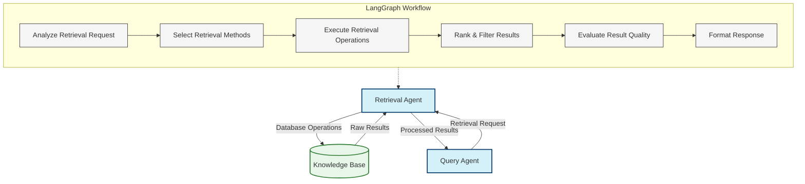

# Idea 12: Retrieval Agent using LangGraph

## Overview

This idea focuses on implementing an intelligent Retrieval Agent using LangGraph and LangChain. This agent serves as the bridge between query requests and the knowledge base, executing sophisticated retrieval strategies to find the most relevant information.

Unlike traditional search functions that use a single retrieval method, this agent dynamically selects and combines multiple retrieval approaches based on the query characteristics and available knowledge.

## Architecture



## Core Components

### 1. Agent State

The agent maintains a comprehensive state that tracks all aspects of the retrieval process:

```typescript
interface RetrievalAgentState {
  // Input
  retrievalRequest: {                    // Request from Query Agent
    type: string;                        // Retrieval strategy type
    parameters: Record<string, any>;     // Strategy parameters
    query: string;                       // Query text
    filters?: Record<string, any>;       // Metadata filters
    requiredSources?: string[];          // Essential sources
  };
  
  // Analysis
  requestAnalysis: {                     // Analysis of request
    entityTypes: string[];               // Entity types to retrieve
    semanticAspects: string[];           // Key semantic aspects
    structuralNeeds: string[];           // Required data structures
    complexityScore: number;             // 0-1 complexity score
  };
  
  // Retrieval planning
  retrievalMethods: RetrievalMethod[];   // Methods to execute
  
  // Execution results
  rawResults: {                          // Raw retrieval results
    vectorResults: VectorResult[];       // Vector search results
    keywordResults: KeywordResult[];     // Keyword search results
    entityResults: EntityResult[];       // Entity search results
    graphResults: GraphResult[];         // Graph traversal results
  };
  
  // Post-processing
  processedResults: {                    // Processed results
    chunks: RetrievedChunk[];            // Text chunks
    entities: Entity[];                  // Entities
    relationships: Relationship[];       // Relationships
  };
  
  // Evaluation
  resultEvaluation: {                    // Quality evaluation
    relevanceScore: number;              // 0-1 relevance score
    coverageScore: number;               // 0-1 coverage score
    confidenceScore: number;             // 0-1 confidence score
    feedback: string;                    // Quality feedback
  };
}

interface RetrievalMethod {
  type: 'vector' | 'keyword' | 'entity' | 'graph';
  parameters: Record<string, any>;      // Method parameters
  priority: number;                     // Execution priority
}

interface VectorResult {
  text: string;                         // Retrieved text
  score: number;                        // Similarity score
  metadata: Record<string, any>;        // Metadata
}

interface KeywordResult {
  text: string;                         // Retrieved text
  matches: {                            // Keyword matches
    term: string;                       // Matched term
    count: number;                      // Occurrence count
  }[];
  metadata: Record<string, any>;        // Metadata
}

interface EntityResult {
  entity: Entity;                       // Retrieved entity
  score: number;                        // Relevance score
}

interface GraphResult {
  startEntity: Entity;                  // Starting entity
  path: {                               // Path in graph
    relationship: Relationship;         // Relationship
    entity: Entity;                     // Connected entity
  }[];
  score: number;                        // Path relevance
}

interface RetrievedChunk {
  text: string;                         // Retrieved text
  score: number;                        // Relevance score
  source: string;                       // Source document
  metadata: Record<string, any>;        // Chunk metadata
}
```

### 2. LangGraph Workflow

The retrieval agent is implemented as a LangGraph workflow with specialized nodes:

```typescript
const retrievalWorkflow = new StateGraph<RetrievalAgentState>({
  channels: {
    requestAnalysis: new Channel(),
    retrievalMethods: new Channel(),
    rawResults: new Channel()
  }
})
  // Define nodes
  .addNode("analyzeRequest", analyzeRetrievalRequest)
  .addNode("selectMethods", selectRetrievalMethods)
  .addNode("executeRetrieval", executeRetrievalOperations)
  .addNode("rankResults", rankAndFilterResults)
  .addNode("evaluateResults", evaluateResultQuality)
  .addNode("formatResponse", formatRetrievalResponse)
  
  // Define edges
  .addEdge("analyzeRequest", "selectMethods")
  .addEdge("selectMethods", "executeRetrieval")
  .addEdge("executeRetrieval", "rankResults")
  .addEdge("rankResults", "evaluateResults")
  .addEdge("evaluateResults", "formatResponse")
  .addEdge("formatResponse", "FINAL");

// Compile the graph into a runnable
const retrievalProcessor = retrievalWorkflow.compile();
```

## Intelligent Retrieval Features

### 1. Request Analysis

```typescript
async function analyzeRetrievalRequest(state: RetrievalAgentState, context: AgentContext): Promise<RetrievalAgentState> {
  // For pre-defined retrieval strategies, we can skip LLM analysis
  if (state.retrievalRequest.type !== 'auto') {
    // Set default analysis for specified strategy type
    state.requestAnalysis = getDefaultAnalysisForType(state.retrievalRequest.type);
    return state;
  }
  
  // Use LLM to analyze the retrieval request
  const analysisPrompt = PromptTemplate.fromTemplate(`
    You are an expert in information retrieval.
    
    QUERY: {query}
    
    CONTEXT: {context}
    
    Analyze this retrieval request and determine its characteristics:
    
    1. Entity types that should be retrieved
    2. Key semantic aspects to focus on
    3. Required data structures (text, tables, relationships, etc.)
    4. Complexity score (0-1)
    
    Format your response as JSON.
  `);
  
  const analysisChain = analysisPrompt.pipe(llm).pipe(JsonOutputParser);
  
  const analysis = await analysisChain.invoke({
    query: state.retrievalRequest.query,
    context: JSON.stringify(state.retrievalRequest.parameters)
  });
  
  // Update state with analysis results
  state.requestAnalysis = {
    entityTypes: analysis.entityTypes,
    semanticAspects: analysis.semanticAspects,
    structuralNeeds: analysis.structuralNeeds,
    complexityScore: analysis.complexityScore
  };
  
  return state;
}

function getDefaultAnalysisForType(type: string) {
  switch(type) {
    case 'semantic':
      return {
        entityTypes: [],
        semanticAspects: ['conceptual_meaning', 'topic_relevance'],
        structuralNeeds: ['text_passages'],
        complexityScore: 0.5
      };
    case 'keyword':
      return {
        entityTypes: [],
        semanticAspects: ['exact_matches', 'term_frequency'],
        structuralNeeds: ['text_passages'],
        complexityScore: 0.3
      };
    case 'entity':
      return {
        entityTypes: ['auto_detect'],
        semanticAspects: ['entity_properties', 'entity_mentions'],
        structuralNeeds: ['entities', 'properties'],
        complexityScore: 0.6
      };
    case 'hybrid':
      return {
        entityTypes: ['auto_detect'],
        semanticAspects: ['conceptual_meaning', 'exact_matches'],
        structuralNeeds: ['text_passages', 'entities', 'relationships'],
        complexityScore: 0.8
      };
    default:
      return {
        entityTypes: [],
        semanticAspects: [],
        structuralNeeds: [],
        complexityScore: 0.5
      };
  }
}
```

### 2. Method Selection

```typescript
async function selectRetrievalMethods(state: RetrievalAgentState, context: AgentContext): Promise<RetrievalAgentState> {
  // If methods are already specified in the request, use those
  if (state.retrievalRequest.type !== 'auto') {
    state.retrievalMethods = [{
      type: mapRequestTypeToMethodType(state.retrievalRequest.type),
      parameters: state.retrievalRequest.parameters,
      priority: 1
    }];
    
    // For hybrid requests, add multiple methods
    if (state.retrievalRequest.type === 'hybrid') {
      state.retrievalMethods = [
        {
          type: 'vector',
          parameters: {
            query: state.retrievalRequest.query,
            k: state.retrievalRequest.parameters.vectorK || 10
          },
          priority: 1
        },
        {
          type: 'keyword',
          parameters: {
            query: state.retrievalRequest.query,
            boost_exact_matches: true
          },
          priority: 0.8
        },
        {
          type: 'entity',
          parameters: {
            query: state.retrievalRequest.query,
            include_related: true
          },
          priority: 0.6
        }
      ];
    }
    
    return state;
  }
  
  // Use LLM to select optimal retrieval methods
  const methodSelectionPrompt = PromptTemplate.fromTemplate(`
    You are an expert in knowledge retrieval techniques.
    
    QUERY: {query}
    
    REQUEST ANALYSIS:
    {requestAnalysis}
    
    AVAILABLE RETRIEVAL METHODS:
    - vector: Semantic/embedding-based search
    - keyword: Traditional keyword-based search
    - entity: Entity-focused retrieval
    - graph: Graph traversal retrieval
    
    Select the optimal combination of retrieval methods for this query.
    For each method, specify:
    1. The retrieval method type
    2. Specific parameters to use
    3. Priority (0-1) for result weighting
    
    Format your response as a JSON array of retrieval method objects.
  `);
  
  const methodSelectionChain = methodSelectionPrompt.pipe(llm).pipe(JsonOutputParser);
  
  const methods = await methodSelectionChain.invoke({
    query: state.retrievalRequest.query,
    requestAnalysis: JSON.stringify(state.requestAnalysis)
  });
  
  // Normalize and validate the methods
  state.retrievalMethods = methods.map(method => ({
    type: normalizeMethodType(method.type),
    parameters: {
      ...method.parameters,
      query: state.retrievalRequest.query,
      filters: state.retrievalRequest.filters,
      requiredSources: state.retrievalRequest.requiredSources
    },
    priority: method.priority || 0.5
  }));
  
  return state;
}

function mapRequestTypeToMethodType(requestType: string): 'vector' | 'keyword' | 'entity' | 'graph' {
  switch(requestType) {
    case 'semantic': return 'vector';
    case 'keyword': return 'keyword';
    case 'entity': return 'entity';
    case 'hybrid': return 'vector'; // Default for hybrid is vector
    default: return 'vector';
  }
}

function normalizeMethodType(type: string): 'vector' | 'keyword' | 'entity' | 'graph' {
  type = type.toLowerCase();
  if (type.includes('vector') || type.includes('semantic') || type.includes('embedding')) return 'vector';
  if (type.includes('keyword') || type.includes('text') || type.includes('term')) return 'keyword';
  if (type.includes('entity')) return 'entity';
  if (type.includes('graph') || type.includes('network') || type.includes('relationship')) return 'graph';
  return 'vector'; // Default to vector
}
```

### 3. Retrieval Execution

```typescript
async function executeRetrievalOperations(state: RetrievalAgentState, context: AgentContext): Promise<RetrievalAgentState> {
  // Initialize raw results
  state.rawResults = {
    vectorResults: [],
    keywordResults: [],
    entityResults: [],
    graphResults: []
  };
  
  const knowledgeBase = context.tools.getKnowledgeBase();
  
  // Execute each retrieval method in parallel
  const retrievalPromises = state.retrievalMethods.map(async method => {
    try {
      switch(method.type) {
        case 'vector':
          const vectorResults = await knowledgeBase.vectorSearch({
            query: method.parameters.query,
            k: method.parameters.k || 10,
            filters: method.parameters.filters || {},
            namespace: method.parameters.namespace
          });
          return { type: 'vector', results: vectorResults };
          
        case 'keyword':
          const keywordResults = await knowledgeBase.keywordSearch({
            query: method.parameters.query,
            boost_exact: method.parameters.boost_exact_matches || false,
            filters: method.parameters.filters || {}
          });
          return { type: 'keyword', results: keywordResults };
          
        case 'entity':
          const entityResults = await knowledgeBase.entitySearch({
            query: method.parameters.query,
            types: method.parameters.entityTypes || [],
            include_related: method.parameters.include_related || false
          });
          return { type: 'entity', results: entityResults };
          
        case 'graph':
          const graphResults = await knowledgeBase.graphTraversal({
            start_entities: method.parameters.startEntities || [],
            relationships: method.parameters.relationships || [],
            max_depth: method.parameters.maxDepth || 2
          });
          return { type: 'graph', results: graphResults };
      }
    } catch (error) {
      console.error(`Error executing ${method.type} retrieval:`, error);
      return { type: method.type, results: [] };
    }
  });
  
  // Wait for all retrievals to complete
  const results = await Promise.all(retrievalPromises);
  
  // Organize results by type
  results.forEach(result => {
    switch(result.type) {
      case 'vector':
        state.rawResults.vectorResults.push(...result.results);
        break;
      case 'keyword':
        state.rawResults.keywordResults.push(...result.results);
        break;
      case 'entity':
        state.rawResults.entityResults.push(...result.results);
        break;
      case 'graph':
        state.rawResults.graphResults.push(...result.results);
        break;
    }
  });
  
  return state;
}
```

### 4. Result Ranking and Filtering

```typescript
async function rankAndFilterResults(state: RetrievalAgentState, context: AgentContext): Promise<RetrievalAgentState> {
  // Initialize processed results
  state.processedResults = {
    chunks: [],
    entities: [],
    relationships: []
  };
  
  // Process vector and keyword results into chunks
  const chunks: RetrievedChunk[] = [];
  
  // Add vector results
  state.rawResults.vectorResults.forEach(result => {
    chunks.push({
      text: result.text,
      score: result.score,
      source: result.metadata.source || 'unknown',
      metadata: result.metadata
    });
  });
  
  // Add keyword results
  state.rawResults.keywordResults.forEach(result => {
    // Calculate keyword score based on matches
    const keywordScore = calculateKeywordScore(result.matches);
    
    chunks.push({
      text: result.text,
      score: keywordScore,
      source: result.metadata.source || 'unknown',
      metadata: {
        ...result.metadata,
        keyword_matches: result.matches
      }
    });
  });
  
  // Process entity results
  const entities = state.rawResults.entityResults.map(result => result.entity);
  
  // Process graph results into relationships
  const relationships: Relationship[] = [];
  state.rawResults.graphResults.forEach(result => {
    result.path.forEach(step => {
      relationships.push(step.relationship);
      
      // Add the connected entity if not already in entities
      if (!entities.some(e => e.id === step.entity.id)) {
        entities.push(step.entity);
      }
    });
  });
  
  // Deduplicate chunks by content similarity
  const uniqueChunks = deduplicateChunks(chunks);
  
  // Sort chunks by score
  uniqueChunks.sort((a, b) => b.score - a.score);
  
  // Update state with processed results
  state.processedResults = {
    chunks: uniqueChunks.slice(0, 20), // Limit to top 20 chunks
    entities: entities,
    relationships: relationships
  };
  
  return state;
}

function calculateKeywordScore(matches: { term: string, count: number }[]): number {
  // Simple scoring based on match count and variety
  const totalMatches = matches.reduce((sum, match) => sum + match.count, 0);
  const uniqueTerms = new Set(matches.map(m => m.term)).size;
  
  // Combine factors: more matches and more unique terms = higher score
  return Math.min(0.95, (totalMatches * 0.1) + (uniqueTerms * 0.2));
}

function deduplicateChunks(chunks: RetrievedChunk[]): RetrievedChunk[] {
  const uniqueChunks: RetrievedChunk[] = [];
  const seenContent = new Set<string>();
  
  for (const chunk of chunks) {
    // Create a fingerprint of the content (simplistic approach)
    const fingerprint = chunk.text.substring(0, 100).trim();
    
    if (!seenContent.has(fingerprint)) {
      seenContent.add(fingerprint);
      uniqueChunks.push(chunk);
    } else {
      // If duplicate, keep the higher-scored version
      const existingIndex = uniqueChunks.findIndex(c => 
        c.text.substring(0, 100).trim() === fingerprint
      );
      
      if (existingIndex >= 0 && uniqueChunks[existingIndex].score < chunk.score) {
        uniqueChunks[existingIndex] = chunk;
      }
    }
  }
  
  return uniqueChunks;
}
```

### 5. Result Evaluation

```typescript
async function evaluateResultQuality(state: RetrievalAgentState, context: AgentContext): Promise<RetrievalAgentState> {
  // For efficiency, only use LLM evaluation when necessary
  // We can rely on heuristics for simple evaluations
  
  // Calculate coverage score based on result counts
  const chunkCount = state.processedResults.chunks.length;
  const entityCount = state.processedResults.entities.length;
  const relationshipCount = state.processedResults.relationships.length;
  
  // Basic heuristic for coverage score
  let coverageScore = 0;
  if (state.requestAnalysis.structuralNeeds.includes('text_passages')) {
    coverageScore += chunkCount > 0 ? Math.min(1, chunkCount / 10) * 0.5 : 0;
  }
  if (state.requestAnalysis.structuralNeeds.includes('entities')) {
    coverageScore += entityCount > 0 ? Math.min(1, entityCount / 5) * 0.3 : 0;
  }
  if (state.requestAnalysis.structuralNeeds.includes('relationships')) {
    coverageScore += relationshipCount > 0 ? Math.min(1, relationshipCount / 3) * 0.2 : 0;
  }
  
  // For complex queries or if coverage is low, use LLM evaluation
  let relevanceScore = 0;
  let feedback = "";
  
  if (state.requestAnalysis.complexityScore > 0.7 || coverageScore < 0.5) {
    // Use LLM to evaluate relevance and quality
    const evaluationPrompt = PromptTemplate.fromTemplate(`
      You are an expert in evaluating search results.
      
      QUERY: {query}
      
      TOP RETRIEVED RESULTS:
      {resultSample}
      
      Evaluate the quality of these results:
      1. Relevance score (0-1): How relevant are these results to the query?
      2. What information gaps exist in the results?
      3. How could the retrieval be improved?
      
      Format your response as JSON.
    `);
    
    const evaluationChain = evaluationPrompt.pipe(llm).pipe(JsonOutputParser);
    
    // Create a sample of the results to evaluate
    const resultSample = formatResultSample(state.processedResults);
    
    const evaluation = await evaluationChain.invoke({
      query: state.retrievalRequest.query,
      resultSample: resultSample
    });
    
    relevanceScore = evaluation.relevanceScore;
    feedback = evaluation.improvementSuggestions;
  } else {
    // For simpler queries, estimate relevance from result scores
    relevanceScore = calculateAverageScore(state.processedResults.chunks);
  }
  
  // Calculate overall confidence
  const confidenceScore = (relevanceScore + coverageScore) / 2;
  
  // Update state
  state.resultEvaluation = {
    relevanceScore,
    coverageScore,
    confidenceScore,
    feedback
  };
  
  return state;
}

function formatResultSample(results: any): string {
  let sample = "TEXT CHUNKS:\n";
  
  results.chunks.slice(0, 5).forEach((chunk, i) => {
    sample += `[${i+1}] (Score: ${chunk.score.toFixed(2)}) ${chunk.text.substring(0, 200)}...\n\n`;
  });
  
  if (results.entities.length > 0) {
    sample += "\nENTITIES:\n";
    results.entities.slice(0, 3).forEach(entity => {
      sample += `- ${entity.name} (${entity.type})\n`;
    });
  }
  
  return sample;
}

function calculateAverageScore(chunks: RetrievedChunk[]): number {
  if (chunks.length === 0) return 0;
  const totalScore = chunks.reduce((sum, chunk) => sum + chunk.score, 0);
  return totalScore / chunks.length;
}
```

## API and Integration

```typescript
// Main API for using the retrieval agent
async function retrieve({
  type,
  parameters
}: {
  type: 'semantic' | 'keyword' | 'entity' | 'hybrid' | 'auto';
  parameters: Record<string, any>;
}): Promise<RetrievalResult> {
  // Initialize the agent state
  const initialState: RetrievalAgentState = {
    retrievalRequest: {
      type,
      parameters,
      query: parameters.query || "",
      filters: parameters.filters || {},
      requiredSources: parameters.requiredSources || []
    },
    requestAnalysis: {
      entityTypes: [],
      semanticAspects: [],
      structuralNeeds: [],
      complexityScore: 0
    },
    retrievalMethods: [],
    rawResults: {
      vectorResults: [],
      keywordResults: [],
      entityResults: [],
      graphResults: []
    },
    processedResults: {
      chunks: [],
      entities: [],
      relationships: []
    },
    resultEvaluation: {
      relevanceScore: 0,
      coverageScore: 0,
      confidenceScore: 0,
      feedback: ""
    }
  };
  
  // Execute the LangGraph
  const result = await retrievalProcessor.invoke(initialState);
  
  // Format the response
  return {
    chunks: result.processedResults.chunks,
    entities: result.processedResults.entities,
    relationships: result.processedResults.relationships,
    metadata: {
      confidence: result.resultEvaluation.confidenceScore,
      methodsUsed: result.retrievalMethods.map(m => m.type),
      feedback: result.resultEvaluation.feedback
    }
  };
}

interface RetrievalResult {
  chunks: RetrievedChunk[];
  entities: Entity[];
  relationships: Relationship[];
  metadata: {
    confidence: number;
    methodsUsed: string[];
    feedback: string;
  };
}
```

## Key Intelligence Features

1. **Multi-Strategy Retrieval**
   - Combines vector, keyword, entity, and graph-based retrieval
   - Dynamically selects the most appropriate methods
   - Weights and merges results from different strategies

2. **Query-Aware Method Selection**
   - Analyzes the query to determine optimal retrieval approaches
   - Adapts strategies based on content type and complexity
   - Configures method-specific parameters automatically

3. **Intelligent Result Processing**
   - Deduplicates similar results across methods
   - Ranks results based on multiple relevance factors
   - Filters out irrelevant or low-quality information

4. **Quality Self-Assessment**
   - Evaluates retrieval completeness and relevance
   - Identifies information gaps
   - Provides confidence scores for retrieved information

5. **Contextual Understanding**
   - Incorporates query context into retrieval decisions
   - Understands semantic intent behind retrieval requests
   - Preserves relationships between pieces of information

## Implementation Strategy

### Phase 1: Core Framework
- Setup LangGraph state management
- Implement basic vector search
- Create result processing functions

### Phase 2: Multi-Strategy Retrieval
- Add keyword search capabilities
- Implement entity retrieval
- Build graph traversal functions

### Phase 3: Intelligence Layer
- Add method selection logic
- Implement result ranking algorithms
- Build evaluation mechanisms

### Phase 4: Integration
- Connect to knowledge base
- Implement Query Agent interface
- Build caching and performance optimizations

## Technical Components

1. **Dependencies**
```json
{
  "dependencies": {
    "@langchain/core": "^0.3.0",
    "@langchain/langgraph": "^0.2.0",
    "@langchain/openai": "^0.5.0",
    "langchain": "^0.1.1",
    "pgvector": "^0.1.0"
  }
}
```

2. **Key Utilities**
- StateGraph: For implementing the retrieval workflow
- VectorStore: For semantic search operations
- EntityStore: For entity and relationship retrieval
- AgentInterface: For communicating with Query Agent

## Benefits of This Approach

1. **Superior Relevance**: Combines multiple retrieval methods for better results
2. **Adaptability**: Adjusts retrieval strategy based on query characteristics
3. **Comprehensive Results**: Returns text, entities, and relationships
4. **Transparency**: Provides confidence scores and quality metrics
5. **Efficient Integration**: Handles complex retrieval without burdening other agents

## Challenges and Considerations

1. **Performance**: Multiple retrieval methods increase latency
2. **Resource Usage**: More complex retrieval requires more computational resources
3. **Knowledge Base Integration**: Requires standardized access to different storage types
4. **Method Selection**: Challenge in selecting optimal methods for each query
5. **Result Fusion**: Combining results from different methods needs careful design

## Conclusion

This Retrieval Agent represents a significant advancement over traditional search functions by using LangGraph and LLMs to intelligently select, execute, and combine multiple retrieval strategies. Rather than relying on a single approach, it adapts its methods to the specific characteristics of each query and the available knowledge.

The agent enables more relevant, comprehensive information retrieval by understanding the semantic intent behind queries and selecting the most appropriate combination of retrieval methods. 