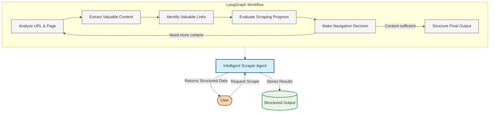

# Idea: Intelligent Scraper Agent using LangGraph

## Overview

This idea focuses exclusively on implementing an intelligent web scraper using LangGraph and LangChain. Unlike traditional scrapers that follow predefined rules, this agent uses large language models to make intelligent decisions about what to scrape, how to extract information, and how to navigate complex websites.

The core innovation is moving from procedural scraping to an agent-based approach where the scraper uses LLMs to understand content semantically and make human-like judgments about value and relevance.

## Architecture



## Core Components

### 1. Agent State

The agent maintains a comprehensive state that tracks all aspects of the scraping process:

```typescript
interface ScraperAgentState {
  // Input configuration
  baseUrl: string;                    // Starting URL
  scrapingGoal: string;               // What we're trying to find
  maxPages: number;                   // Maximum pages to scrape
  
  // Navigation state
  currentUrl: string;                 // Current page being processed
  visitedUrls: Set<string>;           // Pages already visited
  pageQueue: PriorityQueue<{          // URLs to visit next with priority
    url: string;
    expectedValue: number;            // Predicted value of this URL
    depth: number;                    // How deep in the crawl
  }>;
  
  // Content tracking
  extractedContent: Map<string, PageContent>; // Content by URL
  currentPageDOM: string;             // Current page HTML/DOM
  currentPageText: string;            // Extracted text from current page
  
  // Intelligence metrics
  valueMetrics: {                     // Metrics to guide decisions
    informationDensity: number;       // 0-1 score of useful content
    relevance: number;                // 0-1 score of topic relevance
    uniqueness: number;               // 0-1 score of information uniqueness
    completeness: number;             // 0-1 score of goal completion
  };
  
  // Output
  finalOutput: ScraperOutput;         // Final structured output
}
```

### 2. LangGraph Workflow

The scraper is implemented as a LangGraph workflow with specialized nodes:

```typescript
const scraperWorkflow = new StateGraph<ScraperAgentState>({
  channels: {
    currentUrl: new Channel(),
    extractedContent: new Channel(),
    nextActions: new Channel()
  }
})
  // Define nodes
  .addNode("analyzeURL", analyzePage)
  .addNode("extractContent", extractContentFromPage)
  .addNode("identifyLinks", findRelevantLinks)
  .addNode("evaluateProgress", assessScrapingProgress)
  .addNode("decideNextAction", determineNextStep)
  .addNode("structureOutput", organizeExtractedData)
  
  // Define edges
  .addEdge("analyzeURL", "extractContent")
  .addEdge("extractContent", "identifyLinks")
  .addEdge("identifyLinks", "evaluateProgress")
  .addEdge("evaluateProgress", "decideNextAction")
  
  // Conditional edges
  .addConditionalEdge(
    "decideNextAction",
    (state) => {
      // Decision logic based on metrics and conditions
      if (state.valueMetrics.completeness > 0.85) {
        return "structureOutput"; // We have enough information
      }
      if (state.visitedUrls.size >= state.maxPages) {
        return "structureOutput"; // Hit page limit
      }
      return "analyzeURL"; // Continue scraping
    }
  )
  .addEdge("structureOutput", "FINAL");

// Compile the graph into a runnable
const scraper = scraperWorkflow.compile();
```

## Intelligent Decision Making

### 1. URL and Page Analysis

```typescript
async function analyzePage(state: ScraperAgentState, context: AgentContext): Promise<ScraperAgentState> {
  // Fetch the page at the current URL
  const browser = await context.tools.getBrowser();
  const page = await browser.newPage();
  await page.goto(state.currentUrl);
  
  // Extract text and DOM for analysis
  state.currentPageDOM = await page.content();
  state.currentPageText = await page.evaluate(() => document.body.innerText);
  
  // Use LLM to analyze page relevance
  const analysisPrompt = PromptTemplate.fromTemplate(`
    You are an expert web analyst. Analyze this webpage and determine its relevance to our goal.
    
    URL: {currentUrl}
    
    PAGE CONTENT (excerpt):
    {contentExcerpt}
    
    SCRAPING GOAL: {scrapingGoal}
    
    Provide an analysis with the following:
    1. Initial relevance score (0-1) for this page to our goal
    2. Key topics on this page
    3. What valuable information might be present
    4. Should we analyze this page deeply? Why or why not?
    
    Format your response as JSON.
  `);
  
  const analysisChain = analysisPrompt.pipe(llm).pipe(JsonOutputParser);
  const analysis = await analysisChain.invoke({
    currentUrl: state.currentUrl,
    contentExcerpt: state.currentPageText.substring(0, 1500),
    scrapingGoal: state.scrapingGoal
  });
  
  // Update state with analysis results
  state.valueMetrics.relevance = analysis.relevanceScore;
  state.visitedUrls.add(state.currentUrl);
  
  return state;
}
```

### 2. Intelligent Content Extraction

```typescript
async function extractContentFromPage(state: ScraperAgentState, context: AgentContext): Promise<ScraperAgentState> {
  // Skip extraction if relevance is too low
  if (state.valueMetrics.relevance < 0.3) {
    return state; // Not worth extracting
  }
  
  // Use LLM to intelligently extract content
  const extractionPrompt = PromptTemplate.fromTemplate(`
    You are an expert web content extractor. 
    Analyze the following webpage and extract the most valuable information related to our goal.
    
    URL: {currentUrl}
    
    CONTENT:
    {currentPageText}
    
    GOAL: {scrapingGoal}
    
    Extract the following:
    1. Main topic
    2. Key information points relevant to our goal
    3. Relevant data structures (tables, lists)
    4. Entities mentioned
    5. Important relationships
    
    IMPORTANT: Focus ONLY on information relevant to our goal. Ignore navigation, ads, footers, etc.
    Format your response as structured JSON.
  `);
  
  const extractionChain = extractionPrompt.pipe(llm).pipe(JsonOutputParser);
  const extractedContent = await extractionChain.invoke({
    currentUrl: state.currentUrl,
    currentPageText: state.currentPageText,
    scrapingGoal: state.scrapingGoal
  });
  
  // Calculate information density
  const informationDensity = calculateInformationDensity(
    extractedContent, 
    state.currentPageText.length
  );
  
  // Calculate uniqueness compared to already collected info
  const uniqueness = calculateUniqueness(
    extractedContent, 
    state.extractedContent
  );
  
  // Update state
  state.extractedContent.set(state.currentUrl, extractedContent);
  state.valueMetrics.informationDensity = informationDensity;
  state.valueMetrics.uniqueness = uniqueness;
  
  return state;
}
```

### 3. Link Value Prediction

```typescript
async function findRelevantLinks(state: ScraperAgentState, context: AgentContext): Promise<ScraperAgentState> {
  // Extract all links from the page
  const browser = await context.tools.getBrowser();
  const page = await browser.getPage(state.currentUrl);
  
  const links = await page.evaluate(() => {
    return Array.from(document.querySelectorAll('a')).map(a => {
      return {
        href: a.href,
        text: a.innerText,
        context: a.parentElement?.innerText || ''
      };
    });
  });
  
  // Filter out already visited links and external domains
  const newLinks = links.filter(link => {
    const url = new URL(link.href);
    const baseUrlObj = new URL(state.baseUrl);
    
    return !state.visitedUrls.has(link.href) && 
           url.hostname === baseUrlObj.hostname;
  });
  
  // If too many links, use LLM to prioritize
  if (newLinks.length > 10) {
    const linkAnalysisPrompt = PromptTemplate.fromTemplate(`
      You are an expert web crawler with the goal: {scrapingGoal}
      
      We're currently on page: {currentUrl}
      
      Analyze these links and rank them by expected relevance to our goal:
      {links}
      
      For each link, assign:
      1. An expected value score (0-1)
      2. A brief explanation of why it might be valuable
      
      Consider link text, surrounding context, and URL structure.
      Return your analysis as a JSON array of objects with 'href', 'expectedValue', and 'reason'.
    `);
    
    const linkAnalysisChain = linkAnalysisPrompt.pipe(llm).pipe(JsonOutputParser);
    const linkAnalysis = await linkAnalysisChain.invoke({
      currentUrl: state.currentUrl,
      scrapingGoal: state.scrapingGoal,
      links: JSON.stringify(newLinks.slice(0, 20)) // Limit to 20 for analysis
    });
    
    // Add prioritized links to queue
    linkAnalysis.forEach(link => {
      const currentDepth = getDepthFromUrl(state.currentUrl, state.baseUrl);
      state.pageQueue.push({
        url: link.href,
        expectedValue: link.expectedValue,
        depth: currentDepth + 1
      });
    });
  } else {
    // Add all links with default priority
    newLinks.forEach(link => {
      const currentDepth = getDepthFromUrl(state.currentUrl, state.baseUrl);
      state.pageQueue.push({
        url: link.href,
        expectedValue: 0.5, // Default value
        depth: currentDepth + 1
      });
    });
  }
  
  return state;
}
```

### 4. Progress Evaluation and Navigation Decisions

```typescript
async function assessScrapingProgress(state: ScraperAgentState, context: AgentContext): Promise<ScraperAgentState> {
  // Use LLM to evaluate overall progress toward goal
  const progressPrompt = PromptTemplate.fromTemplate(`
    You are an expert information analyst.
    
    GOAL: {scrapingGoal}
    
    INFORMATION COLLECTED SO FAR:
    {collectedInfo}
    
    Pages visited: {visitedCount}
    
    Evaluate our progress toward the scraping goal:
    1. Completeness score (0-1): How complete is our information
    2. Key missing information: What important data are we still missing
    3. Suggestions: What types of pages should we prioritize next
    
    Return your analysis as JSON.
  `);
  
  const progressChain = progressPrompt.pipe(llm).pipe(JsonOutputParser);
  const progress = await progressChain.invoke({
    scrapingGoal: state.scrapingGoal,
    collectedInfo: JSON.stringify(Array.from(state.extractedContent.values())),
    visitedCount: state.visitedUrls.size
  });
  
  // Update state
  state.valueMetrics.completeness = progress.completenessScore;
  
  return state;
}

async function determineNextStep(state: ScraperAgentState, context: AgentContext): Promise<ScraperAgentState> {
  // Get next URL from priority queue if we should continue
  if (state.valueMetrics.completeness < 0.85 && 
      state.visitedUrls.size < state.maxPages &&
      !state.pageQueue.isEmpty()) {
    
    // Get highest priority URL
    const nextPage = state.pageQueue.pop();
    state.currentUrl = nextPage.url;
    state.nextActions = ["CONTINUE_SCRAPING"];
  } else {
    state.nextActions = ["FINALIZE_OUTPUT"];
  }
  
  return state;
}
```

## Utility Functions

```typescript
// Calculate information density based on extracted content vs page size
function calculateInformationDensity(extractedContent, pageTextLength) {
  const extractedTextLength = JSON.stringify(extractedContent).length;
  return Math.min(1, extractedTextLength / (pageTextLength * 0.3));
}

// Calculate uniqueness by comparing to already collected information
function calculateUniqueness(newContent, existingContent) {
  if (existingContent.size === 0) return 1; // First content is always unique
  
  // Compare to existing content for similarity
  let maxSimilarity = 0;
  existingContent.forEach(content => {
    const similarity = calculateSimilarity(newContent, content);
    maxSimilarity = Math.max(maxSimilarity, similarity);
  });
  
  return 1 - maxSimilarity;
}

// Priority Queue implementation
class PriorityQueue<T> {
  private items: {value: T, priority: number}[] = [];
  
  push(item: T, priority: number = 0) {
    this.items.push({value: item, priority});
    this.items.sort((a, b) => b.priority - a.priority);
  }
  
  pop(): T {
    if (this.isEmpty()) throw new Error("Queue is empty");
    return this.items.shift()!.value;
  }
  
  isEmpty(): boolean {
    return this.items.length === 0;
  }
}
```

## Key Intelligence Features

1. **Content Relevance Analysis**
   - Uses LLMs to semantically understand page content
   - Calculates relevance scores to the scraping goal
   - Prioritizes high-relevance pages for deeper extraction

2. **Adaptive Link Following**
   - Predicts which links will lead to valuable information
   - Uses a priority queue to visit the most promising pages first
   - Factors in link text, context, and page structure

3. **Information Value Assessment**
   - Evaluates information density to ignore low-value pages
   - Calculates uniqueness to avoid duplicating content
   - Tracks completeness to know when to stop scraping

4. **Goal-Directed Navigation**
   - Constantly evaluates progress toward the scraping goal
   - Identifies missing information to guide further scraping
   - Makes intelligent decisions about when to stop

5. **Self-Monitoring Capabilities**
   - Tracks overall progress and adjusts strategy
   - Detects when it has sufficient information
   - Avoids wasting resources on low-value paths

## API and Integration

```typescript
// Main API for using the scraper
async function runIntelligentScraper({
  baseUrl,
  scrapingGoal,
  maxPages = 50
}: {
  baseUrl: string;
  scrapingGoal: string;
  maxPages?: number;
}): Promise<ScraperOutput> {
  // Initialize the agent state
  const initialState: ScraperAgentState = {
    baseUrl,
    scrapingGoal,
    maxPages,
    currentUrl: baseUrl,
    visitedUrls: new Set(),
    pageQueue: new PriorityQueue(),
    extractedContent: new Map(),
    currentPageDOM: "",
    currentPageText: "",
    valueMetrics: {
      informationDensity: 0,
      relevance: 0,
      uniqueness: 0,
      completeness: 0
    },
    finalOutput: { data: [], metadata: {} }
  };
  
  // Execute the LangGraph
  const { finalOutput } = await scraper.invoke(initialState);
  
  return finalOutput;
}
```

## Implementation Strategy

### Phase 1: Core Framework
- Setup LangGraph and state management
- Implement basic browser interaction
- Create simple navigation flow

### Phase 2: Intelligence Layer
- Add LLM-powered page analysis
- Implement content extraction
- Build link evaluation capabilities

### Phase 3: Decision Logic
- Create progress evaluation
- Implement priority-based navigation
- Add stopping criteria

### Phase 4: Optimization
- Performance tuning
- Error handling and recovery
- Rate limiting and politeness controls

## Technical Components

1. **Dependencies**
```json
{
  "dependencies": {
    "@langchain/core": "^0.3.0",
    "@langchain/langgraph": "^0.2.0",
    "@langchain/openai": "^0.5.0",
    "playwright": "^1.40.0"
  }
}
```

2. **Key Utilities**
- StateGraph: For implementing the scraper workflow
- Playwright: For browser automation and DOM interaction
- LLM: For semantic analysis and decision making
- Output parsers: For structured LLM outputs

## Benefits of This Approach

1. **Higher Quality Extraction**: Focuses on semantically valuable content
2. **Efficiency**: Prioritizes high-value pages and avoids wasted effort
3. **Adaptability**: Works across different website structures without custom rules
4. **Intelligent Stopping**: Knows when it has enough information
5. **Goal-Oriented**: Focuses on fulfilling the specific scraping goal

## Challenges and Considerations

1. **LLM Cost**: Multiple LLM calls per page increases operating costs
2. **Speed**: More complex processing increases scraping time
3. **Rate Limiting**: Need for intelligent rate limiting to be polite
4. **Error Handling**: Robust recovery from failures is essential
5. **Scalability**: Managing LLM calls at scale requires optimization

## Conclusion

This intelligent scraper represents a significant advancement over traditional web scrapers by using LangGraph and large language models to make human-like decisions about content value and navigation. Rather than blindly following links or extracting based on fixed patterns, it understands content semantically and pursues information that best fulfills the scraping goal.

The result is a more efficient, adaptive, and intelligent scraping system that can navigate complex websites and extract high-quality information with minimal human guidance. 