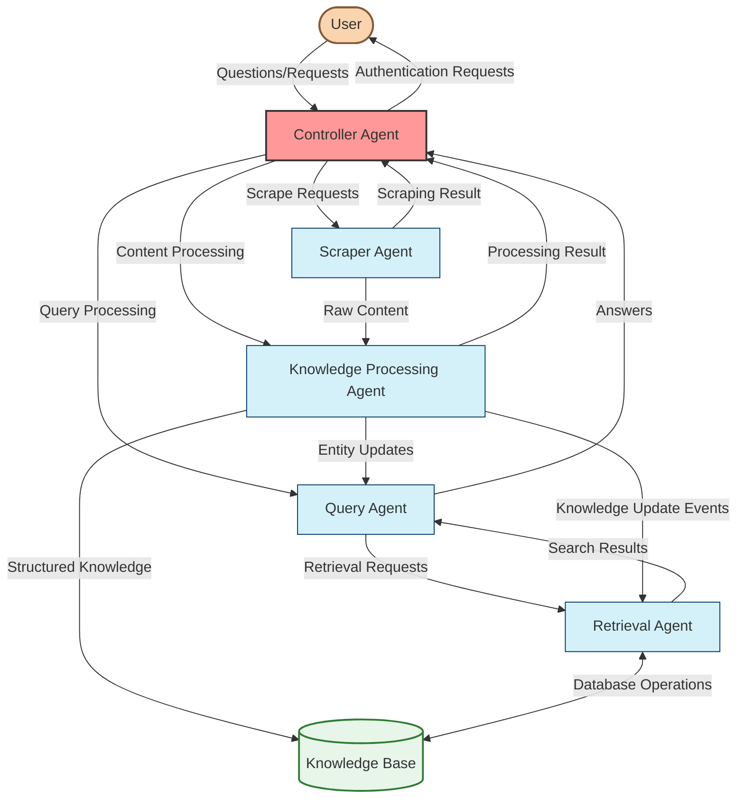
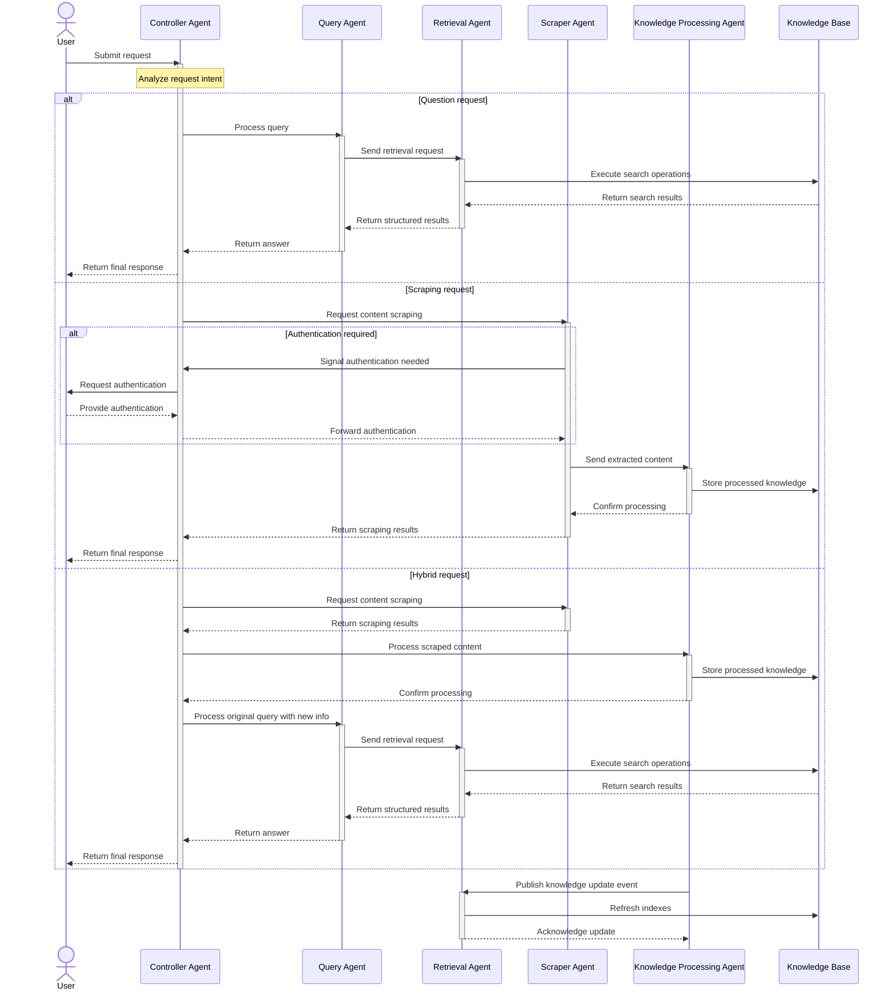

# Multi-Agent Communication

## Agent Communication Workflow



## Message Flow Diagram



## Agent Communication Workflow as Markdown Text

```
                        ┌────────────────────────────────────────────────────┐
                        │        🤖 MULTI-AGENT COMMUNICATION FLOW 🤖        │
                        └────────────────────────────────────────────────────┘
                                                 │
                                                 ▼
┌──────────────────────────────────────────────────────────────────────────────────────────────┐
│                              👤 USER INTERACTION LAYER 👤                                    │
│                                                                                              │
│     ┌──────────────────────────────────┐                ┌────────────────────────────┐       │
│     │      🔍 Query Submission         │                │    🌐 Scrape Request       │       │
│     │                                  │                │                            │       │
│     │  User submits natural            │                │  User requests scraping    │       │
│     │  language questions              │                │  of specific websites      │       │
│     └──────────────────┬───────────────┘                └───────────────┬────────────┘       │
│                        │                                                │                    │
└────────────────────────┼────────────────────────────────────────────────┼────────────────────┘
                         │                                                │
                         └────────────────────┬───────────────────────────┘
                                              │
                                              ▼
┌──────────────────────────────────────────────────────────────────────────────────────────────┐
│                              🎮 CONTROLLER AGENT LAYER 🎮                                    │
│                                                                                              │
│  ┌────────────────────────────────────────────────────────────────────────────────────┐      │
│  │                                                                                    │      │
│  │  • 🧠 Analyzes user request intent                                                 │      │
│  │  • 🔀 Routes requests to appropriate specialized agents                            │      │
│  │  • 🧩 Handles disambiguation when intent or entities are unclear                   │      │
│  │  • 🔐 Coordinates authentication when needed                                       │      │
│  │  • 📊 Aggregates responses from multiple agents                                    │      │
│  │  • 📝 Formats final response for user                                              │      │
│  │                                                                                    │      │
│  └───────────┬──────────────────────┬───────────────────────┬──────────────────┬─────┘      │
│              │                      │                       │                  │            │
└──────────────┼──────────────────────┼───────────────────────┼──────────────────┼────────────┘
               │                      │                       │                  │
               ▼                      ▼                       ▼                  ▼
┌─────────────────────┐   ┌──────────────────┐   ┌────────────────────┐   ┌─────────────────┐
│   🧠 QUERY AGENT    │   │ 🔍 RETRIEVAL AGENT│   │ 🕸️ SCRAPER AGENT   │   │📊 KNOWLEDGE AGENT│
│                     │   │                  │   │                    │   │                 │
│ • Analyzes questions│   │ • Executes search│   │ • Navigates websites│   │ • Analyzes content│
│ • Decomposes queries│   │ • Ranks results  │   │ • Extracts content │   │ • Extracts entities│
│ • Plans retrieval   │   │ • Filters info   │   │ • Handles auth     │   │ • Finds relations │
│ • Synthesizes answer│   │ • Returns results│   │ • Prioritizes data │   │ • Integrates data │
└──────────┬──────────┘   └────────┬─────────┘   └──────────┬─────────┘   └─────────┬───────┘
           │                       │                        │                       │
           │                       │                        │                       │
           │                       ▼                        │                       │
           │             ┌──────────────────┐              │                       │
           │             │    Knowledge     │◀─────────────┘                       │
           └────────────▶│      Base        │◀──────────────────────────────────────┘
                         └──────────────────┘
```

## Message Types and Channels

```
┌─────────────────────────────────────────────────────────────────┐
│       Controller Agent ←→ Specialized Agents Messages           │
├─────────────────────────────┬───────────────────────────────────┤
│    agentRequest             │    agentResponse                  │
├─────────────────────────────┼───────────────────────────────────┤
│  • requestId: string        │  • requestId: string              │
│  • intent: RequestIntent    │  • content: string                │
│  • payload: object          │  • metadata: object               │
│  • options: object          │  • status: ResponseStatus         │
└─────────────────────────────┴───────────────────────────────────┘

┌─────────────────────────────────────────────────────────────────┐
│            Query Agent ←→ Retrieval Agent Messages              │
├─────────────────────────────┬───────────────────────────────────┤
│    retrievalRequest         │    retrievalResponse              │
├─────────────────────────────┼───────────────────────────────────┤
│  • query: string            │  • content: string                │
│  • filters: object          │  • results: RetrievedChunk[]      │
│  • strategies: string[]     │  • evaluation: object             │
└─────────────────────────────┴───────────────────────────────────┘

┌─────────────────────────────────────────────────────────────────┐
│         Scraper Agent ←→ Knowledge Agent Messages               │
├─────────────────────────────┬───────────────────────────────────┤
│    processingRequest        │    processingResponse             │
├─────────────────────────────┼───────────────────────────────────┤
│  • content: ContentItem[]   │  • entities: Entity[]             │
│  • metadata: object         │  • relationships: Relationship[]  │
│  • options: object          │  • chunks: ProcessedChunk[]       │
└─────────────────────────────┴───────────────────────────────────┘

┌─────────────────────────────────────────────────────────────────┐
│         Knowledge Agent ←→ Retrieval Agent Messages             │
├─────────────────────────────┬───────────────────────────────────┤
│    knowledgeUpdateEvent     │    indexUpdateConfirmation        │
├─────────────────────────────┼───────────────────────────────────┤
│  • timestamp: Date          │  • success: boolean               │
│  • changeSet: object        │  • updatedIndexes: string[]       │
│  • source: string           │  • timestamp: Date                │
└─────────────────────────────┴───────────────────────────────────┘

┌─────────────────────────────────────────────────────────────────┐
│         Controller Agent ←→ User Messages                       │
├─────────────────────────────┬───────────────────────────────────┤
│    disambiguationRequest    │    disambiguationResponse         │
├─────────────────────────────┼───────────────────────────────────┤
│  • options: Option[]        │  • selectedOption: Option         │
│  • context: string          │  • additionalInfo: string         │
│  • requestId: string        │  • requestId: string              │
└─────────────────────────────┴───────────────────────────────────┘

┌─────────────────────────────────────────────────────────────────┐
│         Controller Agent ←→ User Authentication                 │
├─────────────────────────────┬───────────────────────────────────┤
│    authenticationRequest    │    authenticationResponse         │
├─────────────────────────────┼───────────────────────────────────┤
│  • url: string              │  • credentials: object            │
│  • authType: string         │  • success: boolean               │
│  • requestId: string        │  • requestId: string              │
└─────────────────────────────┴───────────────────────────────────┘
``` 