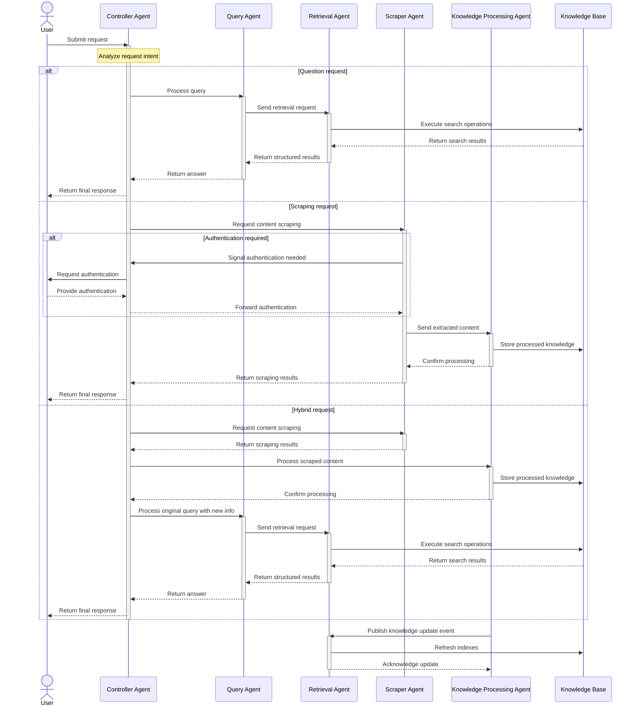

# Multi-Agent Communication

## Agent Communication Workflow


## Message Flow Diagram



## Agent Communication Workflow as Markdown Text

```
                        ┌────────────────────────────────────────────────────┐
                        │        🤖 MULTI-AGENT COMMUNICATION FLOW 🤖        │
                        └────────────────────────────────────────────────────┘
                                                 │
                                                 ▼
┌──────────────────────────────────────────────────────────────────────────────────────────────┐
│                              👤 USER INTERACTION LAYER 👤                                    │
│                                                                                              │
│     ┌──────────────────────────────────┐                ┌────────────────────────────┐       │
│     │      🔍 Query Submission         │                │    🌐 Scrape Request       │       │
│     │                                  │                │                            │       │
│     │  User submits natural            │                │  User requests scraping    │       │
│     │  language questions              │                │  of specific websites      │       │
│     └──────────────────┬───────────────┘                └───────────────┬────────────┘       │
│                        │                                                │                    │
└────────────────────────┼────────────────────────────────────────────────┼────────────────────┘
                         │                                                │
                         └────────────────────┬───────────────────────────┘
                                              │
                                              ▼
┌──────────────────────────────────────────────────────────────────────────────────────────────┐
│                              🎮 CONTROLLER AGENT LAYER 🎮                                    │
│                                                                                              │
│  ┌────────────────────────────────────────────────────────────────────────────────────┐      │
│  │                                                                                    │      │
│  │  • 🧠 Analyzes user request intent                                                 │      │
│  │  • 🔀 Routes requests to appropriate specialized agents                            │      │
│  │  • 🧩 Handles disambiguation when intent or entities are unclear                   │      │
│  │  • 🔐 Coordinates authentication when needed                                       │      │
│  │  • 📊 Aggregates responses from multiple agents                                    │      │
│  │  • 📝 Formats final response for user                                              │      │
│  │                                                                                    │      │
│  └───────────┬──────────────────────┬───────────────────────┬──────────────────┬─────┘      │
│              │                      │                       │                  │            │
└──────────────┼──────────────────────┼───────────────────────┼──────────────────┼────────────┘
               │                      │                       │                  │
               ▼                      ▼                       ▼                  ▼
┌─────────────────────┐   ┌──────────────────┐   ┌────────────────────┐   ┌─────────────────┐
│   🧠 QUERY AGENT    │   │ 🔍 RETRIEVAL AGENT│   │ 🕸️ SCRAPER AGENT   │   │📊 KNOWLEDGE AGENT│
│                     │   │                  │   │                    │   │                 │
│ • Analyzes questions│   │ • Executes search│   │ • Navigates websites│   │ • Analyzes content│
│ • Decomposes queries│   │ • Ranks results  │   │ • Extracts content │   │ • Extracts entities│
│ • Plans retrieval   │   │ • Filters info   │   │ • Handles auth     │   │ • Finds relations │
│ • Synthesizes answer│   │ • Returns results│   │ • Prioritizes data │   │ • Integrates data │
└──────────┬──────────┘   └────────┬─────────┘   └──────────┬─────────┘   └─────────┬───────┘
           │                       │                        │                       │
           │                       │                        │                       │
           │                       ▼                        │                       │
           │             ┌──────────────────┐              │                       │
           │             │    Knowledge     │◀─────────────┘                       │
           └────────────▶│      Base        │◀──────────────────────────────────────┘
                         └──────────────────┘
```

## Internal Chain Architecture

While the diagrams above illustrate how agents communicate with each other, each agent internally utilizes chains to process information and perform its specialized tasks. Chains are sequential processing components that can be combined to create complex workflows.

```mermaid
graph TD
    %% Controller Agent Chains
    subgraph "Controller Agent"
        RequestAnalysis[Request Analysis Chain]
        DisambiguationC[Disambiguation Chain]
        Routing[Routing Chain]
        ResponseAggregation[Response Aggregation Chain]
        
        RequestAnalysis --> DisambiguationC
        DisambiguationC --> Routing
        Routing --> ResponseAggregation
    end
    
    %% Query Agent Chains
    subgraph "Query Agent"
        QueryDecomposition[Query Decomposition Chain]
        RetrievalPlanning[Retrieval Planning Chain]
        AnswerSynthesis[Answer Synthesis Chain]
        
        QueryDecomposition --> RetrievalPlanning
        RetrievalPlanning --> AnswerSynthesis
    end
    
    %% Retrieval Agent Chains
    subgraph "Retrieval Agent"
        HybridSearch[Hybrid Search Chain]
        ResultRanking[Result Ranking Chain]
        ContextEnhancement[Context Enhancement Chain]
        
        HybridSearch --> ResultRanking
        ResultRanking --> ContextEnhancement
    end
    
    %% Scraper Agent Chains
    subgraph "Scraper Agent"
        ContentAnalysis[Content Analysis Chain]
        AuthenticationHandling[Authentication Chain]
        ContentExtraction[Content Extraction Chain]
        
        ContentAnalysis --> AuthenticationHandling
        AuthenticationHandling --> ContentExtraction
    end
    
    %% Knowledge Processing Agent Chains
    subgraph "Knowledge Processing Agent"
        EntityExtraction[Entity Extraction Chain]
        RelationshipDiscovery[Relationship Discovery Chain]
        KnowledgeIntegration[Knowledge Integration Chain]
        
        EntityExtraction --> RelationshipDiscovery
        RelationshipDiscovery --> KnowledgeIntegration
    end
    
    %% Inter-agent Communication
    Controller --> |Routes to| Query
    Controller --> |Routes to| Scraper
    Controller --> |Routes to| Knowledge
    
    Query --> |Requests| Retrieval
    Retrieval --> |Returns| Query
    
    Scraper --> |Sends Content| Knowledge
    
    classDef chainNode fill:#f8e5ee,stroke:#a83253,stroke-width:1px;
    classDef agentNode fill:#d4f1f9,stroke:#05386b,stroke-width:2px;
    
    class RequestAnalysis,DisambiguationC,Routing,ResponseAggregation,QueryDecomposition,RetrievalPlanning,AnswerSynthesis,HybridSearch,ResultRanking,ContextEnhancement,ContentAnalysis,AuthenticationHandling,ContentExtraction,EntityExtraction,RelationshipDiscovery,KnowledgeIntegration chainNode;
    class Controller,Query,Retrieval,Scraper,Knowledge agentNode;
```



### Key Chain Types

Each agent utilizes specialized chains to handle its responsibilities:

#### Controller Agent Chains
- **Request Analysis Chain**: Analyzes user input to determine intent and entities
- **Disambiguation Chain**: Resolves ambiguities in user requests
- **Routing Chain**: Determines which agent(s) should handle the request
- **Response Aggregation Chain**: Combines results from multiple agents into a coherent response

#### Query Agent Chains
- **Query Decomposition Chain**: Breaks complex questions into sub-questions
- **Retrieval Planning Chain**: Determines the optimal retrieval strategy
- **Answer Synthesis Chain**: Generates final answers from retrieved information

#### Retrieval Agent Chains
- **Hybrid Search Chain**: Combines vector, keyword, and metadata-based search
- **Result Ranking Chain**: Ranks and filters search results
- **Context Enhancement Chain**: Enriches results with additional context

#### Scraper Agent Chains
- **Content Analysis Chain**: Evaluates web content for relevance
- **Authentication Handling Chain**: Manages authentication requirements
- **Content Extraction Chain**: Extracts and structures web content

#### Knowledge Processing Agent Chains
- **Entity Extraction Chain**: Identifies entities from raw content
- **Relationship Discovery Chain**: Finds connections between entities
- **Knowledge Integration Chain**: Integrates new knowledge with existing information

### Chain Integration with Memory

Chains interact with the Memory Management System through:

1. **Context Retrieval**: Chains access relevant memory to inform their processing
2. **Intermediate Storage**: Chains store partial results in working memory
3. **Knowledge Updates**: Chains contribute new information to long-term memory

This layered architecture enables complex reasoning while maintaining clear separation of concerns. The agent communication layer handles high-level coordination, while chains within each agent perform the specialized processing required for each task.

### Chain Workflow as Markdown Text

```
                        ┌────────────────────────────────────────────────────┐
                        │        🔗 INTERNAL CHAIN ARCHITECTURE 🔗           │
                        └────────────────────────────────────────────────────┘
                                                 │
                                                 ▼
┌──────────────────────────────────────────────────────────────────────────────────────────────┐
│                              🎮 CONTROLLER AGENT CHAINS 🎮                                   │
│                                                                                              │
│  ┌─────────────────────┐     ┌─────────────────┐     ┌───────────────┐     ┌───────────────┐ │
│  │ Request Analysis    │────▶│ Disambiguation  │────▶│ Routing       │────▶│ Response      │ │
│  │ Chain               │     │ Chain           │     │ Chain         │     │ Aggregation   │ │
│  └─────────────────────┘     └─────────────────┘     └───────────────┘     └───────────────┘ │
│                                                                                              │
└─────────────────────────────────────────┬────────────────────────────────────────────────────┘
                                          │
                                          ▼
┌─────────────────────┬──────────────────────────────────┬────────────────────────────────────┐
│                     │                                  │                                    │
│                     ▼                                  ▼                                    ▼
│  ┌───────────────────────────────┐    ┌───────────────────────────┐    ┌────────────────────────────┐
│  │     QUERY AGENT CHAINS        │    │    SCRAPER AGENT CHAINS    │    │ KNOWLEDGE AGENT CHAINS     │
│  │                               │    │                            │    │                            │
│  │  ┌─────────────┐              │    │  ┌─────────────┐           │    │  ┌─────────────┐           │
│  │  │ Query       │              │    │  │ Content     │           │    │  │ Entity      │           │
│  │  │ Decomposition│              │    │  │ Analysis    │           │    │  │ Extraction  │           │
│  │  └──────┬──────┘              │    │  └──────┬──────┘           │    │  └──────┬──────┘           │
│  │         │                     │    │         │                  │    │         │                  │
│  │         ▼                     │    │         ▼                  │    │         ▼                  │
│  │  ┌─────────────┐              │    │  ┌─────────────┐           │    │  ┌─────────────┐           │
│  │  │ Retrieval   │              │    │  │ Authentication│          │    │  │ Relationship │          │
│  │  │ Planning    │              │    │  │ Handling     │          │    │  │ Discovery   │          │
│  │  └──────┬──────┘              │    │  └──────┬──────┘           │    │  └──────┬──────┘           │
│  │         │                     │    │         │                  │    │         │                  │
│  │         ▼                     │    │         ▼                  │    │         ▼                  │
│  │  ┌─────────────┐              │    │  ┌─────────────┐           │    │  ┌─────────────┐           │
│  │  │ Answer      │              │    │  │ Content     │           │    │  │ Knowledge   │           │
│  │  │ Synthesis   │              │    │  │ Extraction  │           │    │  │ Integration │           │
│  │  └──────┬──────┘              │    │  └──────┬──────┘           │    │  └──────┬──────┘           │
│  └─────────┼────────────────────┘     └─────────┼─────────────────┘     └─────────┼─────────────────┘
│            │                                    │                                  │                 
│            │                                    │                                  │                 
│            ▼                                    ▼                                  ▼                 
│    ┌─────────────────────────────────────────────────────────────────────────────────────────┐      
│    │                           RETRIEVAL AGENT CHAINS                                         │      
│    │                                                                                          │      
│    │      ┌─────────────┐                 ┌─────────────┐                ┌─────────────┐      │      
│    │      │ Hybrid      │                 │ Result      │                │ Context     │      │      
│    │      │ Search      │───────────────▶│ Ranking     │───────────────▶│ Enhancement │      │      
│    │      └─────────────┘                 └─────────────┘                └─────────────┘      │      
│    │                                                                                          │      
│    └─────────────────────────────────────────────────────────────────────────────────────────┘      
│                                                                                                      
│                                                 ▼                                                    
│                                                                                                      
└───────────────────────────────────▶  ┌─────────────────────────┐  ◀────────────────────────────────┘
                                       │                         │                                    
                                       │    Memory Management    │                                    
                                       │       System            │                                    
                                       │                         │                                    
                                       └─────────────────────────┘                                    
```

## Unified Multi-Agent System Architecture

```
┌──────────────────────────────────────────────────────────────────────────────────────────────────────┐
│                               🤖 MULTI-AGENT RAG SYSTEM ARCHITECTURE 🤖                              │
└────────────────────────────────────────────────┬─────────────────────────────────────────────────────┘
                                                 │
                                                 ▼
┌──────────────────────────────────────────────────────────────────────────────────────────────────────┐
│                                  👤 USER INTERACTION LAYER 👤                                        │
│                                                                                                      │
│     ┌──────────────────────────────────┐                    ┌────────────────────────────┐           │
│     │      🔍 Query Submission         │                    │    🌐 Scrape Request       │           │
│     │                                  │                    │                            │           │
│     │  User submits natural            │                    │  User requests scraping    │           │
│     │  language questions              │                    │  of specific websites      │           │
│     └──────────────────┬───────────────┘                    └───────────────┬────────────┘           │
│                        │                                                    │                        │
└────────────────────────┼────────────────────────────────────────────────────┼────────────────────────┘
                         │                                                    │
                         └────────────────────────┬───────────────────────────┘
                                                  │
                                                  ▼
┌──────────────────────────────────────────────────────────────────────────────────────────────────────┐
│                                   🎮 CONTROLLER AGENT 🎮                                             │
│                                                                                                      │
│  ┌────────────────────────────────────────────────────────────────────────────────────────┐          │
│  │                             CONTROLLER AGENT CAPABILITIES                              │          │
│  │                                                                                        │          │
│  │  • 🧠 Analyzes user request intent         • 🔐 Coordinates authentication             │          │
│  │  • 🔀 Routes requests to agents            • 📊 Aggregates multi-agent responses       │          │
│  │  • 🧩 Handles disambiguation               • 📝 Formats final response for user        │          │
│  └────────────────────────────────────────────────────────────────────────────────────────┘          │
│                                                                                                      │
│  ┌────────────────────────────────────────────────────────────────────────────────────────┐          │
│  │                             CONTROLLER AGENT CHAINS                                    │          │
│  │                                                                                        │          │
│  │   ┌─────────────────┐      ┌─────────────────┐      ┌─────────────┐     ┌────────────┐           │
│  │   │ 🧠 Request      │─────▶│ 🧩 Disambiguation│─────▶│ 🔀 Routing  │────▶│ 📊 Response│           │
│  │   │   Analysis      │      │   Chain         │      │   Chain     │     │ Aggregation│           │
│  │   └─────────────────┘      └─────────────────┘      └─────────────┘     └────────────┘           │
│  │                                                                                        │          │
│  └─────────┬─────────────────────────┬────────────────────────────┬────────────────────────┘          │
│            │                         │                            │                                  │
└────────────┼─────────────────────────┼────────────────────────────┼──────────────────────────────────┘
             │                         │                            │
             ▼                         ▼                            ▼
┌────────────────────────┐  ┌───────────────────────┐  ┌────────────────────────┐
│     🧠 QUERY AGENT     │  │  🕸️ SCRAPER AGENT    │  │  📊 KNOWLEDGE AGENT   │
│                        │  │                       │  │                        │
│ ┌──────────────────────┐  │ ┌─────────────────────┐  │ ┌──────────────────────┐
│ │    CAPABILITIES      │  │ │    CAPABILITIES     │  │ │    CAPABILITIES      │
│ │                      │  │ │                     │  │ │                      │
│ │ • Analyzes questions │  │ │ • Navigates websites│  │ │ • Analyzes content   │
│ │ • Decomposes queries │  │ │ • Extracts content  │  │ │ • Extracts entities  │
│ │ • Plans retrieval    │  │ │ • Handles auth      │  │ │ • Finds relations    │
│ │ • Synthesizes answers│  │ │ • Prioritizes data  │  │ │ • Integrates data    │
│ └──────────────────────┘  │ └─────────────────────┘  │ └──────────────────────┘
│                           │                          │                         │
│ ┌──────────────────────┐  │ ┌─────────────────────┐  │ ┌──────────────────────┐
│ │    CHAIN FLOW        │  │ │    CHAIN FLOW       │  │ │    CHAIN FLOW        │
│ │                      │  │ │                     │  │ │                      │
│ │  ┌─────────────┐     │  │ │  ┌─────────────┐    │  │ │  ┌─────────────┐     │
│ │  │ Query       │     │  │ │  │ Content     │    │  │ │  │ Entity      │     │
│ │  │ Decomposition│     │  │ │  │ Analysis    │    │  │ │  │ Extraction  │     │
│ │  └──────┬──────┘     │  │ │  └──────┬──────┘    │  │ │  └──────┬──────┘     │
│ │         │            │  │ │         │           │  │ │         │            │
│ │         ▼            │  │ │         ▼           │  │ │         ▼            │
│ │  ┌─────────────┐     │  │ │  ┌─────────────┐    │  │ │  ┌─────────────┐     │
│ │  │ Retrieval   │     │  │ │  │ Authentication│   │  │ │  │ Relationship │    │
│ │  │ Planning    │     │  │ │  │ Handling     │   │  │ │  │ Discovery   │    │
│ │  └──────┬──────┘     │  │ │  └──────┬──────┘    │  │ │  └──────┬──────┘     │
│ │         │            │  │ │         │           │  │ │         │            │
│ │         ▼            │  │ │         ▼           │  │ │         ▼            │
│ │  ┌─────────────┐     │  │ │  ┌─────────────┐    │  │ │  ┌─────────────┐     │
│ │  │ Answer      │     │  │ │  │ Content     │    │  │ │  │ Knowledge   │     │
│ │  │ Synthesis   │     │  │ │  │ Extraction  │    │  │ │  │ Integration │     │
│ │  └──────┬──────┘     │  │ │  └──────┬──────┘    │  │ │  └──────┬──────┘     │
│ └─────────┼────────────┘  │ └─────────┼───────────┘  │ └─────────┼────────────┘
│           │               │           │              │           │              
└───────────┼───────────────┘           │              └───────────┼──────────────
            │                           │                          │              
            │                           ▼                          │              
            │           ┌────────────────────────────────────┐     │              
            │           │         🔍 RETRIEVAL AGENT         │     │              
            └──────────▶│                                    │◀────┘              
                        │ ┌────────────────────────────────┐ │                    
                        │ │           CAPABILITIES         │ │                    
                        │ │                                │ │                    
                        │ │ • Executes search operations   │ │                    
                        │ │ • Ranks and filters results    │ │                    
                        │ │ • Enhances with context        │ │                    
                        │ │ • Returns structured results   │ │                    
                        │ └────────────────────────────────┘ │                    
                        │                                    │                    
                        │ ┌────────────────────────────────┐ │                    
                        │ │           CHAIN FLOW           │ │                    
                        │ │                                │ │                    
                        │ │     ┌─────────────┐            │ │                    
                        │ │     │ Hybrid      │            │ │                    
                        │ │     │ Search      │            │ │                    
                        │ │     └──────┬──────┘            │ │                    
                        │ │            │                   │ │                    
                        │ │            ▼                   │ │                    
                        │ │     ┌─────────────┐            │ │                    
                        │ │     │ Result      │            │ │                    
                        │ │     │ Ranking     │            │ │                    
                        │ │     └──────┬──────┘            │ │                    
                        │ │            │                   │ │                    
                        │ │            ▼                   │ │                    
                        │ │     ┌─────────────┐            │ │                    
                        │ │     │ Context     │            │ │                    
                        │ │     │ Enhancement │            │ │                    
                        │ │     └──────┬──────┘            │ │                    
                        │ └───────────┼────────────────────┘ │                    
                        └─────────────┼──────────────────────┘                    
                                      │                                           
                                      ▼                                           
┌──────────────────────────────────────────────────────────────────────────────┐
│                          💾 MEMORY MANAGEMENT SYSTEM 💾                      │
│                                                                              │
│  ┌───────────────┐    ┌───────────────┐    ┌───────────────┐    ┌───────────────┐
│  │               │    │               │    │               │    │               │
│  │  📚 Short-Term │    │  🧠 Long-Term  │    │  👤 User      │    │  🔗 Entity    │
│  │  Memory       │    │  Memory       │    │  Memory       │    │  Memory       │
│  │               │    │               │    │               │    │               │
│  └───────────────┘    └───────────────┘    └───────────────┘    └───────────────┘
│                                                                                │
└──────────────────────────────────────────────────────────────────────────────────┘

Message Types:
🔄 Controller ↔ Agents: agentRequest/agentResponse
🔍 Query ↔ Retrieval: retrievalRequest/retrievalResponse  
🕸️ Scraper ↔ Knowledge: processingRequest/processingResponse
📊 Knowledge ↔ Retrieval: knowledgeUpdateEvent/indexUpdateConfirmation
👤 Controller ↔ User: disambiguationRequest/disambiguationResponse, authenticationRequest/authenticationResponse
```

## Message Types and Channels

```
┌─────────────────────────────────────────────────────────────────┐
│       Controller Agent ←→ Specialized Agents Messages           │
├─────────────────────────────┬───────────────────────────────────┤
│    agentRequest             │    agentResponse                  │
├─────────────────────────────┼───────────────────────────────────┤
│  • requestId: string        │  • requestId: string              │
│  • intent: RequestIntent    │  • content: string                │
│  • payload: object          │  • metadata: object               │
│  • options: object          │  • status: ResponseStatus         │
└─────────────────────────────┴───────────────────────────────────┘

┌─────────────────────────────────────────────────────────────────┐
│            Query Agent ←→ Retrieval Agent Messages              │
├─────────────────────────────┬───────────────────────────────────┤
│    retrievalRequest         │    retrievalResponse              │
├─────────────────────────────┼───────────────────────────────────┤
│  • query: string            │  • content: string                │
│  • filters: object          │  • results: RetrievedChunk[]      │
│  • strategies: string[]     │  • evaluation: object             │
└─────────────────────────────┴───────────────────────────────────┘

┌─────────────────────────────────────────────────────────────────┐
│         Scraper Agent ←→ Knowledge Agent Messages               │
├─────────────────────────────┬───────────────────────────────────┤
│    processingRequest        │    processingResponse             │
├─────────────────────────────┼───────────────────────────────────┤
│  • content: ContentItem[]   │  • entities: Entity[]             │
│  • metadata: object         │  • relationships: Relationship[]  │
│  • options: object          │  • chunks: ProcessedChunk[]       │
└─────────────────────────────┴───────────────────────────────────┘

┌─────────────────────────────────────────────────────────────────┐
│         Knowledge Agent ←→ Retrieval Agent Messages             │
├─────────────────────────────┬───────────────────────────────────┤
│    knowledgeUpdateEvent     │    indexUpdateConfirmation        │
├─────────────────────────────┼───────────────────────────────────┤
│  • timestamp: Date          │  • success: boolean               │
│  • changeSet: object        │  • updatedIndexes: string[]       │
│  • source: string           │  • timestamp: Date                │
└─────────────────────────────┴───────────────────────────────────┘

┌─────────────────────────────────────────────────────────────────┐
│         Controller Agent ←→ User Messages                       │
├─────────────────────────────┬───────────────────────────────────┤
│    disambiguationRequest    │    disambiguationResponse         │
├─────────────────────────────┼───────────────────────────────────┤
│  • options: Option[]        │  • selectedOption: Option         │
│  • context: string          │  • additionalInfo: string         │
│  • requestId: string        │  • requestId: string              │
└─────────────────────────────┴───────────────────────────────────┘

┌─────────────────────────────────────────────────────────────────┐
│         Controller Agent ←→ User Authentication                 │
├─────────────────────────────┬───────────────────────────────────┤
│    authenticationRequest    │    authenticationResponse         │
├─────────────────────────────┼───────────────────────────────────┤
│  • url: string              │  • credentials: object            │
│  • authType: string         │  • success: boolean               │
│  • requestId: string        │  • requestId: string              │
└─────────────────────────────┴───────────────────────────────────┘
``` 