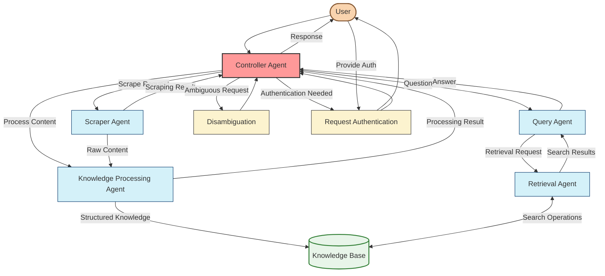
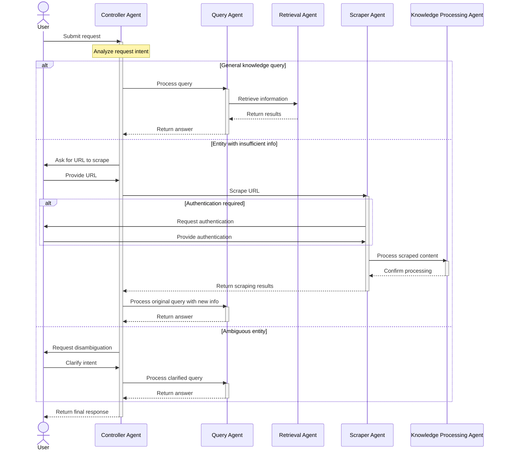

# Controller Agent

The Controller Agent serves as the master orchestrator for the multi-agent system. It receives all user requests, determines the appropriate processing workflow, coordinates between specialized agents, and manages disambiguation when needed.

> **Implementation Phase:** This agent is central to the system architecture and coordinates the workflows defined in all other agent phases.

## Workflow Diagram



## Decision Flow Diagram



## Controller Agent Workflow as Markdown Text

```
                        ┌────────────────────────────────────────────────────┐
                        │        🤖 CONTROLLER AGENT WORKFLOW 🤖             │
                        └────────────────────────────────────────────────────┘
                                                 │
                                                 ▼
┌────────────────────────────────────────────────────────────────────────────────────────────────┐
│                              🧠 REQUEST ANALYSIS 🧠                                            │
│                                                                                                │
│  ┌────────────────────────────────────────────────────────────────────────────────────┐        │
│  │                        📊 Analyze User Intent                                       │        │
│  │                                                                                    │        │
│  │  • 🔍 Identify request type (question, scraping request, hybrid)                   │        │
│  │  • 👤 Extract entity mentions and check knowledge coverage                         │        │
│  │  • 📏 Calculate confidence score for intent classification                         │        │
│  │  • 🧩 Determine if disambiguation is needed                                        │        │
│  └────────────────────────────────────────────────────────────────────────────────────┘        │
└────────────────────────────────────────────────────────────────────────────────────────────────┘
                                                 │
                                                 ▼
┌────────────────────────────────────────────────────────────────────────────────────────────────┐
│                              🧩 DECISION PROCESSING 🧩                                         │
│                                                                                                │
│  ┌────────────────────────────────────────────────────────────────────────────────────┐        │
│  │                       🔀 Route Request                                              │        │
│  │                                                                                    │        │
│  │  • 🗺️ Select appropriate agent(s) to handle request                                │        │
│  │  • 📋 Prepare necessary context for selected agent(s)                              │        │
│  │  • 🔄 Determine if workflow involves multiple agents                               │        │
│  └────────────────────────────────────────────────────────────────────────────────────┘        │
│                                            │                                                   │
│                                            ▼                                                   │
│  ┌────────────────────────────────────────────────────────────────────────────────────┐        │
│  │                       🔍 Handle Ambiguity                                           │        │
│  │                                                                                    │        │
│  │  • ❓ Detect ambiguous entities or intents                                         │        │
│  │  • 📝 Generate disambiguation options                                              │        │
│  │  • 🔄 Process user clarification                                                   │        │
│  └────────────────────────────────────────────────────────────────────────────────────┘        │
└────────────────────────────────────────────────────────────────────────────────────────────────┘
                                                 │
                                                 ▼
┌────────────────────────────────────────────────────────────────────────────────────────────────┐
│                            🔄 WORKFLOW ORCHESTRATION 🔄                                        │
│                                                                                                │
│  ┌────────────────────────────────────────────────────────────────────────────────────┐        │
│  │                       🚀 Coordinate Agents                                          │        │
│  │                                                                                    │        │
│  │  • 📤 Dispatch requests to appropriate agents                                      │        │
│  │  • 🔄 Manage agent communication                                                   │        │
│  │  • 📊 Track workflow progress                                                      │        │
│  │  • 🔍 Handle exceptions and errors                                                 │        │
│  └────────────────────────────────────────────────────────────────────────────────────┘        │
│                                            │                                                   │
│                                            ▼                                                   │
│  ┌────────────────────────────────────────────────────────────────────────────────────┐        │
│  │                      🔐 Manage Authentication                                       │        │
│  │                                                                                    │        │
│  │  • 🚪 Detect authentication requirements                                           │        │
│  │  • 📱 Request user authentication when needed                                      │        │
│  │  • 🔑 Securely pass credentials to agents                                          │        │
│  │  • 🔄 Handle authentication failures                                               │        │
│  └────────────────────────────────────────────────────────────────────────────────────┘        │
└────────────────────────────────────────────────────────────────────────────────────────────────┘
                                                 │
                                                 ▼
┌────────────────────────────────────────────────────────────────────────────────────────────────┐
│                              📋 RESPONSE MANAGEMENT 📋                                         │
│                                                                                                │
│  ┌────────────────────────────────────────────────────────────────────────────────────┐        │
│  │                      📝 Process Agent Responses                                     │        │
│  │                                                                                    │        │
│  │  • 🔄 Consolidate responses from multiple agents                                   │        │
│  │  • 📊 Ensure response quality and completeness                                     │        │
│  │  • 🧩 Format final response for user                                               │        │
│  └────────────────────────────────────────────────────────────────────────────────────┘        │
│                                            │                                                   │
│                                            ▼                                                   │
│  ┌────────────────────────────────────────────────────────────────────────────────────┐        │
│  │                     📋 Update Memory                                                │        │
│  │                                                                                    │        │
│  │  • 💾 Update conversation history                                                  │        │
│  │  • 🧠 Track entities and user preferences                                          │        │
│  │  • 📊 Record workflow performance metrics                                          │        │
│  └────────────────────────────────────────────────────────────────────────────────────┘        │
└────────────────────────────────────────────────────────────────────────────────────────────────┘
                                                 │
                                                 ▼
                        ┌────────────────────────────────────────────────────┐
                        │              ✅ FINAL RESPONSE ✅                   │
                        │                                                    │
                        │  • 📄 Send formatted response to user              │
                        │  • 🔄 Prepare for next interaction                 │
                        └────────────────────────────────────────────────────┘
```

## Decision Tree

```
┌───────────────────────────────────────────────────────────────────────────┐
│                          CONTROLLER AGENT DECISION TREE                    │
├───────────────────────────────────────────────────────────────────────────┤
│                                                                           │
│  ├─ Is this a QUESTION?                                                   │
│  │  ├─ YES                                                                │
│  │  │  ├─ Do we have sufficient information?                              │
│  │  │  │  ├─ YES → Route to Query Agent                                   │
│  │  │  │  └─ NO → Ask user for more information or URL to scrape          │
│  │  │  │                                                                  │
│  │  │  └─ Is entity ambiguous?                                            │
│  │  │     ├─ YES → Present disambiguation options                         │
│  │  │     └─ NO → Proceed with query                                      │
│  │  │                                                                     │
│  │  └─ NO                                                                 │
│  │                                                                        │
│  ├─ Is this a SCRAPING request?                                           │
│  │  ├─ YES                                                                │
│  │  │  ├─ Is URL provided?                                                │
│  │  │  │  ├─ YES → Route to Scraper Agent                                 │
│  │  │  │  └─ NO → Ask user for URL                                        │
│  │  │  │                                                                  │
│  │  │  └─ Will authentication be needed?                                  │
│  │  │     ├─ YES → Prepare for human authentication                       │
│  │  │     └─ NO → Proceed with scraping                                   │
│  │  │                                                                     │
│  │  └─ NO                                                                 │
│  │                                                                        │
│  └─ Is this a HYBRID request?                                             │
│     ├─ YES → Plan multi-agent workflow                                    │
│     └─ NO → Request clarification from user                               │
│                                                                           │
└───────────────────────────────────────────────────────────────────────────┘
``` 