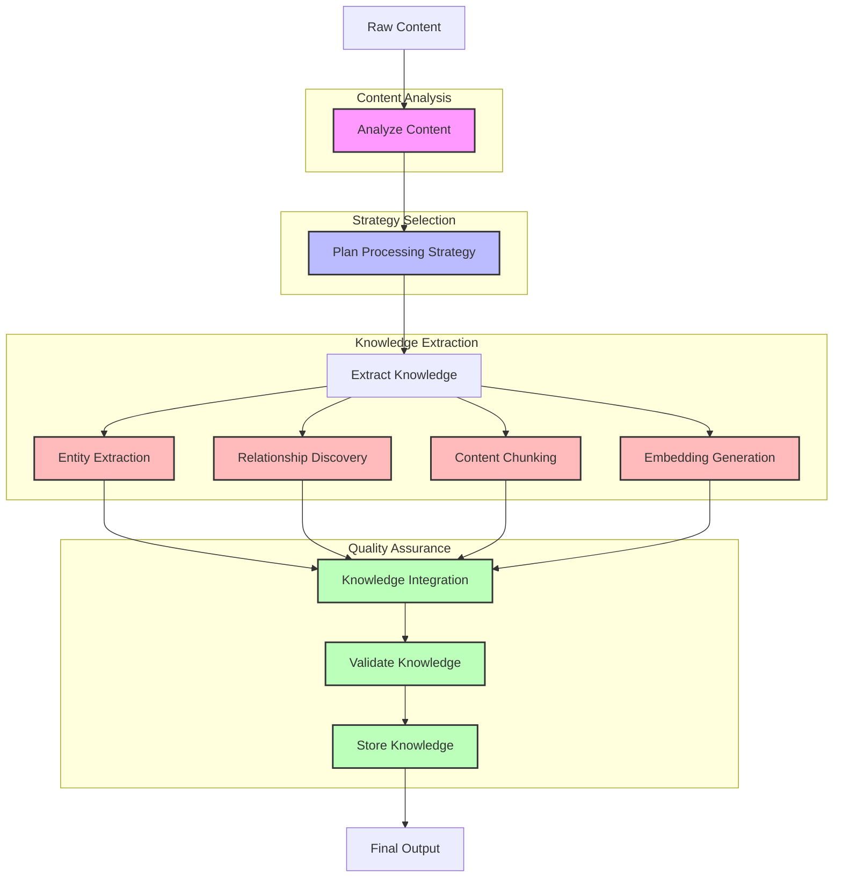

# Knowledge Processing Agent

The Knowledge Processing Agent transforms raw web content into structured, interconnected knowledge using content-adaptive processing. It analyzes content type and characteristics to determine optimal processing strategies for each piece of content.

> **Implementation Phase:** This agent is part of [Phase 4: Knowledge Processing Agent](../../../ideas/phases/phase4-knowledge-processing-agent.md) in the project implementation roadmap.

## Workflow Diagram



## Workflow as Markdown Text

```
                        ┌────────────────────────────────────────────────────┐
                        │    🤖 KNOWLEDGE PROCESSING AGENT WORKFLOW 🤖       │
                        └────────────────────────────────────────────────────┘
                                                 │
                                                 ▼
                        ┌────────────────────────────────────────────────────┐
                        │               🔍 RAW CONTENT 🔍                    │
                        └────────────────────────────────────────────────────┘
                                                 │
                                                 ▼
┌────────────────────────────────────────────────────────────────────────────────────────────────┐
│                                🧠 CONTENT ANALYSIS 🧠                                          │
│                                                                                                │
│  ┌────────────────────────────────────────────────────────────────────────────────────┐        │
│  │                        📊 Analyze Content                                           │        │
│  │                                                                                    │        │
│  │  • 📄 Identify content type (webpage, document, structured data)                   │        │
│  │  • 🏗️ Determine content structure                                                 │        │
│  │  • 🔍 Detect domain and topic                                                      │        │
│  │  • 📏 Assess content complexity                                                    │        │
│  │  • 📊 Evaluate information density                                                 │        │
│  └────────────────────────────────────────────────────────────────────────────────────┘        │
└────────────────────────────────────────────────────────────────────────────────────────────────┘
                                                 │
                                                 ▼
┌────────────────────────────────────────────────────────────────────────────────────────────────┐
│                                🧩 STRATEGY SELECTION 🧩                                        │
│                                                                                                │
│  ┌────────────────────────────────────────────────────────────────────────────────────┐        │
│  │                       🔀 Plan Processing Strategy                                   │        │
│  │                                                                                    │        │
│  │  • 📋 Select processing techniques                                                 │        │
│  │  • 📊 Determine chunking strategy                                                  │        │
│  │  • 👤 Choose entity extraction approach                                            │        │
│  │  • 🔄 Define relationship discovery method                                         │        │
│  │  • 📈 Select embedding model                                                       │        │
│  └────────────────────────────────────────────────────────────────────────────────────┘        │
└────────────────────────────────────────────────────────────────────────────────────────────────┘
                                                 │
                                                 ▼
┌────────────────────────────────────────────────────────────────────────────────────────────────┐
│                             🔍 KNOWLEDGE EXTRACTION 🔍                                         │
│                                                                                                │
│  ┌──────────────────────┐  ┌──────────────────────┐  ┌──────────────────────┐  ┌──────────────────────┐  │
│  │  👤 Entity           │  │  🔗 Relationship     │  │  📋 Content          │  │  📊 Embedding        │  │
│  │  Extraction          │  │  Discovery           │  │  Chunking            │  │  Generation          │  │
│  │                      │  │                      │  │                      │  │                      │  │
│  │  • 🧍 People         │  │  • 🔄 Connections    │  │  • ✂️ Semantic       │  │  • 🔢 Vector        │  │
│  │  • 🏢 Organizations  │  │  • 🔀 Hierarchies    │  │    division          │  │    creation          │  │
│  │  • 💡 Concepts       │  │  • 🧩 Properties     │  │  • 🧩 Optimal size   │  │  • 📊 Dimensional    │  │
│  │  • 📦 Products       │  │  • 📊 Strengths      │  │  • 🔄 Overlapping    │  │    reduction         │  │
│  └──────────┬───────────┘  └──────────┬───────────┘  └──────────┬───────────┘  └──────────┬───────────┘  │
│             │                         │                         │                         │              │
└─────────────┼─────────────────────────┼─────────────────────────┼─────────────────────────┼──────────────┘
              │                         │                         │                         │
              └─────────────────────────┴─────────────────────────┴─────────────────────────┘
                                                 │
                                                 ▼
┌────────────────────────────────────────────────────────────────────────────────────────────────┐
│                                📋 QUALITY ASSURANCE 📋                                         │
│                                                                                                │
│  ┌────────────────────────────────────────────────────────────────────────────────────┐        │
│  │                      🔄 Knowledge Integration                                       │        │
│  │                                                                                    │        │
│  │  • 🔄 Merge with existing knowledge                                                │        │
│  │  • 🧩 Connect related entities                                                     │        │
│  │  • 🔗 Establish relationships                                                      │        │
│  │  • 📋 Link chunks to entities                                                      │        │
│  └────────────────────────────────────────────────────────────────────────────────────┘        │
│                                            │                                                   │
│                                            ▼                                                   │
│  ┌────────────────────────────────────────────────────────────────────────────────────┐        │
│  │                     ⚖️ Validate Knowledge                                           │        │
│  │                                                                                    │        │
│  │  • ✅ Check consistency                                                            │        │
│  │  • 📊 Assess completeness                                                          │        │
│  │  • 🎯 Verify accuracy                                                              │        │
│  │  • 🚩 Flag low-confidence data                                                     │        │
│  └────────────────────────────────────────────────────────────────────────────────────┘        │
│                                            │                                                   │
│                                            ▼                                                   │
│  ┌────────────────────────────────────────────────────────────────────────────────────┐        │
│  │                    💾 Store Knowledge                                               │        │
│  │                                                                                    │        │
│  │  • 📊 Store embeddings in vector DB                                                │        │
│  │  • 🔗 Save relationships in graph DB                                               │        │
│  │  • 📄 Archive original content                                                     │        │
│  │  • 📝 Preserve metadata and attribution                                            │        │
│  └────────────────────────────────────────────────────────────────────────────────────┘        │
└────────────────────────────────────────────────────────────────────────────────────────────────┘
                                                 │
                                                 ▼
                        ┌────────────────────────────────────────────────────┐
                        │              ✅ FINAL OUTPUT ✅                     │
                        │                                                    │
                        │  • 👤 Structured entities                          │
                        │  • 🔗 Mapped relationships                         │
                        │  • 📋 Semantic chunks                              │
                        │  • 📊 Vector embeddings                            │
                        └────────────────────────────────────────────────────┘
```

## Knowledge Processing Flow

1. **Analysis Phase** 🧠:
   - The agent receives raw content (webpage, document, text) and analyzes its characteristics
   - It identifies content type, structure, domain, and complexity
   - This analysis informs the optimal processing approach for maximum knowledge extraction

2. **Strategy Planning** 🧩:
   - Based on content analysis, the agent selects appropriate processing techniques
   - It determines the optimal chunking strategy for the specific content
   - It plans which extraction techniques will yield the most valuable knowledge

3. **Knowledge Extraction** 🔍:
   - The agent applies multiple extraction techniques:
     - Entity Extraction: Identifies people, organizations, concepts, etc.
     - Relationship Discovery: Maps connections between entities
     - Content Chunking: Divides content into semantically meaningful units
     - Embedding Generation: Creates vector representations for semantic search

4. **Knowledge Integration** 🔄:
   - Extracted knowledge is integrated into the existing knowledge base
   - New entities are merged with existing ones when they represent the same concept
   - Relationships between entities are established or strengthened
   - Content chunks are linked to entities they reference

5. **Validation** ⚖️:
   - The agent verifies the quality of extracted knowledge
   - It checks for consistency with existing knowledge
   - It assesses completeness and accuracy of extraction
   - It flags low-confidence information for human review

6. **Storage** 💾:
   - Processed knowledge is stored in appropriate database structures:
     - Vector database for embeddings
     - Graph database for relationships
     - Document database for original content
     - Metadata for attribution and tracking

## Usage

```typescript
import { KnowledgeProcessingAgent } from './lib/agents/knowledge-processing';

// Create a new knowledge processing agent
const agent = new KnowledgeProcessingAgent();

// Process a webpage
const result = await agent.processContent({
  content: "<html>...</html>",
  contentType: "html",
  source: "https://example.com/article",
  metadata: {
    author: "John Doe",
    publishDate: "2023-05-15"
  }
});

// Process a batch of content
const batchResults = await agent.processBatch([
  { content: "...", contentType: "text", source: "doc1.txt" },
  { content: "...", contentType: "markdown", source: "doc2.md" }
]);

// Process with custom extraction options
const customResult = await agent.processContent({
  content: "...",
  contentType: "pdf",
  source: "whitepaper.pdf",
  options: {
    entityTypes: ["organization", "technology", "product"],
    chunkSize: 500,
    overlapSize: 50,
    extractRelationships: true
  }
});
```

### Implementation with LangGraph

The Knowledge Processing Agent is implemented using LangGraph for state management and workflow orchestration:

```typescript
const knowledgeWorkflow = new StateGraph<KnowledgeAgentState>({
  channels: {
    contentAnalysis: new Channel(),
    extractedEntities: new Channel(),
    relationships: new Channel()
  }
})
  .addNode("analyzeContent", analyzeContentType)
  .addNode("cleanNormalize", cleanAndNormalizeContent)
  .addNode("extractEntities", identifyEntities)
  .addNode("buildRelationships", discoverRelationships)
  .addNode("createEmbeddings", generateEmbeddings)
  .addNode("indexContent", storeInKnowledgeBase)
  .addNode("validateKnowledge", validateKnowledgeIntegration)
  
  .addEdge("analyzeContent", "cleanNormalize")
  .addEdge("cleanNormalize", "extractEntities")
  .addEdge("extractEntities", "buildRelationships")
  .addEdge("buildRelationships", "createEmbeddings")
  .addEdge("createEmbeddings", "indexContent")
  .addEdge("indexContent", "validateKnowledge")
  .addEdge("validateKnowledge", "FINAL");

// Example usage in API route
export async function POST(req: Request) {
  const { content, contentType, source, metadata, options } = await req.json();
  
  try {
    const agent = new KnowledgeProcessingAgent();
    const result = await agent.processContent({
      content,
      contentType,
      source,
      metadata,
      options
    });
    
    return Response.json({ success: true, result });
  } catch (error) {
    console.error("Processing error:", error);
    return Response.json({ success: false, error: error.message }, { status: 500 });
  }
}
```

### Integration with Enhanced Database Schema

The agent works with an enhanced database schema for knowledge storage:

```typescript
// Database models reflecting the enhanced schema
interface Entity {
  id: string;
  name: string;
  type: string;
  properties: Record<string, any>;
  sources: string[];
  embedding?: number[];
  confidence: number;
}

interface Relationship {
  id: string;
  sourceId: string;
  targetId: string;
  type: string;
  properties: Record<string, any>;
  confidence: number;
}

// Database operations
async function storeEntity(entity: Entity): Promise<string> {
  const { data, error } = await supabaseClient
    .from('entities')
    .insert({
      name: entity.name,
      type: entity.type,
      properties: entity.properties,
      sources: entity.sources,
      embedding: entity.embedding
    })
    .select('id')
    .single();
    
  if (error) throw error;
  return data.id;
}
```

## Response Structure

The agent returns a structured response containing:

```typescript
interface ProcessingResponse {
  entities: {
    id: string;                 // Unique entity identifier
    name: string;               // Entity name
    type: string;               // Entity type (person, org, concept, etc.)
    attributes: Record<string, any>; // Additional entity properties
    confidence: number;         // Confidence score (0-1)
    sourceLocations: {          // Where in the content the entity was found
      startChar: number;
      endChar: number;
      context: string;
    }[];
  }[];
  relationships: {
    source: string;             // Source entity ID
    target: string;             // Target entity ID
    type: string;               // Relationship type
    attributes: Record<string, any>; // Additional relationship properties
    confidence: number;         // Confidence score (0-1)
    sourceLocations: {          // Where in the content the relationship was found
      startChar: number;
      endChar: number;
      context: string;
    }[];
  }[];
  chunks: {
    id: string;                 // Chunk identifier
    content: string;            // Text content
    embedding: number[];        // Vector embedding
    metadata: {
      source: string;           // Original source
      startChar: number;        // Position in original content
      endChar: number;
      entities: string[];       // Referenced entity IDs
    };
  }[];
  metadata: {
    processingTime: number;     // Time taken to process
    contentLength: number;      // Original content length
    contentType: string;        // Type of content processed
    extractionQuality: number;  // Overall quality score (0-1)
  };
}
``` 