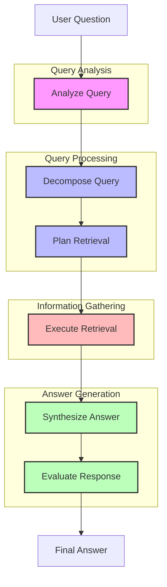

# Query Agent

The Query Agent translates natural language questions into effective knowledge base queries by understanding semantic intent. It analyzes query complexity and decomposes complex queries into logical sub-questions with dependencies, planning optimal retrieval strategies for each component.

> **Implementation Phase:** This agent is part of [Phase 3: Query Agent](../../../ideas/phases/phase3-query-agent.md) in the project implementation roadmap.

## Workflow Diagram



## Workflow as Markdown Text

```
                        ┌────────────────────────────────────────────────────┐
                        │           🤖 QUERY AGENT WORKFLOW 🤖               │
                        └────────────────────────────────────────────────────┘
                                                 │
                                                 ▼
                        ┌────────────────────────────────────────────────────┐
                        │             🔍 USER QUESTION 🔍                    │
                        └────────────────────────────────────────────────────┘
                                                 │
                                                 ▼
┌────────────────────────────────────────────────────────────────────────────────────────────────┐
│                                🧠 QUERY ANALYSIS 🧠                                           │
│                                                                                                │
│  ┌────────────────────────────────────────────────────────────────────────────────────┐        │
│  │                        📊 Analyze Query                                             │        │
│  │                                                                                    │        │
│  │  • 🎯 Identify query intent (informational, navigational, transactional)           │        │
│  │  • 🔤 Extract main topics and concepts                                             │        │
│  │  • 👤 Recognize entity references                                                  │        │
│  │  • ⏱️ Identify temporal aspects                                                    │        │
│  │  • 📏 Calculate complexity score                                                   │        │
│  └────────────────────────────────────────────────────────────────────────────────────┘        │
└────────────────────────────────────────────────────────────────────────────────────────────────┘
                                                 │
                                                 ▼
┌────────────────────────────────────────────────────────────────────────────────────────────────┐
│                                🧩 QUERY PROCESSING 🧩                                          │
│                                                                                                │
│  ┌────────────────────────────────────────────────────────────────────────────────────┐        │
│  │                       🔀 Decompose Query                                            │        │
│  │                                                                                    │        │
│  │  • 📋 Break complex queries into simpler sub-questions                             │        │
│  │  • 🔄 Establish dependencies between sub-questions                                 │        │
│  │  • 🧮 Determine processing order                                                   │        │
│  └────────────────────────────────────────────────────────────────────────────────────┘        │
│                                            │                                                   │
│                                            ▼                                                   │
│  ┌────────────────────────────────────────────────────────────────────────────────────┐        │
│  │                       📝 Plan Retrieval                                             │        │
│  │                                                                                    │        │
│  │  • 🔍 Select optimal retrieval strategies                                          │        │
│  │  • 🏷️ Define filters and constraints                                              │        │
│  │  • 📁 Identify required knowledge sources                                          │        │
│  └────────────────────────────────────────────────────────────────────────────────────┘        │
└────────────────────────────────────────────────────────────────────────────────────────────────┘
                                                 │
                                                 ▼
┌────────────────────────────────────────────────────────────────────────────────────────────────┐
│                            🔄 INFORMATION GATHERING 🔄                                         │
│                                                                                                │
│  ┌────────────────────────────────────────────────────────────────────────────────────┐        │
│  │                       🔎 Execute Retrieval                                          │        │
│  │                                                                                    │        │
│  │  • 🤝 Coordinate with Retrieval Agent                                              │        │
│  │  • 📚 Process sub-questions in dependency order                                    │        │
│  │  • 📊 Collect and organize retrieved information                                   │        │
│  └────────────────────────────────────────────────────────────────────────────────────┘        │
└────────────────────────────────────────────────────────────────────────────────────────────────┘
                                                 │
                                                 ▼
┌────────────────────────────────────────────────────────────────────────────────────────────────┐
│                              📋 ANSWER GENERATION 📋                                           │
│                                                                                                │
│  ┌────────────────────────────────────────────────────────────────────────────────────┐        │
│  │                      📝 Synthesize Answer                                           │        │
│  │                                                                                    │        │
│  │  • 🔄 Compile information into coherent answer                                     │        │
│  │  • ⚖️ Resolve conflicts between sources                                            │        │
│  │  • 📚 Include citations for information sources                                    │        │
│  │  • 🔄 Generate follow-up questions                                                 │        │
│  └────────────────────────────────────────────────────────────────────────────────────┘        │
│                                            │                                                   │
│                                            ▼                                                   │
│  ┌────────────────────────────────────────────────────────────────────────────────────┐        │
│  │                     ⭐ Evaluate Response                                            │        │
│  │                                                                                    │        │
│  │  • ✅ Assess completeness of answer                                                │        │
│  │  • 🎯 Verify accuracy of information                                               │        │
│  │  • 📊 Check clarity of explanation                                                 │        │
│  │  • 🏷️ Validate citation quality                                                   │        │
│  └────────────────────────────────────────────────────────────────────────────────────┘        │
└────────────────────────────────────────────────────────────────────────────────────────────────┘
                                                 │
                                                 ▼
                        ┌────────────────────────────────────────────────────┐
                        │              ✅ FINAL ANSWER ✅                     │
                        │                                                    │
                        │  • 📄 Comprehensive answer text                    │
                        │  • 📚 Source citations                             │
                        │  • 📊 Confidence metrics                           │
                        │  • ❓ Follow-up question suggestions               │
                        └────────────────────────────────────────────────────┘
```

## Query Agent Flow

1. **Analysis Phase** 🧠:
   - The agent receives a natural language query and analyzes it to identify intent, topics, entities, complexity, and temporal aspects
   - This analysis determines whether the query needs to be decomposed or can be processed directly

2. **Decomposition Phase** 🧩:
   - For complex queries, the agent breaks them down into simpler sub-questions
   - It establishes dependencies between sub-questions to determine processing order
   - Each sub-question is analyzed to determine the appropriate retrieval strategy

3. **Retrieval Planning** 📝:
   - The agent creates a detailed plan for retrieving information
   - It selects optimal retrieval strategies based on query characteristics
   - Filters and constraints are defined to narrow search scope

4. **Retrieval Execution** 🔄:
   - The agent coordinates with the Retrieval Agent to gather required information
   - For decomposed queries, it processes sub-questions in the correct dependency order
   - It collects and organizes all retrieved information

5. **Answer Synthesis** 📋:
   - The agent compiles retrieved information into a coherent answer
   - It resolves conflicts between different information sources
   - Citations are included to attribute information to original sources

6. **Response Evaluation** ⭐:
   - The quality of the answer is evaluated for:
     - Completeness: How thoroughly the question is answered
     - Accuracy: How correct the information is
     - Clarity: How well the answer is expressed
     - Citations: How well sources are attributed

## Usage

```typescript
import { QueryAgent } from './lib/agents/query';

// Create a new query agent
const agent = new QueryAgent();

// Process a simple question
const answer = await agent.processQuery("What are the key features of our product?");

// Process a complex question with context
const detailedAnswer = await agent.processQuery(
  "How do our product features compare to competitors in terms of performance and price?", 
  { 
    includeContext: true,
    requireCitations: true
  }
);

// Stream an answer as it's generated
await agent.streamAnswer(
  "What customer feedback did we receive last quarter?",
  {}, // Optional parameters
  async (chunk) => {
    // Handle streamed chunks
    console.log(chunk);
  }
);
```

### Implementation with LangGraph

This agent is implemented using LangGraph for state management and workflow orchestration:

```typescript
const queryWorkflow = new StateGraph<QueryAgentState>({
  channels: {
    queryAnalysis: new Channel(),
    subQueries: new Channel(),
    retrievalPlan: new Channel(),
    retrievedInfo: new Channel()
  }
})
  .addNode("analyzeQuery", analyzeQueryIntent)
  .addNode("decomposeQuery", breakDownComplexQuery)
  .addNode("planRetrieval", createRetrievalStrategy)
  .addNode("executeRetrieval", retrieveInformation)
  .addNode("synthesizeAnswer", generateComprehensiveAnswer)
  .addNode("evaluateResponse", assessAnswerQuality)
  
  .addEdge("analyzeQuery", "decomposeQuery")
  .addEdge("decomposeQuery", "planRetrieval")
  .addEdge("planRetrieval", "executeRetrieval")
  .addEdge("executeRetrieval", "synthesizeAnswer")
  .addEdge("synthesizeAnswer", "evaluateResponse")
  .addEdge("evaluateResponse", "FINAL");

const queryProcessor = queryWorkflow.compile();

// Use in an API endpoint
export async function POST(req: Request) {
  const { query, options } = await req.json();
  
  const result = await queryProcessor.invoke({
    rawQuery: query,
    conversationHistory: options?.history || [],
  });
  
  return Response.json(result.generatedAnswer);
}
```

## Response Structure

The agent returns a structured response containing:

```typescript
interface QueryResponse {
  answer: string;                 // Formatted answer text
  citations: Citation[];          // Source citations
  confidence: number;             // Confidence score (0-1)
  subQuestions?: {                // For decomposed queries
    question: string;
    answer: string;
    citations: Citation[];
  }[];
  followupQuestions?: string[];   // Suggested follow-up questions
  metadata: {
    processingTime: number;       // Time taken to process query
    retrievalMethods: string[];   // Retrieval methods used
    sourceCount: number;          // Number of sources used
  };
}
``` 