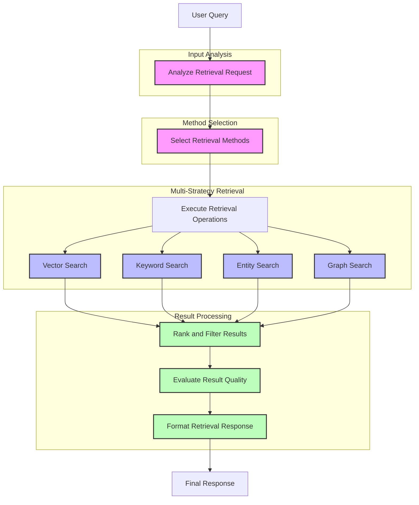

# Retrieval Agent

The Retrieval Agent is a sophisticated component that enables intelligent, multi-strategy information retrieval from various knowledge sources. It analyzes user queries to determine the most effective retrieval methods and combines results for comprehensive answers.

> **Implementation Phase:** This agent is part of [Phase 2: Retrieval Agent](../../../ideas/phases/phase2-retrieval-agent.md) in the project implementation roadmap.

## Workflow Diagram



## Workflow as Markdown Text

```
                        ┌────────────────────────────────────────────────────┐
                        │         🤖 RETRIEVAL AGENT WORKFLOW 🤖             │
                        └────────────────────────────────────────────────────┘
                                                 │
                                                 ▼
                        ┌────────────────────────────────────────────────────┐
                        │                🔍 USER QUERY 🔍                    │
                        └────────────────────────────────────────────────────┘
                                                 │
                                                 ▼
┌────────────────────────────────────────────────────────────────────────────────────────────────┐
│                                🧠 INPUT ANALYSIS 🧠                                           │
│                                                                                                │
│  ┌────────────────────────────────────────────────────────────────────────────────────┐        │
│  │                        📊 Analyze Retrieval Request                                 │        │
│  │                                                                                    │        │
│  │  • 👤 Identify entity types (people, companies, concepts)                          │        │
│  │  • 💡 Extract semantic aspects (information being sought)                          │        │
│  │  • 🏗️ Determine structural needs (hierarchical, relational, flat)                  │        │
│  │  • 📈 Calculate complexity score (1-10)                                            │        │
│  └────────────────────────────────────────────────────────────────────────────────────┘        │
└────────────────────────────────────────────────────────────────────────────────────────────────┘
                                                 │
                                                 ▼
┌────────────────────────────────────────────────────────────────────────────────────────────────┐
│                                🧩 METHOD SELECTION 🧩                                          │
│                                                                                                │
│  ┌────────────────────────────────────────────────────────────────────────────────────┐        │
│  │                       🔀 Select Retrieval Methods                                   │        │
│  │                                                                                    │        │
│  │  • 🏅 Assign priority to each method                                               │        │
│  │  • 📝 Choose methods based on query analysis                                       │        │
│  └────────────────────────────────────────────────────────────────────────────────────┘        │
└────────────────────────────────────────────────────────────────────────────────────────────────┘
                                                 │
                                                 ▼
┌────────────────────────────────────────────────────────────────────────────────────────────────┐
│                             🔄 MULTI-STRATEGY RETRIEVAL 🔄                                     │
│                                                                                                │
│  ┌──────────────────────┐  ┌──────────────────────┐  ┌──────────────────────┐  ┌──────────────────────┐  │
│  │  🧮 Vector Search    │  │  🔤 Keyword Search   │  │  👤 Entity Search    │  │  🕸️ Graph Search     │  │
│  │                      │  │                      │  │                      │  │                      │  │
│  │  • 🔍 Semantic       │  │  • 📌 Exact match    │  │  • 🏷️ Entity focus   │  │  • 🔗 Relationships  │  │
│  │  • 📊 Embeddings     │  │  • 📊 Term freq      │  │  • 🧩 Type filter    │  │  • 🌐 Graph paths    │  │
│  │  • 📏 Similarity     │  │  • 🔠 Tokens         │  │  • 📛 Named entity   │  │  • 🛣️ Path discover  │  │
│  └──────────┬───────────┘  └──────────┬───────────┘  └──────────┬───────────┘  └──────────┬───────────┘  │
│             │                         │                         │                         │              │
└─────────────┼─────────────────────────┼─────────────────────────┼─────────────────────────┼──────────────┘
              │                         │                         │                         │
              └─────────────────────────┴─────────────────────────┴─────────────────────────┘
                                                 │
                                                 ▼
┌────────────────────────────────────────────────────────────────────────────────────────────────┐
│                                📋 RESULT PROCESSING 📋                                         │
│                                                                                                │
│  ┌────────────────────────────────────────────────────────────────────────────────────┐        │
│  │                      🔝 Rank and Filter Results                                     │        │
│  │                                                                                    │        │
│  │  • 🔄 Consolidate from multiple sources                                            │        │
│  │  • 🗑️ Remove duplicates                                                            │        │
│  │  • 📊 Prioritize by relevance                                                      │        │
│  └────────────────────────────────────────────────────────────────────────────────────┘        │
│                                            │                                                   │
│                                            ▼                                                   │
│  ┌────────────────────────────────────────────────────────────────────────────────────┐        │
│  │                     ⭐ Evaluate Result Quality                                      │        │
│  │                                                                                    │        │
│  │  • 🎯 Calculate relevance score                                                    │        │
│  │  • 📊 Assess coverage completeness                                                 │        │
│  │  • 🔒 Determine confidence level                                                   │        │
│  └────────────────────────────────────────────────────────────────────────────────────┘        │
│                                            │                                                   │
│                                            ▼                                                   │
│  ┌────────────────────────────────────────────────────────────────────────────────────┐        │
│  │                    📝 Format Retrieval Response                                     │        │
│  │                                                                                    │        │
│  │  • 📄 Synthesize coherent answer                                                   │        │
│  │  • 🏗️ Structure results logically                                                  │        │
│  │  • 📚 Include source attribution                                                   │        │
│  └────────────────────────────────────────────────────────────────────────────────────┘        │
└────────────────────────────────────────────────────────────────────────────────────────────────┘
                                                 │
                                                 ▼
                        ┌────────────────────────────────────────────────────┐
                        │              ✅ FINAL RESPONSE ✅                   │
                        │                                                    │
                        │  • 📄 Formatted answer text                        │
                        │  • 🧩 Retrieved chunks                             │
                        │  • ⭐ Quality evaluation                           │
                        └────────────────────────────────────────────────────┘
```

## Retrieval Agent Flow

1. **Analysis Phase** 🧠:
   - The agent receives a query and analyzes it to identify entity types, semantic aspects, structural needs, and complexity
   - This analysis determines which retrieval methods will be most effective

2. **Method Selection** 🧩:
   - Based on query analysis, the agent selects from multiple retrieval methods:
     - Vector search (semantic similarity)
     - Keyword search (exact term matching)
     - Entity search (finding specific entities)
     - Graph search (relationship exploration)
   - Each method is assigned a priority level

3. **Execution Phase** 🔄:
   - The agent executes the selected retrieval methods in parallel
   - Each method returns different result types (vector results, keyword results, entity results, graph results)

4. **Processing Phase** 📋:
   - Results are ranked, filtered, and consolidated
   - Duplicate information is removed
   - Sources are tracked and attributed

5. **Evaluation Phase** ⭐:
   - The quality of results is evaluated for:
     - Relevance: How well the results match the query
     - Coverage: How comprehensively the results answer the query
     - Confidence: How reliable the information is

6. **Response Formatting** 📝:
   - Final results are organized into a coherent response
   - Results can be returned as a complete package or streamed incrementally

## Usage

```typescript
import { RetrievalAgent } from './lib/agents/retrieval';

// Create a new retrieval agent
const agent = new RetrievalAgent();

// Basic search returning just the chunks
const results = await agent.search("What are the key features of our product?");

// Full retrieval with evaluation and formatted response
const response = await agent.retrieve("How does our pricing compare to competitors?");

// Stream results as they're found
await agent.streamResults(
  "What customer feedback did we receive last quarter?",
  {}, // Optional filters
  { streamDelay: 100 }, // Options
  async (chunk) => {
    // Handle streamed chunks
    console.log(chunk);
  }
);
```

### API Integration Example

This agent can be integrated with API endpoints as shown in the implementation phase:

```typescript
// app/api/retrieve/route.ts
import { NextResponse } from "next/server";
import { RetrievalAgent } from "@/lib/agents/retrieval";

export const runtime = "edge";

export async function POST(req: Request) {
  try {
    const { query, filters, options } = await req.json();
    
    // Initialize retrieval agent
    const agent = new RetrievalAgent();
    
    // Use streaming response
    const encoder = new TextEncoder();
    const stream = new TransformStream();
    const writer = stream.writable.getWriter();
    
    // Process with agent and stream results
    agent.streamResults(query, filters, options, async (chunk) => {
      await writer.write(encoder.encode(JSON.stringify(chunk) + "\n"));
    });
    
    return new Response(stream.readable, {
      headers: {
        "Content-Type": "text/event-stream",
        "Cache-Control": "no-cache",
      },
    });
  } catch (error) {
    console.error("Retrieval error:", error);
    return NextResponse.json(
      { error: "Failed to process retrieval request" },
      { status: 500 }
    );
  }
}
```

## Response Structure

The agent returns a structured response containing:

```typescript
interface RetrievalResponse {
  content: string;           // Formatted answer text
  results: RetrievedChunk[]; // Individual retrieved chunks
  evaluation: {
    relevanceScore: number;  // How relevant the results are (0-1)
    coverageScore: number;   // How comprehensive the results are (0-1)
    confidenceScore: number; // How reliable the information is (0-1)
    feedback: string;        // Qualitative assessment of results
  };
}
``` 