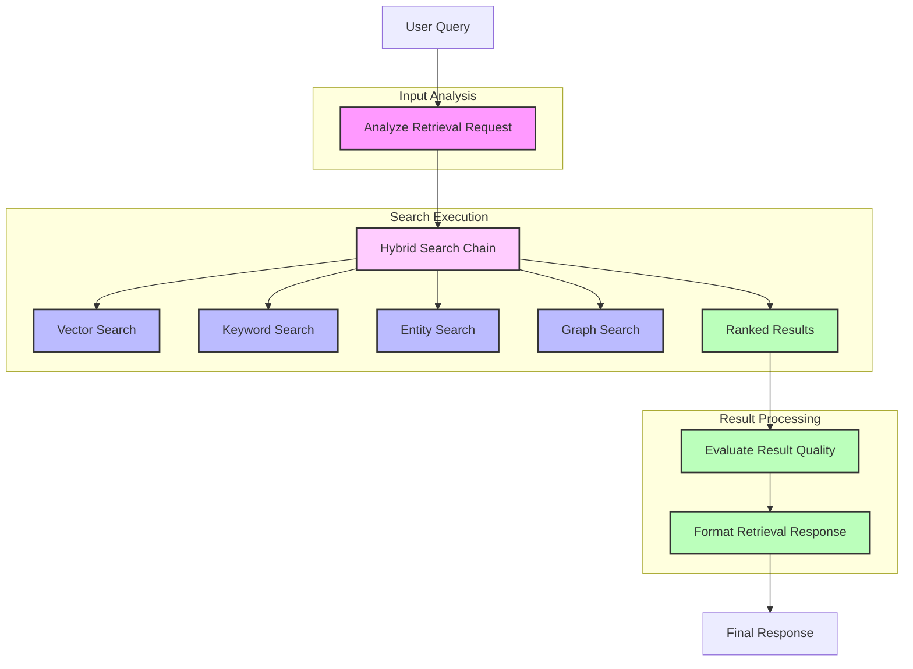

# Retrieval Agent

The Retrieval Agent is a sophisticated component that enables intelligent, multi-strategy information retrieval from various knowledge sources. It analyzes user queries to determine the most effective retrieval methods and combines results for comprehensive answers.

> **Implementation Phase:** This agent is part of [Phase 2: Retrieval Agent](../../../ideas/phases/phase2-retrieval-agent.md) in the project implementation roadmap.

## Workflow Diagram



## Workflow as Markdown Text

```
                        ┌────────────────────────────────────────────────────┐
                        │         🤖 RETRIEVAL AGENT WORKFLOW 🤖             │
                        └────────────────────────────────────────────────────┘
                                                 │
                                                 ▼
                        ┌────────────────────────────────────────────────────┐
                        │                🔍 USER QUERY 🔍                    │
                        └────────────────────────────────────────────────────┘
                                                 │
                                                 ▼
┌────────────────────────────────────────────────────────────────────────────────────────────────┐
│                                🧠 INPUT ANALYSIS 🧠                                           │
│                                                                                                │
│  ┌────────────────────────────────────────────────────────────────────────────────────┐        │
│  │                        📊 Analyze Retrieval Request                                 │        │
│  │                                                                                    │        │
│  │  • 👤 Identify entity types (people, companies, concepts)                          │        │
│  │  • 💡 Extract semantic aspects (information being sought)                          │        │
│  │  • 🏗️ Determine structural needs (hierarchical, relational, flat)                  │        │
│  │  • 📈 Calculate complexity score (1-10)                                            │        │
│  └────────────────────────────────────────────────────────────────────────────────────┘        │
└────────────────────────────────────────────────────────────────────────────────────────────────┘
                                                 │
                                                 ▼
┌────────────────────────────────────────────────────────────────────────────────────────────────┐
│                             🔄 HYBRID SEARCH CHAIN 🔄                                          │
│                                                                                                │
│  ┌────────────────────────────────────────────────────────────────────────────────────┐        │
│  │                       🧩 Intelligent Search Orchestration                           │        │
│  │                                                                                    │        │
│  │  • 🧮 Analyzes query and determines optimal search methods                         │        │
│  │  • 🏅 Assigns priority to each method                                              │        │
│  │  • 🔄 Executes search methods in parallel                                          │        │
│  │  • 🔝 Ranks and combines results                                                   │        │
│  └────────────────────────────────────────────────────────────────────────────────────┘        │
│                                                                                                │
│  ┌──────────────────────┐  ┌──────────────────────┐  ┌──────────────────────┐  ┌──────────────────────┐  │
│  │  🧮 Vector Search    │  │  🔤 Keyword Search   │  │  👤 Entity Search    │  │  🕸️ Graph Search     │  │
│  │                      │  │                      │  │                      │  │                      │  │
│  │  • 🔍 Semantic       │  │  • 📌 Exact match    │  │  • 🏷️ Entity focus   │  │  • 🔗 Relationships  │  │
│  │  • 📊 Embeddings     │  │  • 📊 Term freq      │  │  • 🧩 Type filter    │  │  • 🌐 Graph paths    │  │
│  │  • 📏 Similarity     │  │  • 🔠 Tokens         │  │  • 📛 Named entity   │  │  • 🛣️ Path discover  │  │
│  └──────────────────────┘  └──────────────────────┘  └──────────────────────┘  └──────────────────────┘  │
└────────────────────────────────────────────────────────────────────────────────────────────────────────────┘
                                                 │
                                                 ▼
┌────────────────────────────────────────────────────────────────────────────────────────────────┐
│                                📋 RESULT PROCESSING 📋                                         │
│                                                                                                │
│  ┌────────────────────────────────────────────────────────────────────────────────────┐        │
│  │                     ⭐ Evaluate Result Quality                                      │        │
│  │                                                                                    │        │
│  │  • 🎯 Calculate relevance score                                                    │        │
│  │  • 📊 Assess coverage completeness                                                 │        │
│  │  • 🔒 Determine confidence level                                                   │        │
│  └────────────────────────────────────────────────────────────────────────────────────┘        │
│                                            │                                                   │
│                                            ▼                                                   │
│  ┌────────────────────────────────────────────────────────────────────────────────────┐        │
│  │                    📝 Format Retrieval Response                                     │        │
│  │                                                                                    │        │
│  │  • 📄 Synthesize coherent answer                                                   │        │
│  │  • 🏗️ Structure results logically                                                  │        │
│  │  • 📚 Include source attribution                                                   │        │
│  └────────────────────────────────────────────────────────────────────────────────────┘        │
└────────────────────────────────────────────────────────────────────────────────────────────────┘
                                                 │
                                                 ▼
                        ┌────────────────────────────────────────────────────┐
                        │              ✅ FINAL RESPONSE ✅                   │
                        │                                                    │
                        │  • 📄 Formatted answer text                        │
                        │  • 🧩 Retrieved chunks                             │
                        │  • ⭐ Quality evaluation                           │
                        └────────────────────────────────────────────────────┘
```

## Retrieval Agent Flow

1. **Analysis Phase** 🧠:
   - The agent receives a query and analyzes it to identify entity types, semantic aspects, structural needs, and complexity
   - This analysis determines which retrieval methods will be most effective

2. **Hybrid Search Chain** 🔄:
   - The agent uses the standalone Hybrid Search Chain which:
     - Selects appropriate search methods based on the query analysis
     - Executes the selected methods (vector, keyword, entity, graph)
     - Combines and ranks results from all methods
   - This modular approach allows for better separation of concerns and reusability

3. **Evaluation Phase** ⭐:
   - The quality of results is evaluated for:
     - Relevance: How well the results match the query
     - Coverage: How comprehensively the results answer the query
     - Confidence: How reliable the information is

4. **Response Formatting** 📝:
   - Final results are organized into a coherent response
   - Results can be returned as a complete package or streamed incrementally

## Integration with Hybrid Search Chain

The Retrieval Agent is built using LangGraph and integrates with the standalone Hybrid Search Chain:

```typescript
import { RetrievalAgent } from './lib/agents/retrieval';
import { createHybridSearchChain } from './lib/chains/hybrid-search-chain';
import { StateGraph } from '@langchain/langgraph';

// Create the hybrid search chain
const hybridSearchChain = createHybridSearchChain({
  vectorStore,
  supabaseClient,
  knowledgeBase
});

// Create the retrieval workflow that uses the hybrid search chain
function createRetrievalWorkflow() {
  const workflow = new StateGraph()
    .addNode("analyzeRequest", analyzeRetrievalRequest)
    .addNode("executeSearch", async (state) => {
      // Use the hybrid search chain
      const searchResults = await hybridSearchChain.invoke({
        query: state.retrievalRequest.query,
        filters: state.retrievalRequest.filters,
        analysisOptions: {
          // Pass analysis data to help with method selection
          considerEntities: state.requestAnalysis.entityTypes.length > 0
        }
      });
      
      // Update state with search results
      return {
        rawResults: {
          // Map results by source
          vectorResults: searchResults.results.filter(r => r.source === 'vector'),
          keywordResults: searchResults.results.filter(r => r.source === 'keyword'),
          // ... other result types
        }
      };
    })
    .addNode("evaluateResults", evaluateResultQuality)
    .addNode("formatResponse", formatRetrievalResponse);
  
  // Define workflow edges
  workflow.addEdge("analyzeRequest", "executeSearch");
  workflow.addEdge("executeSearch", "evaluateResults");
  workflow.addEdge("evaluateResults", "formatResponse");
  
  return workflow.compile();
}
```

## Usage

```typescript
import { RetrievalAgent } from './lib/agents/retrieval';

// Create a new retrieval agent
const agent = new RetrievalAgent();

// Basic search returning just the chunks
const results = await agent.search("What are the key features of our product?");

// Full retrieval with evaluation and formatted response
const response = await agent.retrieve("How does our pricing compare to competitors?");

// Stream results as they're found
await agent.streamResults(
  "What customer feedback did we receive last quarter?",
  {},
  { streamDelay: 100 },
  async (chunk) => {
    // Process each chunk as it's retrieved
    console.log(chunk);
  }
);
```

## Implemented Search Methods

The Retrieval Agent currently uses the following search methods through the Hybrid Search Chain:

- ✅ **Vector Search**: Semantic search using embeddings and cosine similarity
- ✅ **Keyword Search**: Text-based search using Supabase text search capabilities
- 🚧 **Entity Search**: Search focused on structured entity data (requires Knowledge Base)
- 🚧 **Graph Search**: Search through relationship networks (requires Knowledge Base)

## Benefits of the Current Architecture

1. **Separation of Concerns**: The agent focuses on orchestration while the chain handles search execution
2. **Reusability**: The Hybrid Search Chain can be used by other components
3. **Maintainability**: Search logic can be updated independently of the agent
4. **Extensibility**: New search methods can be added to the chain without modifying the agent
5. **Testability**: Components can be tested independently 