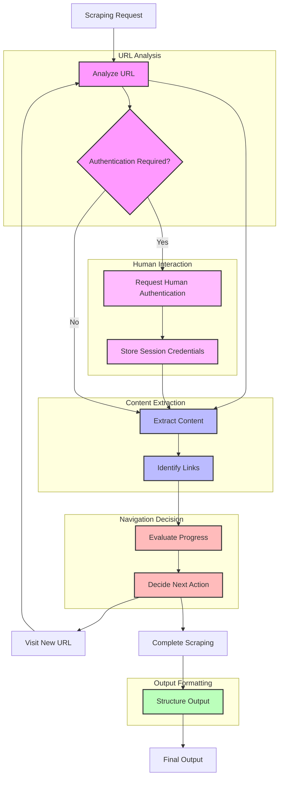

# Intelligent Scraper Agent

The Intelligent Scraper Agent makes dynamic decisions about what content to extract from websites, optimizing for value and relevance. It analyzes pages for information density and relevance, evaluates outgoing links to determine optimal navigation paths, and maintains a priority queue of URLs based on expected value.

> **Implementation Phase:** This agent is part of [Phase 5: Scraper Agent](../../../ideas/phases/phase5-scraper-agent.md) in the project implementation roadmap.

## Workflow Diagram



## Workflow as Markdown Text

```
                        ┌────────────────────────────────────────────────────┐
                        │      🤖 INTELLIGENT SCRAPER AGENT WORKFLOW 🤖      │
                        └────────────────────────────────────────────────────┘
                                                 │
                                                 ▼
                        ┌────────────────────────────────────────────────────┐
                        │             🔍 SCRAPING REQUEST 🔍                 │
                        └────────────────────────────────────────────────────┘
                                                 │
                                                 ▼
┌────────────────────────────────────────────────────────────────────────────────────────────────┐
│                                🧠 URL ANALYSIS 🧠                                              │
│                                                                                                │
│  ┌────────────────────────────────────────────────────────────────────────────────────┐        │
│  │                        📊 Analyze URL                                               │        │
│  │                                                                                    │        │
│  │  • 🌐 Determine URL relevance to goal                                              │        │
│  │  • 📋 Check domain authority and reliability                                       │        │
│  │  • 🚦 Apply robots.txt restrictions                                                │        │
│  │  • 📏 Calculate expected information value                                         │        │
│  │  • 🔄 Check if previously visited                                                  │        │
│  └────────────────────────────────────────────────────────────────────────────────────┘        │
│                                            │                                                   │
│                                            ▼                                                   │
│  ┌────────────────────────────────────────────────────────────────────────────────────┐        │
│  │                        🔐 Authentication Check                                      │        │
│  │                                                                                    │        │
│  │  • 🚪 Detect login requirements                                                    │        │
│  │  • 🔑 Check for existing session credentials                                       │        │
│  │  • 🧩 Identify authentication mechanism                                            │        │
│  │  • 🚦 Determine if human intervention needed                                       │        │
│  └────────────────────────────────────────────────────────────────────────────────────┘        │
└────────────────────────────────────────────────────────────────────────────────────────────────┘
                                                 │
                                                 ▼
┌────────────────────────────────────────────────────────────────────────────────────────────────┐
│                              👤 HUMAN INTERACTION 👤                                           │
│                                                                                                │
│  ┌────────────────────────────────────────────────────────────────────────────────────┐        │
│  │                       🔒 Request Human Authentication                               │        │
│  │                                                                                    │        │
│  │  • 📱 Notify user about authentication need                                        │        │
│  │  • 🔗 Provide secure authentication link                                           │        │
│  │  • ⏱️ Wait for authentication completion                                           │        │
│  │  • 🔄 Verify successful authentication                                             │        │
│  └────────────────────────────────────────────────────────────────────────────────────┘        │
│                                            │                                                   │
│                                            ▼                                                   │
│  ┌────────────────────────────────────────────────────────────────────────────────────┐        │
│  │                       🔑 Store Session Credentials                                  │        │
│  │                                                                                    │        │
│  │  • 🔒 Securely store cookies/tokens                                                │        │
│  │  • ⏱️ Track session expiration                                                     │        │
│  │  • 🛡️ Apply encryption for credential storage                                     │        │
│  │  • 🔄 Configure for subsequent requests                                            │        │
│  └────────────────────────────────────────────────────────────────────────────────────┘        │
└────────────────────────────────────────────────────────────────────────────────────────────────┘
                                                 │
                                                 ▼
┌────────────────────────────────────────────────────────────────────────────────────────────────┐
│                              📥 CONTENT EXTRACTION 📥                                          │
│                                                                                                │
│  ┌────────────────────────────────────────────────────────────────────────────────────┐        │
│  │                       📄 Extract Content                                            │        │
│  │                                                                                    │        │
│  │  • 🏗️ Analyze page structure                                                      │        │
│  │  • 🎯 Focus on high-value elements                                                 │        │
│  │  • 🗑️ Ignore navigation, ads, boilerplate                                         │        │
│  │  • 📋 Extract text and semantic structure                                          │        │
│  └────────────────────────────────────────────────────────────────────────────────────┘        │
│                                            │                                                   │
│                                            ▼                                                   │
│  ┌────────────────────────────────────────────────────────────────────────────────────┐        │
│  │                       🔗 Identify Links                                             │        │
│  │                                                                                    │        │
│  │  • 🔍 Discover all links on page                                                   │        │
│  │  • 📊 Analyze link context                                                         │        │
│  │  • 📈 Assign priority scores                                                       │        │
│  │  • 🧮 Add to URL priority queue                                                    │        │
│  └────────────────────────────────────────────────────────────────────────────────────┘        │
└────────────────────────────────────────────────────────────────────────────────────────────────┘
                                                 │
                                                 ▼
┌────────────────────────────────────────────────────────────────────────────────────────────────┐
│                             🧭 NAVIGATION DECISION 🧭                                          │
│                                                                                                │
│  ┌────────────────────────────────────────────────────────────────────────────────────┐        │
│  │                       📊 Evaluate Progress                                          │        │
│  │                                                                                    │        │
│  │  • 📈 Track scraping progress towards goal                                         │        │
│  │  • 📊 Calculate information density                                                │        │
│  │  • 🔄 Assess information uniqueness                                                │        │
│  │  • 📏 Estimate goal completion percentage                                          │        │
│  └────────────────────────────────────────────────────────────────────────────────────┘        │
│                                            │                                                   │
│                                            ▼                                                   │
│  ┌────────────────────────────────────────────────────────────────────────────────────┐        │
│  │                     🚀 Decide Next Action                                           │        │
│  │                                                                                    │        │
│  │  • ⚖️ Select next URL from priority queue                                          │        │
│  │  • 🛑 Determine if scraping should stop                                            │        │
│  │  • 🔄 Adjust scraping parameters if needed                                         │        │
│  │  • 📊 Update URL priority scores                                                   │        │
│  └────────────────────────────────────────────────────────────────────────────────────┘        │
└────────────────────────────────────────────────────────────────────────────────────────────────┘
                                                 │
                                                 ▼
┌────────────────────────────────────────────────────────────────────────────────────────────────┐
│                               📋 OUTPUT FORMATTING 📋                                          │
│                                                                                                │
│  ┌────────────────────────────────────────────────────────────────────────────────────┐        │
│  │                      📝 Structure Output                                            │        │
│  │                                                                                    │        │
│  │  • 🗂️ Organize scraped content                                                    │        │
│  │  • 🔗 Preserve content relationships                                               │        │
│  │  • 📋 Prepare metadata for processing                                              │        │
│  │  • 🏷️ Add source attribution                                                      │        │
│  │  • 📊 Generate scraping metrics                                                    │        │
│  └────────────────────────────────────────────────────────────────────────────────────┘        │
└────────────────────────────────────────────────────────────────────────────────────────────────┘
                                                 │
                                                 ▼
                        ┌────────────────────────────────────────────────────┐
                        │              ✅ FINAL OUTPUT ✅                     │
                        │                                                    │
                        │  • 📄 Structured content                           │
                        │  • 🔗 Link relationships                           │
                        │  • 📊 Content metrics                              │
                        │  • 🧠 Preliminary entity data                      │
                        └────────────────────────────────────────────────────┘
```

## Scraper Agent Flow

1. **URL Analysis Phase** 🔍:
   - The agent receives a starting URL and scraping goal
   - It analyzes the URL to determine relevance to the goal
   - This analysis informs initial expectations about page value
   - It detects if authentication is required to access the content

2. **Authentication Phase** 🔐 (when required):
   - The agent identifies when a site requires authentication
   - It determines the type of authentication needed (basic, form-based, OAuth, etc.)
   - If credentials are required and not available, it requests human intervention
   - After authentication, it securely stores session tokens for future requests

3. **Content Extraction** 📥:
   - The agent intelligently extracts content based on page structure
   - It focuses on high-value elements while ignoring navigation, ads, etc.
   - It extracts both text content and semantic structure

4. **Link Identification** 🔗:
   - The agent discovers links within the current page
   - It analyzes link context to predict information value
   - It assigns priority scores to each link based on expected relevance

5. **Progress Evaluation** 📊:
   - The agent tracks overall scraping progress towards the goal
   - It calculates information density and uniqueness of gathered content
   - It estimates completeness of information relative to the scraping goal

6. **Navigation Decision** 🧭:
   - Based on progress evaluation, the agent decides:
     - Which URL to visit next from the priority queue
     - Whether to continue scraping or stop (goal completion)
     - Whether to adjust scraping parameters based on findings

7. **Output Structuring** 📋:
   - The agent organizes scraped content into a coherent structure
   - It preserves relationships between content from different pages
   - It prepares metadata for knowledge processing

### Implementation with LangGraph

The agent is implemented using LangGraph for state management and workflow orchestration:

```typescript
interface ScraperAgentState {
  baseUrl: string;
  scrapingGoal: string;
  maxPages: number;
  
  currentUrl: string;
  visitedUrls: Set<string>;
  pageQueue: PriorityQueue<{
    url: string;
    expectedValue: number;
    depth: number;
  }>;
  
  extractedContent: Map<string, PageContent>;
  currentPageDOM: string;
  currentPageText: string;
  
  valueMetrics: {
    informationDensity: number;
    relevance: number;
    uniqueness: number;
    completeness: number;
  };
  
  finalOutput: ScraperOutput;
}

const scraperWorkflow = new StateGraph<ScraperAgentState>({
  channels: {
    currentUrl: new Channel(),
    extractedContent: new Channel(),
    nextActions: new Channel()
  }
})
  .addNode("analyzeURL", analyzePage)
  .addNode("checkAuthentication", detectAuthRequirements)
  .addNode("requestHumanAuth", handleAuthenticationProcess)
  .addNode("extractContent", extractContentFromPage)
  .addNode("identifyLinks", findRelevantLinks)
  .addNode("evaluateProgress", assessScrapingProgress)
  .addNode("decideNextAction", determineNextStep)
  .addNode("structureOutput", organizeExtractedData)
  
  // Define the main flow
  .addEdge("analyzeURL", "checkAuthentication")
  
  // Add conditional edge for authentication
  .addConditionalEdge(
    "checkAuthentication",
    (state) => state.requiresAuthentication ? "requestHumanAuth" : "extractContent"
  )
  .addEdge("requestHumanAuth", "extractContent")
  
  // Continue with normal flow
  .addEdge("extractContent", "identifyLinks")
  .addEdge("identifyLinks", "evaluateProgress")
  .addEdge("evaluateProgress", "decideNextAction")
  
  // Add conditional edge for completing or continuing
  .addConditionalEdge(
    "decideNextAction",
    (state) => {
      if (state.valueMetrics.completeness > 0.85 || 
          state.visitedUrls.size >= state.maxPages) {
        return "structureOutput";
      }
      return "analyzeURL";
    }
  )
  .addEdge("structureOutput", "FINAL");

// Compile the workflow
const scraperProcessor = scraperWorkflow.compile();
```

## Human-in-the-Loop Authentication

The Scraper Agent supports human-in-the-loop authentication for accessing protected content:

```typescript
interface AuthenticationConfig {
  enableHumanAuth: boolean;        // Whether to enable human authentication
  authTimeout: number;             // Timeout in seconds for waiting for human auth
  credentialStorage: {
    type: 'memory' | 'encrypted';  // How to store credentials
    encryptionKey?: string;        // Key for encrypted storage
    expiration: number;            // Credential expiration in seconds
  };
  notificationChannels: {          // How to notify users
    email?: string;
    webhook?: string;
    browserNotification?: boolean;
  };
}

interface HumanAuthRequest {
  url: string;                     // URL requiring authentication
  authType: 'basic' | 'form' | 'oauth' | 'unknown';
  formFields?: string[];           // Required fields for form authentication
  instructions?: string;           // Custom instructions for the user
  callbackUrl: string;             // Where to return after authentication
}
```

### Authentication Flow

1. **Detection**: The agent detects login pages using pattern recognition, form analysis, and response status codes.

2. **Request**: When authentication is needed, the agent generates a unique session token and creates a secure authentication portal URL.

3. **Notification**: The user is notified through configured channels (email, webhook, or browser notification).

4. **User Authentication**: The user follows the link, authenticates on the target site, and the agent captures the resulting cookies/tokens.

5. **Session Management**: The agent securely stores and manages the authentication session for subsequent requests.

### Implementation Example

```typescript
import { ScraperAgent } from './lib/agents/scraper';

// Create a scraper with human authentication
const agent = new ScraperAgent({
  humanAuthentication: {
    enableHumanAuth: true,
    authTimeout: 300, // 5 minutes
    credentialStorage: {
      type: 'encrypted',
      expiration: 86400 // 24 hours
    },
    notificationChannels: {
      email: 'user@example.com',
      browserNotification: true
    }
  }
});

// Start scraping with human auth callback
await agent.scrape({
  baseUrl: "https://example.com/members-only",
  scrapingGoal: "Gather member-only documentation",
  onAuthRequired: async (authRequest) => {
    console.log(`Authentication required at ${authRequest.url}`);
    console.log(`Authentication portal: ${authRequest.authPortalUrl}`);
    
    // Custom handling like sending a notification
    await sendAuthNotification(authRequest);
    
    // Wait for authentication to complete
    return await waitForAuthentication(authRequest.sessionToken);
  }
});
```

### Integration with Background Jobs

For authentication in background scraping jobs, the agent uses a notification and callback system:

```typescript
// In background job processing
import { scrapingQueue } from '@/utils/queue';

// Add job with authentication configuration
await scrapingQueue.add('authenticate-and-scrape', {
  baseUrl: 'https://example.com/members-only',
  scrapingGoal: 'Gather restricted content',
  maxPages: 50,
  authConfig: {
    enableHumanAuth: true,
    notificationWebhook: 'https://your-app.com/api/auth-callback',
    resumeJobOnAuth: true
  }
});

// In the API route handler for authentication callbacks
export async function POST(req: Request) {
  const { sessionToken, authResult } = await req.json();
  
  // Resume the job with the authenticated session
  await scrapingQueue.resumeJob(sessionToken, authResult);
  
  return new Response(JSON.stringify({ success: true }));
}
```

### Security Considerations

1. **Credential Encryption**: All stored credentials are encrypted at rest.
2. **Session Isolation**: Each scraping job uses isolated session contexts.
3. **Minimal Persistence**: Credentials are only stored for the required duration.
4. **Secure Transmission**: All authentication requests use secure channels.
5. **Audit Logging**: All authentication events are logged for accountability.

## Usage

```typescript
import { ScraperAgent } from './lib/agents/scraper';

// Create a new scraper agent
const agent = new ScraperAgent();

// Basic scraping with a goal
const results = await agent.scrape({
  baseUrl: "https://example.com",
  scrapingGoal: "Gather information about product features and pricing"
});

// Advanced scraping with configuration
const detailedResults = await agent.scrape({
  baseUrl: "https://example.com",
  scrapingGoal: "Collect technical specifications for all products",
  maxPages: 50,
  maxDepth: 3,
  includeImages: true,
  filters: {
    mustIncludePatterns: ["specification", "technical", "product"],
    excludePatterns: ["blog", "news", "contact"]
  }
});

// Stream results as they're found
await agent.streamScraping(
  {
    baseUrl: "https://example.com",
    scrapingGoal: "Find customer testimonials"
  },
  async (pageResult) => {
    // Handle each scraped page as it's processed
    console.log(`Scraped ${pageResult.url}`);
    console.log(`Found ${pageResult.content.length} bytes of content`);
  }
);
```

## Response Structure

The agent returns a structured response containing:

```typescript
interface ScrapingResponse {
  pages: {
    url: string;                 // Page URL
    title: string;               // Page title
    content: string;             // Extracted content
    contentType: string;         // Content type (text, html, etc.)
    extractionTime: string;      // When the page was scraped
    metrics: {
      informationDensity: number; // How much useful info (0-1)
      relevance: number;          // Relevance to goal (0-1)
      uniqueness: number;         // Information uniqueness (0-1)
    };
    links: {
      url: string;               // Discovered link
      context: string;           // Text surrounding the link
      predictedValue: number;    // Expected information value (0-1)
      visited: boolean;          // Whether this link was visited
    }[];
    entities: {                  // Preliminary entity extraction
      name: string;
      type: string;
      mentions: number;
    }[];
  }[];
  summary: {
    pagesScraped: number;        // Total pages scraped
    totalContentSize: number;    // Total content size in bytes
    executionTime: number;       // Time taken to scrape
    goalCompletion: number;      // Estimated completion of goal (0-1)
    coverageScore: number;       // Information coverage score (0-1)
  };
}
```

## Debugging Common Scraping Issues

### Common Challenges

1. **Single Page Applications (SPAs)** 🔄
   - Sites built with React, Vue, Angular, or Next.js often load content dynamically via JavaScript
   - Basic HTTP fetching may only retrieve the initial HTML shell without actual content
   - Sites like xotiv.com are SPAs that require JavaScript execution to render content

2. **CORS Restrictions** 🛡️
   - Many sites block cross-origin requests, preventing client-side fetching
   - This protection affects API calls from browsers but not server-side requests
   - CORS errors appear in browser console but not in server-side logs

3. **Authentication Requirements** 🔒
   - Some content is only available after login
   - Sites may serve limited or placeholder content to unauthenticated users
   - Authentication flows often require human interaction

4. **Rate Limiting and Bot Detection** 🤖
   - Sites may block requests that appear automated
   - Rapid sequential requests can trigger rate limiting
   - Missing or suspicious user agents can lead to blocks

### Debugging Steps

1. **Use the Debug Tab** 🛠️
   - The Debug tab in the UI provides tools to test direct URL fetching
   - This helps identify if the issue is with fetching or parsing

2. **Check Console Logs** 📋
   - Detailed logs are provided with the prefix `[BrowserInterface]`, `[ScraperAgent]`, etc.
   - Look for specific errors related to fetching, parsing, or content extraction

3. **For SPA Sites Like xotiv.com** 📱
   - Our basic fetching implementation cannot execute JavaScript
   - SPA sites require a full browser environment (Puppeteer/Playwright) to render content
   - Consider upgrading the `fetchPage` function to use a headless browser for full rendering

4. **Server vs. Client Fetching** 🖥️
   - The scraper operates server-side, avoiding CORS restrictions
   - If testing in the browser console, you may see CORS errors that don't affect the actual scraper

### Implementing a Full Browser Solution

For sites like xotiv.com, a more robust solution would involve:

```typescript
// Example of headless browser implementation (not currently implemented)
async function fetchPageWithBrowser(url: string, options = {}) {
  const browser = await puppeteer.launch();
  const page = await browser.newPage();
  
  // Set realistic browser headers
  await page.setUserAgent('Mozilla/5.0...');
  
  // Navigate and wait for content to load
  await page.goto(url, { waitUntil: 'networkidle2' });
  
  // Wait for JS execution to complete
  await page.waitForTimeout(2000);
  
  // Extract the fully rendered HTML
  const html = await page.content();
  
  await browser.close();
  return html;
}
```

### Future Improvements

The current implementation uses a simple fetch approach, which works for most static websites but has limitations with modern web applications. Future improvements will include:

1. Implementing a proper headless browser solution for JavaScript rendering
2. Adding more sophisticated authentication handling
3. Improving rate limiting detection and respect
4. Enhancing the detection of content behind paywalls or login screens 