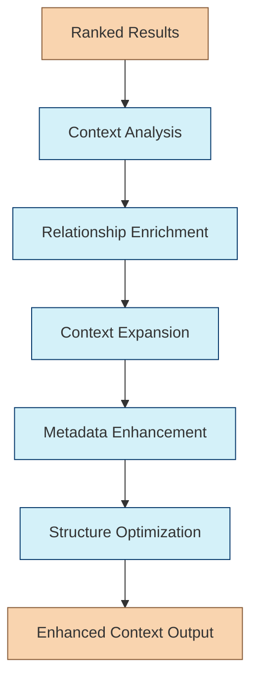

# Context Enhancement Chain

The Context Enhancement Chain enriches the ranked search results with additional context to provide more comprehensive information for answering the user's query. This is the fifth and final chain in the Retrieval Agent's workflow.

## Purpose

Raw search results often lack important context that helps make them more useful and complete. This chain:

- Adds contextual information to clarify search results
- Includes relevant metadata and source information
- Enriches entities with additional attributes and relationships
- Connects isolated information fragments into a coherent whole
- Optimizes the context for downstream language model processing

## Chain Workflow



### 1. Context Analysis

The chain first analyzes what context is missing from the ranked results:

- Identifies information gaps in the results
- Detects entity mentions that need elaboration
- Recognizes incomplete explanations or concepts
- Determines what additional context would be most valuable

### 2. Relationship Enrichment

Next, the chain identifies and adds relationship information:

- Establishes connections between entities in the results
- Adds relevant relationships from the knowledge base
- Clarifies how different results relate to each other
- Creates a network of connected information

### 3. Context Expansion

For key concepts and entities, the chain adds explanatory context:

- Expands abbreviated or technical terms
- Provides background information for domain-specific concepts
- Adds historical context where relevant
- Includes definitions for specialized terminology

### 4. Metadata Enhancement

The chain enriches results with valuable metadata:

- Adds source credibility and recency information
- Includes author expertise when available
- Provides timestamps and version information
- Incorporates any available citations or references

### 5. Structure Optimization

Finally, the chain optimizes the structure of the enhanced context:

- Arranges information in logical order
- Groups related information together
- Formats content for optimal language model processing
- Balances context completeness with conciseness

## Implementation

```typescript
export interface ContextEnhancementInput {
  query: string;
  results: RankedResult[];  // From Result Ranking Chain
  conversationHistory?: ConversationMessage[];  // Optional conversation context
}

export interface EnhancedContext {
  content: string;  // Enhanced content text
  entities: {
    name: string;
    type: string;
    description: string;
    attributes: Record<string, any>;
    relationships: {
      entity: string;
      type: string;
      description: string;
    }[];
  }[];
  sources: {
    title: string;
    url?: string;
    author?: string;
    publishDate?: string;
    credibilityScore?: number;
  }[];
  metadata: {
    totalTokenCount: number;
    enhancementStats: {
      addedEntities: number;
      addedRelationships: number;
      expandedConcepts: number;
    };
  };
}

export function createContextEnhancementChain(config?: {
  knowledgeBase: KnowledgeBase;
  maxTokens?: number;
  expansionLevel?: 'minimal' | 'moderate' | 'comprehensive';
}) {
  // Implementation details
  // ...
  return chain;
}
```

## Usage Example

```typescript
import { createContextEnhancementChain } from "../chains/context-enhancement-chain";
import { RankedResult } from "../chains/result-ranking-chain";

const contextEnhancementChain = createContextEnhancementChain({
  knowledgeBase: knowledgeBase,
  maxTokens: 4000,
  expansionLevel: 'moderate'
});

// Example ranked results from Result Ranking Chain
const rankedResults: RankedResult[] = [
  {
    content: "CRISPR-Cas9 is a gene editing technology that allows for precise modifications to DNA.",
    score: 0.95,
    source: {
      type: "document",
      name: "Introduction to CRISPR",
      url: "https://example.com/crispr-intro"
    },
    metadata: {
      author: "Jennifer Doudna Lab",
      published: "2022-01-15"
    },
    originalMethod: "vector"
  },
  // More ranked results...
];

// Enhance context
const enhancedContext = await contextEnhancementChain.invoke({
  query: "How does CRISPR gene editing work and what are its applications?",
  results: rankedResults
});

// Result includes:
// - Enhanced content with expanded explanations
// - Structured entity information about CRISPR, Cas9, gene editing
// - Relationship data showing how CRISPR relates to other genetic technologies
// - Source information with credibility assessment
// - Metadata about the enhancement process
```

## Enhancement Techniques

### Entity Enrichment

```typescript
async function enrichEntity(
  entityName: string,
  entityType: string,
  knowledgeBase: KnowledgeBase
): Promise<EnhancedContext["entities"][0]> {
  // Query knowledge base for entity details
  const entityData = await knowledgeBase.getEntity(entityName, entityType);
  
  if (!entityData) {
    // Create a minimal entity if not found
    return {
      name: entityName,
      type: entityType,
      description: "",
      attributes: {},
      relationships: []
    };
  }
  
  // Get relationships for this entity
  const relationships = await knowledgeBase.getEntityRelationships(
    entityData.id,
    { limit: 5, minConfidence: 0.7 }
  );
  
  // Format the entity with its relationships
  return {
    name: entityData.name,
    type: entityData.type,
    description: entityData.description || "",
    attributes: entityData.attributes || {},
    relationships: relationships.map(rel => ({
      entity: rel.targetEntity.name,
      type: rel.type,
      description: rel.description || ""
    }))
  };
}
```

### Context Expansion

```typescript
async function expandContext(
  content: string,
  concepts: string[],
  expansionLevel: 'minimal' | 'moderate' | 'comprehensive',
  knowledgeBase: KnowledgeBase
): Promise<string> {
  let expandedContent = content;
  
  for (const concept of concepts) {
    // Get concept explanation from knowledge base
    const conceptData = await knowledgeBase.getConcept(concept);
    
    if (!conceptData) continue;
    
    // Determine expansion text based on level
    let expansionText = "";
    switch (expansionLevel) {
      case 'minimal':
        expansionText = conceptData.shortDefinition || "";
        break;
      case 'moderate':
        expansionText = conceptData.description || "";
        break;
      case 'comprehensive':
        expansionText = `${conceptData.description || ""} ${conceptData.additionalDetails || ""}`;
        break;
    }
    
    if (expansionText) {
      // Add expansion text where the concept is mentioned
      expandedContent = expandedContent.replace(
        new RegExp(`\\b${escapeRegExp(concept)}\\b`, 'gi'),
        `${concept} (${expansionText})`
      );
    }
  }
  
  return expandedContent;
}
```

## Integration with Other Chains

The Context Enhancement Chain integrates with:

1. **Result Ranking Chain** - Receives ranked results to enhance
2. **Knowledge Base** - Retrieves additional context information
3. **Query Chain** - Outputs enhanced context for answer generation

## Advanced Features

- **Query-Guided Enhancement**: Focuses enhancement on aspects relevant to the query
- **Conversation-Aware Context**: Incorporates conversation history for better context
- **Source Triangulation**: Cross-references information from multiple sources
- **Domain-Specific Enhancement**: Applies different enhancement strategies based on domain
- **Adaptive Expansion**: Adjusts detail level based on result comprehensiveness
- **Conflicting Information Handling**: Highlights differences when sources disagree 