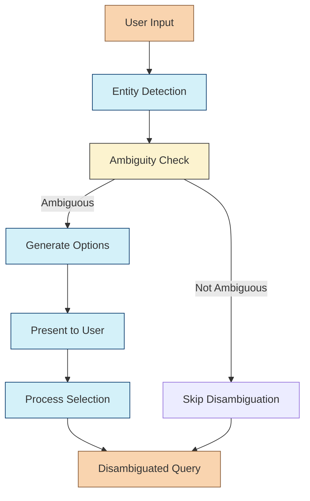

# Entity Disambiguation Chain

The Entity Disambiguation Chain is responsible for resolving ambiguous entity references in user queries. When users mention entities that could refer to multiple distinct items, this chain generates disambiguation options, presents them to the user, and processes their selection.

## Purpose

In a multi-agent RAG system, users often reference entities that may have multiple interpretations. For example:

- "Tell me about Apple" could refer to the technology company, the fruit, or other entities named "Apple"
- "Who is Michael Jordan?" could refer to the basketball player, the actor, or other individuals with the same name
- "What is Python?" could refer to the programming language, the snake, or the Monty Python comedy group

The disambiguation chain identifies these ambiguities and helps users clarify their intent, improving the accuracy of subsequent information retrieval.

## Disambiguation Performance Metrics

| Metric | Threshold | Impact |
|--------|-----------|--------|
| **Ambiguity Score** | > 0.7 | Triggers disambiguation |
| **Confidence Score** | < 0.5 | Low confidence in entity prediction |
| **Entity Match Count** | > 1 | Multiple potential entity matches |
| **Context Relevance** | < 0.6 | Low relevance to conversation context |
| **Historical Preference** | > 0.8 | Strong user preference exists |

## Entity Disambiguation Categories

```
┌───────────────────────────────┬───────────────────────────────┬───────────────────────────────┐
│                               │                               │                               │
│     ENTITY TYPE AMBIGUITY     │     REFERENCE AMBIGUITY       │      CONTEXT AMBIGUITY        │
│                               │                               │                               │
├───────────────────────────────┼───────────────────────────────┼───────────────────────────────┤
│                               │                               │                               │
│  Multiple entity types with   │  Single entity type with      │  Entity is clear but context  │
│  the same name                │  multiple specific instances  │  of usage is ambiguous        │
│                               │                               │                               │
│  Example: "Apple"             │  Example: "Michael Jordan"    │  Example: "It" in a complex   │
│  • Technology company         │  • Basketball player          │  conversation with multiple   │
│  • Fruit                      │  • Actor                      │  potential referents          │
│  • Record label               │  • Professor                  │                               │
│                               │                               │                               │
└───────────────────────────────┴───────────────────────────────┴───────────────────────────────┘
```

## Chain Components



## Disambiguation Decision Process

```
           LOW                        MEDIUM                         HIGH
┌────────────────────┬────────────────────────┬────────────────────────┐
│                    │                        │                        │
│ AMBIGUITY SCORE    │     AMBIGUITY SCORE    │     AMBIGUITY SCORE    │
│     (0-0.3)        │        (0.3-0.7)       │        (0.7-1.0)       │
│                    │                        │                        │
├────────────────────┼────────────────────────┼────────────────────────┤
│                    │                        │                        │
│  No disambiguation │  Check context and     │  Always disambiguate   │
│  needed            │  user history          │                        │
│                    │                        │                        │
└────────────────────┴────────────────────────┴────────────────────────┘
```

### 1. Entity Detection

The first step identifies potential entities in the user's query using:

- Named Entity Recognition (NER)
- Keyword extraction
- Domain-specific entity recognition patterns

### 2. Ambiguity Check

For each detected entity, the chain:

1. Queries the knowledge base for matching entities
2. Calculates an ambiguity score based on:
   - Number of potential matches
   - Similarity between matches
   - Context relevance
3. Determines if disambiguation is needed based on the ambiguity score

### 3. Option Generation

When disambiguation is needed, the chain:

1. Retrieves information about each potential entity match
2. Generates concise descriptions that highlight key differences
3. Ranks options by relevance to the user's query context
4. Prepares formatted options for presentation

### 4. User Interaction

The controller agent presents disambiguation options to the user, who selects the intended entity.

### 5. Selection Processing

Once the user makes a selection, the chain:

1. Updates the query with the disambiguated entity reference
2. Records the selection in user memory for future reference
3. Returns the disambiguated query for further processing

## Implementation

```typescript
interface DisambiguationOption {
  id: string;
  name: string;
  description: string;
  confidence: number;
  type: string;
}

interface DisambiguationRequest {
  query: string;
  entityText: string;
  entitySpan: [number, number];
  context: string;
}

interface DisambiguationResult {
  needsDisambiguation: boolean;
  originalQuery: string;
  disambiguatedQuery?: string;
  options?: DisambiguationOption[];
  selectedOption?: DisambiguationOption;
}
```

## Usage Example

```typescript
import { createDisambiguationChain } from "../chains/disambiguation-chain";

// Create the chain
const disambiguationChain = createDisambiguationChain();

// Example input
const input = {
  query: "Tell me about Apple's latest products",
  entityText: "Apple",
  entitySpan: [14, 19],
  context: "The user has been discussing technology companies."
};

// Run the chain
const result = await disambiguationChain.invoke(input);

// Check if disambiguation is needed
if (result.needsDisambiguation) {
  // Present options to user
  console.log("Please select which Apple you're referring to:");
  result.options.forEach((option, index) => {
    console.log(`${index + 1}. ${option.name}: ${option.description}`);
  });
  
  // Process user selection
  // ...
} else {
  // Proceed with the original or already disambiguated query
  console.log(`Proceeding with query: ${result.disambiguatedQuery || result.originalQuery}`);
}
```

## Disambiguation Flow as Markdown Text

```
┌─────────────────────────────────────────────────────────────────────────────────┐
│                      ENTITY DISAMBIGUATION PROCESS                               │
├─────────────────────────────────────────────────────────────────────────────────┤
│                                                                                 │
│  1️⃣ ENTITY DETECTION                                                            │
│     ├─ Use NER to identify potential entities                                   │
│     ├─ Extract keywords that might be entities                                  │
│     └─ Apply domain-specific entity recognition                                 │
│                                                                                 │
│  2️⃣ AMBIGUITY ASSESSMENT                                                        │
│     ├─ Query knowledge base for each entity                                     │
│     │  ├─ Check for multiple matches                                            │
│     │  └─ Calculate similarity between matches                                  │
│     │                                                                           │
│     ├─ Calculate ambiguity score                                                │
│     │  ├─ Number of potential matches                                           │
│     │  ├─ Contextual clarity                                                    │
│     │  └─ Historical user preferences                                           │
│     │                                                                           │
│     └─ Decision point                                                           │
│        ├─ If score > threshold → Need disambiguation                            │
│        └─ If score ≤ threshold → Skip disambiguation                            │
│                                                                                 │
│  3️⃣ OPTION GENERATION                                                           │
│     ├─ For each potential entity match:                                         │
│     │  ├─ Retrieve key information                                              │
│     │  ├─ Generate concise description                                          │
│     │  └─ Calculate confidence score                                            │
│     │                                                                           │
│     ├─ Rank options by relevance                                                │
│     └─ Format for presentation                                                  │
│                                                                                 │
│  4️⃣ USER INTERACTION                                                            │
│     ├─ Present options to user                                                  │
│     ├─ Allow selection                                                          │
│     └─ Process user choice                                                      │
│                                                                                 │
│  5️⃣ QUERY REFINEMENT                                                            │
│     ├─ Update query with disambiguated entity                                   │
│     ├─ Record selection in user memory                                          │
│     └─ Return refined query for processing                                      │
│                                                                                 │
└─────────────────────────────────────────────────────────────────────────────────┘
```

## Integration with Other Components

The Entity Disambiguation Chain integrates with:

1. **Controller Agent** - Receives ambiguous queries and returns disambiguation options
2. **Knowledge Base** - Queries for potential entity matches
3. **User Memory** - Records user preferences for future disambiguation
4. **UI Components** - Presents disambiguation options to the user

## Advanced Features

- **Contextual Disambiguation**: Uses conversation history to improve disambiguation accuracy
- **Multi-Entity Disambiguation**: Handles multiple ambiguous entities in a single query
- **Learning from User Choices**: Improves disambiguation over time based on user selections
- **Domain-Specific Disambiguation**: Applies different strategies based on entity types 