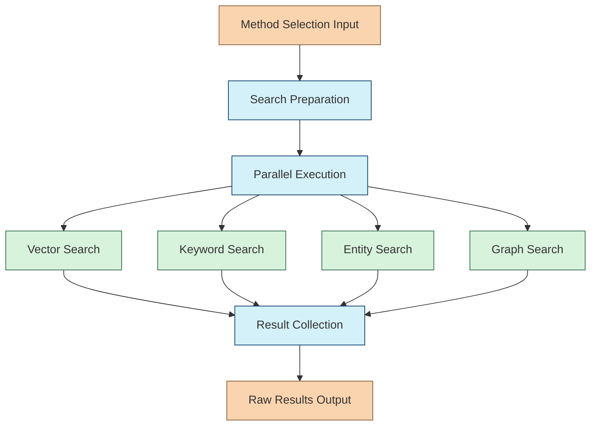

# Hybrid Search Chain

The Hybrid Search Chain executes multiple search strategies in parallel based on the methods selected by the Search Method Selection Chain. This is the third chain in the Retrieval Agent's workflow and the core component responsible for actually retrieving information.

## Purpose

Rather than relying on a single search method, the Hybrid Search Chain:

- Executes multiple search strategies in parallel
- Accesses different knowledge stores as needed
- Handles search failures gracefully
- Returns raw results from each method for further processing

This multi-strategy approach provides more comprehensive and accurate results than any single method alone.

## Chain Workflow



### 1. Search Preparation

Before executing searches, the chain:

- Validates selected methods and parameters
- Prepares query variations optimized for each method
- Sets up search limits and filters
- Initializes tracking for search performance

### 2. Parallel Execution

The chain executes selected search methods in parallel:

#### Vector Search
- Uses embedding models to find semantically similar content
- Supports multiple vector spaces (text, code, images)
- Configurable for similarity thresholds and result count

#### Keyword Search
- Traditional text-based search with advanced features
- Supports exact phrase matching, field boosting, and proximity search
- Handles stemming, synonyms, and other text processing

#### Entity Search
- Queries structured knowledge about specific entities
- Filters by entity type, attributes, and relationships
- Returns structured entity data with metadata

#### Graph Search
- Traverses relationship networks between entities
- Configurable for traversal depth and relationship types
- Returns paths and connected entities

### 3. Result Collection

After searches complete, the chain:

- Collects results from all methods
- Preserves method-specific metadata and scores
- Handles search timeouts and errors
- Formats raw results for downstream processing

## Implementation

```typescript
export interface HybridSearchInput {
  query: string;
  methods: RetrievalMethod[];  // From Search Method Selection Chain
  filters?: Record<string, any>;  // Optional metadata filters
  limit?: number;  // Maximum results per method
}

export interface RawSearchResult {
  method: string;  // Search method that produced this result
  content: string;  // Text content
  metadata: Record<string, any>;  // Source metadata
  score: number;  // Raw relevance score
}

export interface HybridSearchOutput {
  vectorResults: RawSearchResult[];
  keywordResults: RawSearchResult[];
  entityResults: {
    entity: {
      id: string;
      type: string;
      name: string;
      attributes: Record<string, any>;
    },
    score: number;
  }[];
  graphResults: {
    path: {
      entity: {
        id: string;
        type: string;
        name: string;
      },
      relationship: {
        type: string;
        direction: string;
        properties: Record<string, any>;
      }
    }[],
    score: number;
  }[];
  searchMetrics: {
    methodExecuted: string[];
    timings: Record<string, number>;
    counts: Record<string, number>;
  };
}

export function createHybridSearchChain(config?: {
  vectorStore: VectorStore;
  knowledgeBase: KnowledgeBase;
  defaultLimit?: number;
  timeout?: number;
}) {
  // Implementation details
  // ...
  return chain;
}
```

## Usage Example

```typescript
import { createHybridSearchChain } from "../chains/hybrid-search-chain";
import { RetrievalMethod } from "../chains/search-method-selection-chain";

const hybridSearchChain = createHybridSearchChain({
  vectorStore: vectorStore,
  knowledgeBase: knowledgeBase,
  defaultLimit: 20,
  timeout: 5000  // 5 seconds
});

// Example methods from Search Method Selection Chain
const selectedMethods: RetrievalMethod[] = [
  {
    type: "vector",
    parameters: {
      k: 10,
      similarityThreshold: 0.7
    },
    priority: 0.8
  },
  {
    type: "entity",
    parameters: {
      entityTypes: ["Person", "Organization"],
      includeRelated: true
    },
    priority: 0.6
  }
];

// Execute hybrid search
const searchResults = await hybridSearchChain.invoke({
  query: "Who founded OpenAI and what is their background?",
  methods: selectedMethods,
  filters: {
    recency: "last 2 years"
  }
});

// Results include data from both methods:
// - vectorResults: Text chunks about OpenAI founders
// - entityResults: Structured data about people and organizations
// - searchMetrics: Performance data about the search operation
```

## Search Method Implementations

### Vector Search

```typescript
async function executeVectorSearch(
  query: string,
  parameters: Record<string, any>,
  vectorStore: VectorStore
): Promise<RawSearchResult[]> {
  const { k = 10, similarityThreshold = 0.7 } = parameters;
  
  const results = await vectorStore.similaritySearch(
    query,
    k,
    { score: { $gte: similarityThreshold } }
  );
  
  return results.map(result => ({
    method: "vector",
    content: result.pageContent,
    metadata: result.metadata,
    score: result.score
  }));
}
```

### Entity Search

```typescript
async function executeEntitySearch(
  query: string,
  parameters: Record<string, any>,
  knowledgeBase: KnowledgeBase
): Promise<HybridSearchOutput["entityResults"]> {
  const { entityTypes, includeRelated = false } = parameters;
  
  // Search for entities matching the query
  const results = await knowledgeBase.findEntities({
    query,
    types: entityTypes,
    includeRelated
  });
  
  return results.map(result => ({
    entity: {
      id: result.id,
      type: result.type,
      name: result.name,
      attributes: result.attributes
    },
    score: result.relevance
  }));
}
```

## Integration with Other Chains

The Hybrid Search Chain integrates with:

1. **Search Method Selection Chain** - Receives search methods and parameters
2. **Result Ranking Chain** - Provides raw search results for ranking
3. **Vector Database** - Executes vector searches
4. **Knowledge Base** - Executes entity and graph searches

## Advanced Features

- **Adaptive Timeout Management**: Adjusts timeouts based on query complexity
- **Query Reformulation**: Optimizes queries for each search method
- **Failure Recovery**: Falls back to alternative methods if primary methods fail
- **Search Method Caching**: Caches results for similar queries
- **Parallel Processing**: Optimizes resource usage during parallel execution
- **Progressive Result Streaming**: Returns results as they become available 