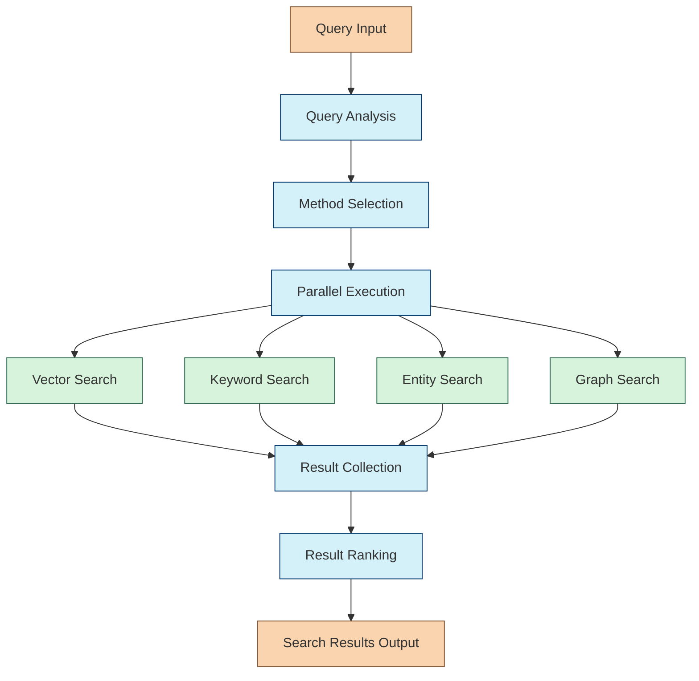

# Hybrid Search Chain

The Hybrid Search Chain executes multiple search strategies based on query analysis and combines the results. This standalone chain is a core component responsible for intelligent information retrieval across different search methods.

## Purpose

Rather than relying on a single search method, the Hybrid Search Chain:

- Analyzes queries to select optimal search strategies
- Executes multiple search methods (vector, keyword, entity, graph)
- Combines and ranks results from different methods
- Provides a unified, relevant set of search results

This multi-strategy approach provides more comprehensive and accurate results than any single method alone.

## Chain Workflow



## Workflow as Markdown Text

```
                       ┌────────────────────────────────────────────────────┐
                       │       🔍 HYBRID SEARCH CHAIN WORKFLOW 🔍           │
                       └────────────────────────────────────────────────────┘
                                                │
                                                ▼
                       ┌────────────────────────────────────────────────────┐
                       │              📥 QUERY INPUT 📥                     │
                       └────────────────────────────────────────────────────┘
                                                │
                                                ▼
┌───────────────────────────────────────────────────────────────────────────────────────────┐
│                              🧠 QUERY ANALYSIS 🧠                                         │
│                                                                                           │
│  • 📊 Analyze query complexity and characteristics                                        │
│  • 👤 Identify entity types being requested                                               │
│  • 💡 Extract semantic aspects of the query                                               │
│  • 🏗️ Determine structural needs (text, relationships, etc.)                              │
└───────────────────────────────────────────────────────────────────────────────────────────┘
                                                │
                                                ▼
┌───────────────────────────────────────────────────────────────────────────────────────────┐
│                            🔀 METHOD SELECTION 🔀                                         │
│                                                                                           │
│  • 🧮 Determine which methods will be most effective                                      │
│  • ⚙️ Configure parameters for each selected method                                       │
│  • 🏆 Assign priority weights for result ranking                                          │
└───────────────────────────────────────────────────────────────────────────────────────────┘
                                                │
                                                ▼
┌───────────────────────────────────────────────────────────────────────────────────────────┐
│                           ⚡ PARALLEL EXECUTION ⚡                                         │
│                                                                                           │
│  ┌─────────────────────┐  ┌─────────────────────┐  ┌─────────────────────┐  ┌─────────────────────┐ │
│  │  🧮 Vector Search   │  │  🔤 Keyword Search  │  │  👤 Entity Search   │  │  🕸️ Graph Search    │ │
│  │                     │  │                     │  │                     │  │                     │ │
│  │  • Semantic search  │  │  • Text-based       │  │  • Entity-focused   │  │  • Relationship     │ │
│  │  • Using embeddings │  │  • Exact matching   │  │  • Type filtering   │  │  • Network traversal│ │
│  │  • Similarity score │  │  • Term frequency   │  │  • Structured data  │  │  • Path discovery   │ │
│  └─────────────────────┘  └─────────────────────┘  └─────────────────────┘  └─────────────────────┘ │
└───────────────────────────────────────────────────────────────────────────────────────────────────────┘
                   │                    │                    │                    │
                   └──────────┬─────────┴──────────┬─────────┴──────────┬────────┘
                              │                    │                    │
                              ▼                    ▼                    ▼
┌───────────────────────────────────────────────────────────────────────────────────────────┐
│                         🔄 RESULT COLLECTION 🔄                                           │
│                                                                                           │
│  • 📊 Collect results from all executed methods                                           │
│  • 🔄 Remove duplicates across different search methods                                   │
└───────────────────────────────────────────────────────────────────────────────────────────┘
                                                │
                                                ▼
┌───────────────────────────────────────────────────────────────────────────────────────────┐
│                          ⭐ RESULT RANKING ⭐                                             │
│                                                                                           │
│  • 📈 Rank results based on relevance scores                                              │
│  • 🏆 Apply method priority weights                                                       │
│  • 🔝 Produce final ordered list                                                          │
└───────────────────────────────────────────────────────────────────────────────────────────┘
                                                │
                                                ▼
                       ┌────────────────────────────────────────────────────┐
                       │           📤 SEARCH RESULTS OUTPUT 📤              │
                       └────────────────────────────────────────────────────┘
```

### 1. Query Analysis

The chain first analyzes the query to understand:

- Query complexity and characteristics
- Entity types being requested
- Semantic aspects of the query
- Structural needs (text, relationships, etc.)

### 2. Method Selection

Based on the analysis, the chain selects appropriate search methods:

- Determines which methods will be most effective for the query
- Configures parameters for each method
- Assigns priority weights to each method for result ranking

### 3. Parallel Execution

The chain executes selected search methods:

#### Vector Search
- Uses embedding models to find semantically similar content
- Implemented using the vector store integration
- Optimized for semantic understanding

#### Keyword Search
- Text-based search for specific terms and phrases
- Implemented with Supabase text search capabilities
- Optimized for exact matching and specific terminology

#### Entity Search
- Queries structured knowledge about specific entities (when knowledge base is available)
- Filters by entity type, attributes, and relationships
- Returns structured entity data with metadata

#### Graph Search
- Traverses relationship networks between entities (when knowledge base is available)
- Configurable for traversal depth and relationship types
- Returns paths and connected entities

### 4. Result Collection & Ranking

After searches complete, the chain:

- Collects results from all executed methods
- Removes duplicates across different search methods
- Ranks results based on relevance and method priorities
- Returns a unified set of ranked results

## Implementation

```typescript
import { RunnableSequence } from "@langchain/core/runnables";
import { VectorStore } from "@langchain/core/vectorstores";

export interface HybridSearchInput {
  query: string;
  filters?: Record<string, unknown>;  // Optional metadata filters
  analysisOptions?: {
    considerEntities?: boolean;
    considerRelationships?: boolean;
  };
  methodOptions?: {
    vector?: {
      enabled?: boolean;
      k?: number;
      similarityThreshold?: number;
    };
    keyword?: {
      enabled?: boolean;
      k?: number;
    };
    entity?: {
      enabled?: boolean;
      types?: string[];
    };
    graph?: {
      enabled?: boolean;
      depth?: number;
    };
  };
}

export interface RetrievalMethod {
  type: 'vector' | 'keyword' | 'entity' | 'graph';
  parameters: Record<string, unknown>;
  priority: number;
}

export interface HybridSearchResult {
  content: string;
  metadata: Record<string, unknown>;
  score: number;
  source: string;  // Which method found this result
}

export interface HybridSearchOutput {
  results: HybridSearchResult[];
  methodsUsed: string[];
  metrics: {
    methodCounts: Record<string, number>;
    timings: Record<string, number>;
    totalResults: number;
  };
}

export function createHybridSearchChain(config: {
  vectorStore: VectorStore;
  supabaseClient: any;
  knowledgeBase?: any;  // Optional - for entity and graph search
  defaultLimit?: number;
}) {
  // Create a LangChain Runnable sequence
  const chain = RunnableSequence.from([
    // Step 1: Analyze query and select methods
    analyzeQueryAndSelectMethods,
    
    // Step 2: Execute search methods in parallel
    executeSearchMethods, 
    
    // Step 3: Rank and consolidate results
    rankAndConsolidateResults
  ]);
  
  return chain;
}
```

## Integration with Retrieval Agent

The Hybrid Search Chain is designed to integrate seamlessly with the Retrieval Agent:

```typescript
import { createHybridSearchChain } from "../chains/hybrid-search-chain";
import { StateGraph } from "@langchain/langgraph";

// In your Retrieval Agent workflow definition
export function createRetrievalWorkflow() {
  // Create the hybrid search chain
  const hybridSearchChain = createHybridSearchChain({
    vectorStore,
    supabaseClient,
    knowledgeBase,
    defaultLimit: 20
  });
  
  // Create the workflow
  const workflow = new StateGraph()
    .addNode("analyzeRequest", analyzeRetrievalRequest)
    // Instead of executing search directly in the workflow,
    // use the hybrid search chain
    .addNode("executeSearch", async (state) => {
      // Call the hybrid search chain with the current state
      const searchResults = await hybridSearchChain.invoke({
        query: state.retrievalRequest.query,
        filters: state.retrievalRequest.filters,
        // Pass analysis data to help with method selection
        analysisOptions: {
          considerEntities: state.requestAnalysis.entityTypes.length > 0,
          considerRelationships: state.requestAnalysis.structuralNeeds.includes("relationships")
        }
      });
      
      // Update the state with search results
      return {
        rawResults: {
          vectorResults: searchResults.results.filter(r => r.source === 'vector'),
          keywordResults: searchResults.results.filter(r => r.source === 'keyword'),
          entityResults: searchResults.results.filter(r => r.source === 'entity'),
          graphResults: searchResults.results.filter(r => r.source === 'graph')
        }
      };
    })
    .addNode("evaluateResults", evaluateResultQuality)
    .addNode("formatResponse", formatRetrievalResponse);
  
  // Define the workflow edges
  workflow.addEdge("analyzeRequest", "executeSearch");
  workflow.addEdge("executeSearch", "evaluateResults");
  workflow.addEdge("evaluateResults", "formatResponse");
  
  return workflow.compile();
}
```

## Key Features and Benefits

1. **Standalone Component**: Can be used independently or within the Retrieval Agent
2. **Intelligent Method Selection**: Chooses optimal search methods based on query analysis
3. **Modular Design**: Easily extensible with new search methods
4. **Result Consolidation**: Removes duplicates and ranks by relevance
5. **LangChain Compatible**: Uses the Runnable interface for easy integration
6. **LangGraph Compatible**: Works seamlessly with StateGraph-based agents

## Currently Implemented Methods

- ✅ Vector Search: Semantic search using embeddings
- ✅ Keyword Search: Text-based search for specific terms
- 🚧 Entity Search: Pending Knowledge Base implementation
- 🚧 Graph Search: Pending Knowledge Base implementation 