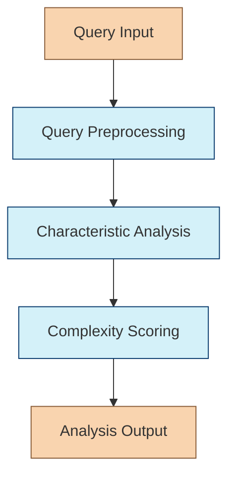

# Request Analysis Chain

The Request Analysis Chain is responsible for analyzing search queries to determine their characteristics, which informs the optimal retrieval strategy. This is the first chain in the Retrieval Agent's workflow.

## Purpose

When a user submits a query, understanding its characteristics is crucial for effective retrieval. This chain identifies:

- Types of entities that need to be retrieved
- Key semantic aspects to focus on
- Required data structures (text, tables, relationships)
- Query complexity

This analysis helps downstream chains determine which search strategies will be most effective.

## Chain Workflow



### 1. Query Preprocessing

Before analysis, the chain preprocesses the input query:

- Removes unnecessary punctuation and stopwords
- Identifies potential entities
- Extracts key terms
- Normalizes text for consistent analysis

### 2. Characteristic Analysis

The core analysis identifies:

1. **Entity Types**: What kinds of entities does the query reference? (people, organizations, products, concepts, etc.)
2. **Semantic Aspects**: What aspects of these entities are relevant? (attributes, relationships, history, function, etc.)
3. **Structural Needs**: What data structures would best represent the answer? (text, tables, graphs, lists, etc.)
4. **Query Context**: How does this query relate to conversation history or user preferences?

### 3. Complexity Scoring

The chain assigns a complexity score (0-1) based on:

- Number of entities and concepts referenced
- Complexity of relationships between entities
- Specificity of the query
- Amount of context needed for a complete answer

## Implementation

```typescript
export interface RequestAnalysisInput {
  query: string;
  conversationHistory?: ConversationMessage[];
  userContext?: UserContext;
}

export interface RequestAnalysisOutput {
  entityTypes: string[];        // Types of entities to retrieve
  semanticAspects: string[];    // Aspects to focus on
  structuralNeeds: string[];    // Data structures needed
  complexityScore: number;      // 0-1 complexity score
  extractedEntities?: {         // Optional extracted entities
    name: string;
    type: string;
    confidence: number;
  }[];
}

export function createRequestAnalysisChain(config?: {
  modelName?: string;
  temperature?: number;
}) {
  // Implementation details
  // ...
  return chain;
}
```

## Usage Example

```typescript
import { createRequestAnalysisChain } from "../chains/request-analysis-chain";

const requestAnalysisChain = createRequestAnalysisChain({
  modelName: "gpt-4",
  temperature: 0.2
});

// Simple query
const result1 = await requestAnalysisChain.invoke({
  query: "Tell me about Apple's latest iPhone"
});
// Result: {
//   entityTypes: ["Product", "Company"],
//   semanticAspects: ["latest features", "specifications", "release date"],
//   structuralNeeds: ["text", "table"],
//   complexityScore: 0.3
// }

// Complex query
const result2 = await requestAnalysisChain.invoke({
  query: "Compare the market strategies of Apple, Google, and Microsoft in the AI space over the last 5 years and predict future trends"
});
// Result: {
//   entityTypes: ["Company", "Industry", "Technology", "TimeFrame"],
//   semanticAspects: ["market strategy", "competition", "historical development", "future trends"],
//   structuralNeeds: ["text", "comparison table", "timeline", "graph"],
//   complexityScore: 0.85
// }
```

## Prompt Template

The chain uses a prompt template similar to:

```
You are an expert in information retrieval analysis.

QUERY: {query}

CONVERSATION HISTORY: {conversationHistory}

USER CONTEXT: {userContext}

Analyze this query to determine its characteristics for optimal retrieval strategy:

1. Entity types that should be retrieved (e.g., Person, Organization, Product, Concept)
2. Key semantic aspects to focus on (e.g., attributes, relationships, history)
3. Required data structures (text, tables, relationships, etc.)
4. Complexity score (0-1, where 0 is simple and 1 is highly complex)

Format your response as JSON with the following structure:
{
  "entityTypes": ["type1", "type2"],
  "semanticAspects": ["aspect1", "aspect2"],
  "structuralNeeds": ["need1", "need2"],
  "complexityScore": 0.X
}
```

## Integration with Other Chains

The Request Analysis Chain integrates with:

1. **Search Method Selection Chain** - Provides analysis to help select retrieval methods
2. **Hybrid Search Chain** - Can influence search parameters based on query characteristics
3. **Result Ranking Chain** - Analysis helps determine relevance weighting

## Advanced Features

- **Dynamic Entity Recognition**: Uses LLM-based entity recognition for flexibility across domains
- **Context-Aware Analysis**: Incorporates conversation history for better understanding
- **Adaptive Complexity Scoring**: Calibrates complexity based on query patterns
- **Specialized Analysis**: Provides domain-specific analysis for different query types (scientific, legal, etc.) 