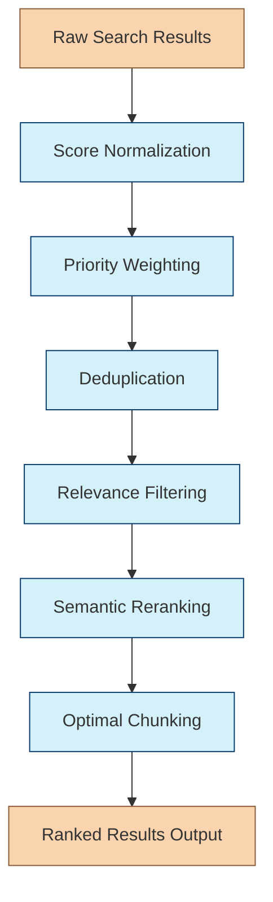

# Result Ranking Chain

The Result Ranking Chain processes the raw search results from the Hybrid Search Chain, ranking, filtering, and deduplicating them to produce a coherent set of high-quality results. This is the fourth chain in the Retrieval Agent's workflow.

## Purpose

Raw search results from multiple methods need careful processing to be useful. This chain:

- Combines results from different search methods
- Ranks results based on relevance and method priorities
- Removes duplicates and near-duplicates
- Filters out irrelevant or low-quality results
- Prepares a unified set of results for context enhancement

## Chain Workflow



### 1. Score Normalization

Different search methods produce scores on different scales. This step:

- Normalizes scores from each method to a 0-1 range
- Handles method-specific scoring peculiarities
- Accounts for distribution of scores within each method
- Establishes a common scoring foundation

### 2. Priority Weighting

The chain applies method priority weights from the Search Method Selection Chain:

- Multiplies normalized scores by method priority weights
- Balances contribution from each search method
- Emphasizes methods most relevant to the query
- Creates a unified ranking across methods

### 3. Deduplication

Search results often contain duplicates or near-duplicates. This step:

- Identifies exact content duplicates
- Detects semantic duplicates using embedding similarity
- Groups similar content fragments
- Keeps the highest-scoring item from each duplicate group

### 4. Relevance Filtering

Not all results are equally relevant to the query. This step:

- Filters out results below relevance thresholds
- Removes outliers and irrelevant content
- Applies query-specific filtering criteria
- Ensures result quality meets minimum standards

### 5. Semantic Reranking

For final ranking refinement, the chain uses semantic understanding:

- Computes semantic similarity between query and results
- Considers both lexical and semantic relevance
- Potentially uses LLM-based relevance scoring
- Produces final relevance ranking

### 6. Optimal Chunking

Finally, the chain ensures results are optimally chunked:

- Adjusts chunk sizes for coherent information units
- Merges small related chunks if needed
- Splits overly large chunks into digestible pieces
- Optimizes for context window utilization

## Implementation

```typescript
export interface ResultRankingInput {
  query: string;
  rawResults: HybridSearchOutput;  // From Hybrid Search Chain
  methodPriorities: Record<string, number>;  // Method priorities
  maxResults?: number;  // Maximum results to return
}

export interface RankedResult {
  content: string;  // Text content
  score: number;    // Final relevance score
  source: {
    type: string;   // Source type (document, entity, etc.)
    name: string;   // Source name
    url?: string;   // Optional source URL
  };
  metadata: Record<string, any>;  // Additional metadata
  originalMethod: string;  // Search method that produced this result
}

export interface ResultRankingOutput {
  results: RankedResult[];
  stats: {
    inputCounts: Record<string, number>;  // Input counts by method
    duplicatesRemoved: number;            // Number of duplicates removed
    lowRelevanceRemoved: number;          // Number filtered for low relevance
    finalCount: number;                   // Final result count
  };
}

export function createResultRankingChain(config?: {
  deduplicationThreshold?: number;
  minRelevanceScore?: number;
  rerankerModel?: string;
  optimalChunkSize?: number;
}) {
  // Implementation details
  // ...
  return chain;
}
```

## Usage Example

```typescript
import { createResultRankingChain } from "../chains/result-ranking-chain";
import { HybridSearchOutput } from "../chains/hybrid-search-chain";

const resultRankingChain = createResultRankingChain({
  deduplicationThreshold: 0.85,
  minRelevanceScore: 0.4,
  rerankerModel: "cross-encoder/ms-marco-MiniLM-L-12-v2",
  optimalChunkSize: 800
});

// Example raw results from Hybrid Search Chain
const searchResults: HybridSearchOutput = {
  vectorResults: [
    /* vector search results */
  ],
  keywordResults: [
    /* keyword search results */
  ],
  entityResults: [
    /* entity search results */
  ],
  graphResults: [
    /* graph search results */
  ],
  searchMetrics: {
    /* search metrics */
  }
};

// Method priorities from Search Method Selection Chain
const methodPriorities = {
  vector: 0.8,
  entity: 0.6,
  keyword: 0.4,
  graph: 0.5
};

// Rank and process results
const rankedResults = await resultRankingChain.invoke({
  query: "What are the main applications of transformer models in NLP?",
  rawResults: searchResults,
  methodPriorities: methodPriorities,
  maxResults: 20
});

// Result: {
//   results: [
//     {
//       content: "Transformer models have revolutionized NLP with applications including...",
//       score: 0.92,
//       source: {
//         type: "document",
//         name: "Attention Is All You Need - Summary",
//         url: "https://example.com/papers/transformers-summary"
//       },
//       metadata: {
//         author: "AI Research Team",
//         published: "2021-03-15",
//         category: "Deep Learning"
//       },
//       originalMethod: "vector"
//     },
//     // More ranked results...
//   ],
//   stats: {
//     inputCounts: { vector: 15, keyword: 8, entity: 6, graph: 3 },
//     duplicatesRemoved: 7,
//     lowRelevanceRemoved: 5,
//     finalCount: 20
//   }
// }
```

## Key Algorithms

### Score Normalization

```typescript
function normalizeScores(
  results: RawSearchResult[],
  method: string
): RawSearchResult[] {
  if (results.length === 0) return [];
  
  // Find min and max scores
  const scores = results.map(r => r.score);
  const minScore = Math.min(...scores);
  const maxScore = Math.max(...scores);
  
  // Avoid division by zero
  const range = maxScore - minScore || 1;
  
  // Apply normalization
  return results.map(result => ({
    ...result,
    score: (result.score - minScore) / range
  }));
}
```

### Deduplication

```typescript
function deduplicateResults(
  results: RawSearchResult[],
  threshold: number,
  embeddings: Embeddings
): RawSearchResult[] {
  // Group by exact content matches first
  const contentGroups = new Map<string, RawSearchResult[]>();
  
  for (const result of results) {
    const key = result.content.trim();
    if (!contentGroups.has(key)) {
      contentGroups.set(key, []);
    }
    contentGroups.get(key)!.push(result);
  }
  
  // For each content group with multiple results, keep highest score
  let deduplicated: RawSearchResult[] = [];
  
  for (const group of contentGroups.values()) {
    if (group.length === 1) {
      deduplicated.push(group[0]);
    } else {
      // Keep result with highest score
      deduplicated.push(group.reduce((max, current) => 
        current.score > max.score ? current : max, group[0]));
    }
  }
  
  // Now check for semantic duplicates using embeddings
  const embeddingVectors = await embeddings.embedDocuments(
    deduplicated.map(r => r.content)
  );
  
  const uniqueResults: RawSearchResult[] = [];
  const usedIndices = new Set<number>();
  
  for (let i = 0; i < deduplicated.length; i++) {
    if (usedIndices.has(i)) continue;
    
    usedIndices.add(i);
    uniqueResults.push(deduplicated[i]);
    
    // Check remaining results for semantic duplicates
    for (let j = i + 1; j < deduplicated.length; j++) {
      if (usedIndices.has(j)) continue;
      
      const similarity = cosineSimilarity(embeddingVectors[i], embeddingVectors[j]);
      if (similarity > threshold) {
        usedIndices.add(j);
        // Keep the one with higher score if this is a duplicate
        if (deduplicated[j].score > deduplicated[i].score) {
          uniqueResults[uniqueResults.length - 1] = deduplicated[j];
        }
      }
    }
  }
  
  return uniqueResults;
}
```

## Integration with Other Chains

The Result Ranking Chain integrates with:

1. **Hybrid Search Chain** - Receives raw search results
2. **Search Method Selection Chain** - Uses method priorities
3. **Context Enhancement Chain** - Provides ranked results for enhancement

## Advanced Features

- **Adaptive Relevance Thresholds**: Adjusts thresholds based on result distribution
- **Diversity Optimization**: Ensures variety in results when appropriate
- **Cross-Method Correlation**: Boosts scores for results found by multiple methods
- **Query-Aware Chunking**: Optimizes chunk boundaries based on query relevance
- **Feedback Learning**: Improves ranking based on user interactions with results 