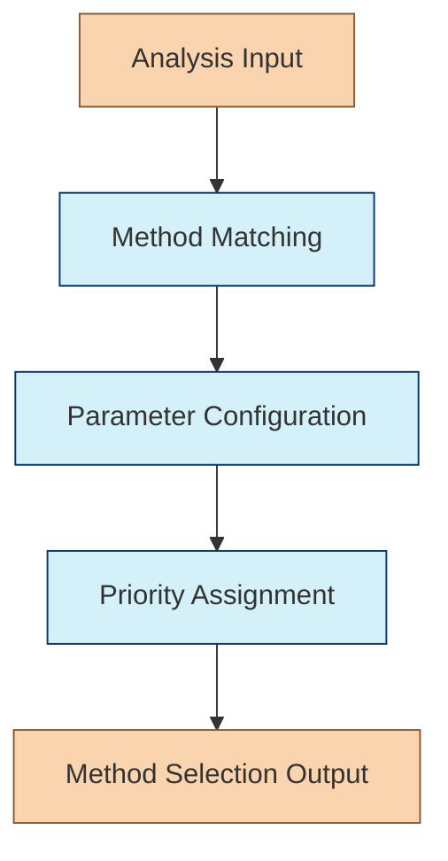

# Search Method Selection Chain

The Search Method Selection Chain is responsible for determining the optimal combination of search methods to use for a given query based on the analysis provided by the Request Analysis Chain. This is the second chain in the Retrieval Agent's workflow.

## Purpose

Different types of queries benefit from different search approaches. This chain:

- Selects which search methods to use (vector, keyword, entity, graph)
- Determines parameters for each method
- Assigns priority weights to each method for result ranking
- Adapts to query characteristics for optimal retrieval

## Chain Workflow



### 1. Method Matching

The chain analyzes which search methods match the query characteristics:

- **Vector Search**: Semantic meaning, conceptual queries, similarity-based retrieval
- **Keyword Search**: Specific terminology, exact phrases, technical content
- **Entity Search**: Named entities, specific objects or concepts, attribute-based queries
- **Graph Search**: Relationship queries, connection exploration, network analysis

### 2. Parameter Configuration

For each selected method, the chain configures optimal parameters:

- **Vector Search**: Embedding model, similarity threshold, vector count (k)
- **Keyword Search**: Boost factors, field weights, exact match requirements
- **Entity Search**: Entity types, attribute filters, relationship depth
- **Graph Search**: Start nodes, relationship types, traversal depth, direction

### 3. Priority Assignment

The chain assigns priority weights (0-1) to each method based on:

- Relevance to query characteristics
- Expected effectiveness for this query type
- Confidence in method selection
- Balance between precision and recall needs

## Implementation

```typescript
export interface SearchMethodSelectionInput {
  query: string;
  analysis: RequestAnalysisOutput;  // From Request Analysis Chain
  availableMethods?: string[];      // Optional restriction of available methods
}

export interface RetrievalMethod {
  type: 'vector' | 'keyword' | 'entity' | 'graph';
  parameters: Record<string, any>;
  priority: number;  // 0-1 weight for result ranking
}

export interface SearchMethodSelectionOutput {
  methods: RetrievalMethod[];
  reasoning: string;  // Explanation of method selection
}

export function createSearchMethodSelectionChain(config?: {
  modelName?: string;
  temperature?: number;
  defaultMethods?: string[];
}) {
  // Implementation details
  // ...
  return chain;
}
```

## Usage Example

```typescript
import { createSearchMethodSelectionChain } from "../chains/search-method-selection-chain";
import { RequestAnalysisOutput } from "../chains/request-analysis-chain";

const searchMethodSelectionChain = createSearchMethodSelectionChain({
  modelName: "gpt-4",
  temperature: 0.1
});

// Example query analysis from Request Analysis Chain
const analysisResult: RequestAnalysisOutput = {
  entityTypes: ["Company", "Product"],
  semanticAspects: ["latest features", "pricing", "market position"],
  structuralNeeds: ["text", "comparison"],
  complexityScore: 0.6
};

// Select search methods
const methodSelection = await searchMethodSelectionChain.invoke({
  query: "What are the differences between iPhone 15 Pro and Samsung Galaxy S23?",
  analysis: analysisResult
});

// Result: {
//   methods: [
//     {
//       type: "vector",
//       parameters: {
//         k: 15,
//         similarityThreshold: 0.75,
//         includeMetadata: true
//       },
//       priority: 0.8
//     },
//     {
//       type: "entity",
//       parameters: {
//         entityTypes: ["Product", "Company"],
//         attributes: ["features", "specifications", "price"],
//         includeRelated: true
//       },
//       priority: 0.7
//     },
//     {
//       type: "keyword",
//       parameters: {
//         boostExactMatches: true,
//         fieldWeights: {
//           title: 2.0,
//           content: 1.0
//         }
//       },
//       priority: 0.5
//     }
//   ],
//   reasoning: "This product comparison query requires both semantic understanding (vector search) and specific entity information. Entity search helps retrieve structured product details, while vector search captures broader comparison aspects. Keyword search adds support for exact product name matches."
// }
```

## Prompt Template

The chain uses a prompt template similar to:

```
You are an expert in information retrieval strategy selection.

QUERY: {query}

QUERY ANALYSIS:
{analysis}

AVAILABLE SEARCH METHODS:
- vector: Semantic/embedding-based search for meaning and concepts
- keyword: Traditional keyword matching for specific terms and phrases
- entity: Entity-focused retrieval for structured information about objects
- graph: Relationship-based retrieval for connections between entities

Based on the query and its analysis, select the optimal combination of search methods.
For each method you select:
1. Specify appropriate parameters
2. Assign a priority weight (0-1) for result ranking

Focus on methods that best match the query characteristics. Not all methods are required.
Provide brief reasoning for your selection.

Format your response as JSON with the following structure:
{
  "methods": [
    {
      "type": "method_name",
      "parameters": {
        "param1": value1,
        "param2": value2
      },
      "priority": 0.X
    }
  ],
  "reasoning": "Explanation of method selection"
}
```

## Decision Heuristics

The chain uses the following heuristics to guide method selection:

| Query Characteristic | Primary Method | Secondary Method | Example |
|----------------------|----------------|------------------|---------|
| Conceptual/abstract | Vector | Entity | "Explain quantum computing" |
| Factual/specific | Entity | Keyword | "Population of Tokyo in 2023" |
| Relationship-oriented | Graph | Vector | "Connection between climate change and coral bleaching" |
| Comparative | Vector + Entity | Keyword | "Differences between Python and JavaScript" |
| Multi-entity | Entity + Graph | Vector | "Key battles of World War II" |
| Technical/specialized | Keyword + Vector | Entity | "React useState hook examples" |

## Integration with Other Chains

The Search Method Selection Chain integrates with:

1. **Request Analysis Chain** - Receives query analysis as input
2. **Hybrid Search Chain** - Provides search methods and parameters
3. **Result Ranking Chain** - Supplies priority weights for result scoring

## Advanced Features

- **Adaptive Method Selection**: Learns from past query performance
- **Method Combination Optimization**: Finds synergistic method combinations
- **Parameter Auto-tuning**: Adjusts parameters based on query characteristics
- **Explainable Selection**: Provides reasoning for method choices 