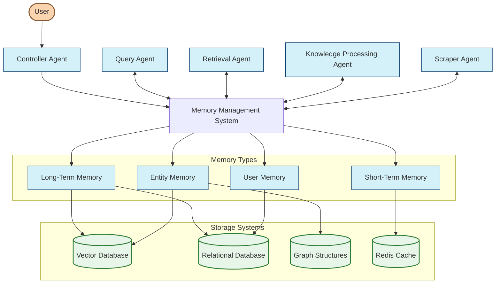

# Memory Management System

The Memory Management System provides a comprehensive framework for storing, retrieving, and updating information across the multi-agent RAG system. It enables agents to maintain context, learn from interactions, and build a persistent knowledge base.

## Architecture Overview



## Memory Types

### Short-Term Memory

Short-term memory maintains context during active interactions and agent operations.

**Components:**
- **Session Memory**: Conversation context for user interactions
- **Working Memory**: Temporary storage for agent processing

**Storage:**
- Redis for fast access and automatic expiration
- In-memory structures for immediate agent operations

**Lifecycle:**
- Created at session/task start
- Updated continuously during interaction
- Expired after period of inactivity (24-48 hours)

### Long-Term Memory

Long-term memory provides persistent storage of knowledge and learnings.

**Components:**
- **Knowledge Base**: Structured facts and information
- **Document Chunks**: Text passages with embeddings
- **Conversation History**: Records of past interactions

**Storage:**
- Vector database (Supabase pgvector) for semantic search
- Relational database for structured metadata
- Object storage for large documents

**Lifecycle:**
- Continuously updated through learning
- Versioned to track changes
- Rarely deleted, primarily augmented

### Entity Memory

Entity memory organizes information around specific entities and their relationships.

**Components:**
- **Entity Records**: Core information about entities
- **Relationships**: Connections between entities
- **Entity Embeddings**: Vector representations of entities

**Storage:**
- Graph structures in PostgreSQL
- Entity attributes in relational tables
- Entity embeddings in vector database

**Lifecycle:**
- Dynamically updated as new information is discovered
- Relationships strengthened or weakened based on evidence
- Entities can be merged when duplicates are identified

### User Memory

User memory maintains information specific to individual users.

**Components:**
- **User Profiles**: Preferences and settings
- **Interaction History**: Pattern of user behavior
- **Personalization Data**: Learned preferences

**Storage:**
- Relational database for structured profiles
- Vector embeddings for semantic user understanding

**Lifecycle:**
- Created upon user registration
- Updated with each interaction
- Persistent for the life of the user account

## Memory Storage Systems

### Vector Database (Supabase pgvector)

Provides semantic search capabilities through vector embeddings.

**Primary Uses:**
- Document retrieval based on meaning
- Finding similar entities
- Semantic search for related content

**Implementation:**
```typescript
// Example vector search
async function semanticSearch(query: string, options: SearchOptions) {
  const embedding = await embedText(query);
  
  const { data } = await supabase.rpc('match_documents', {
    query_embedding: embedding,
    match_threshold: options.threshold || 0.7,
    match_count: options.limit || 10
  });
  
  return data;
}
```

### Relational Database (PostgreSQL)

Stores structured data with relationships and constraints.

**Primary Uses:**
- User profiles and settings
- Document metadata
- Structured entity attributes
- System configuration

**Implementation:**
```typescript
// Example entity attribute query
async function getEntityAttributes(entityId: string) {
  const { data } = await supabase
    .from('entity_attributes')
    .select('*')
    .eq('entity_id', entityId);
    
  return data;
}
```

### Graph Structures (PostgreSQL)

Represents entity relationships for traversal and discovery.

**Primary Uses:**
- Entity relationship network
- Knowledge graph navigation
- Connection discovery

**Implementation:**
```typescript
// Example relationship query using adjacency list
async function findRelatedEntities(entityId: string, depth: number = 1) {
  const { data } = await supabase.rpc('get_related_entities', {
    start_entity_id: entityId,
    max_depth: depth
  });
  
  return data;
}
```

### Redis Cache

Fast in-memory storage for temporary data with automatic expiration.

**Primary Uses:**
- Active conversation context
- Session state
- Working memory for agents
- Inter-agent communication

**Implementation:**
```typescript
// Example conversation context storage
async function storeConversationContext(conversationId: string, context: any) {
  // Store context with 24 hour expiration
  await redis.set(
    `conversation:${conversationId}:context`,
    JSON.stringify(context),
    'EX',
    60 * 60 * 24
  );
}
```

## Memory Retrieval

Memory retrieval enables agents to access the right information at the right time.

### Vector-Based Retrieval

```typescript
async function retrieveRelevantKnowledge(query: string, k: number = 5) {
  const embedding = await embedText(query);
  
  const results = await supabase.rpc('match_documents', {
    query_embedding: embedding,
    match_threshold: 0.7,
    match_count: k
  });
    
  return results;
}
```

### Graph Traversal Retrieval

```typescript
async function findEntityConnections(entityId: string, maxDepth: number = 2) {
  const { data } = await supabase.rpc('traverse_entity_relationships', {
    start_entity_id: entityId,
    max_depth: maxDepth
  });
  
  return data;
}
```

### Context-Aware Retrieval

```typescript
async function retrieveConversationContext(conversationId: string) {
  // Get recent conversation turns
  const recentTurns = await redis.lrange(
    `conversation:${conversationId}:history`, 
    0, 
    5
  );
  
  // Extract entities from conversation history
  const mentionedEntities = await extractEntitiesFromConversation(
    recentTurns.map(turn => JSON.parse(turn))
  );
  
  return {
    conversationContext: recentTurns.map(turn => JSON.parse(turn)),
    relevantEntities: mentionedEntities
  };
}
```

### Multi-Strategy Retrieval

```typescript
async function comprehensiveRetrieval(query: string, userId: string) {
  // Execute multiple retrieval strategies in parallel
  const [
    vectorResults,
    graphResults,
    userContextResults
  ] = await Promise.all([
    retrieveRelevantKnowledge(query),
    identifyEntitiesAndRelationships(query),
    getUserPreferencesAndHistory(userId)
  ]);
  
  // Combine and rank results
  const combinedResults = rankAndDeduplicate([
    ...vectorResults,
    ...graphResults,
    ...userContextResults
  ]);
  
  return combinedResults;
}
```

## Memory Updates

Memory updates keep the system's knowledge current and accurate.

### Knowledge Base Updates

```typescript
async function updateKnowledge(newContent: Document[]) {
  // Process new content
  const processedChunks = await chunkContent(newContent);
  const embeddedChunks = await embedChunks(processedChunks);
  
  // Store in vector database
  await supabase.from('document_chunks').insert(
    embeddedChunks.map(chunk => ({
      content: chunk.text,
      embedding: chunk.embedding,
      document_id: chunk.documentId,
      metadata: chunk.metadata
    }))
  );
  
  // Extract and store entities
  const entities = await extractEntities(processedChunks);
  await storeEntities(entities);
  
  // Update relationships
  const relationships = await identifyRelationships(entities);
  await updateRelationships(relationships);
}
```

### Conversation Memory Updates

```typescript
async function updateConversationMemory(conversationId: string, turn: ConversationTurn) {
  // Add new turn to conversation history
  await redis.lpush(
    `conversation:${conversationId}:history`, 
    JSON.stringify(turn)
  );
  
  // Maintain a limited history size
  await redis.ltrim(
    `conversation:${conversationId}:history`, 
    0, 
    19
  );
  
  // Update active entities in conversation
  const mentionedEntities = await extractEntitiesFromTurn(turn);
  
  // For each entity, update its recency score
  for (const entity of mentionedEntities) {
    await redis.zadd(
      `conversation:${conversationId}:entities`, 
      Date.now(), 
      entity.id
    );
  }
  
  // Set conversation TTL
  const CONVERSATION_TTL = 60 * 60 * 24; // 24 hours
  await redis.expire(
    `conversation:${conversationId}:history`, 
    CONVERSATION_TTL
  );
}
```

### Entity Memory Updates

```typescript
async function updateEntityRelationships(entityId: string, newRelationships: Relationship[]) {
  // Get existing relationships
  const { data: existingRelationships } = await supabase
    .from('relationships')
    .select('*')
    .or(`source_id.eq.${entityId},target_id.eq.${entityId}`);
  
  // Identify relationships to add, update, or remove
  const {
    toAdd,
    toUpdate,
    toRemove
  } = diffRelationships(existingRelationships, newRelationships);
  
  // Execute updates
  await Promise.all([
    // Add new relationships
    toAdd.length > 0 ? supabase.from('relationships').insert(toAdd) : null,
    
    // Update existing relationships
    ...toUpdate.map(rel => 
      supabase
        .from('relationships')
        .update({
          type: rel.type,
          properties: rel.properties,
          updated_at: new Date().toISOString()
        })
        .eq('id', rel.id)
    ),
    
    // Soft delete removed relationships
    toRemove.length > 0 
      ? supabase
          .from('relationships')
          .update({
            status: 'deprecated',
            updated_at: new Date().toISOString()
          })
          .in('id', toRemove.map(r => r.id))
      : null
  ]);
}
```

## Memory Orchestration

The memory system is orchestrated through events and coordination mechanisms.

### Event-Based Updates

```typescript
// Setup memory update event listeners
function setupMemoryEventListeners() {
  // Listen for knowledge updates
  eventBus.on('knowledge_updated', async (event) => {
    await updateKnowledgeBase(event.data);
    await notifyRetrievalAgent(event.data);
  });
  
  // Listen for conversation updates
  eventBus.on('conversation_updated', async (event) => {
    await updateConversationMemory(event.conversationId, event.turn);
  });
  
  // Listen for entity updates
  eventBus.on('entity_updated', async (event) => {
    await synchronizeEntityAcrossMemorySystems(event.entityId);
  });
}
```

### Memory Maintenance

```typescript
async function performMemoryMaintenance() {
  // Consolidate fragmented knowledge
  await consolidateKnowledgeFragments();
  
  // Clean up expired temporary memories
  await cleanupExpiredTemporaryMemories();
  
  // Optimize vector indexes
  await optimizeVectorIndexes();
  
  // Recalculate entity importance scores
  await recalculateEntityImportanceScores();
  
  // Archive inactive conversations
  await archiveInactiveConversations({ olderThan: '30d' });
}
```

## Integration with Agents

### Controller Agent Integration

```typescript
// In Controller Agent
async function processUserRequest(request: UserRequest) {
  // Load conversation context from memory
  const context = await memorySystem.getConversationContext(
    request.conversationId
  );
  
  // Update request with context
  const enrichedRequest = {
    ...request,
    context
  };
  
  // Process request
  const response = await processRequestWithContext(enrichedRequest);
  
  // Update memory with new turn
  await memorySystem.updateConversation(
    request.conversationId,
    {
      user: request.text,
      system: response.text,
      timestamp: new Date().toISOString()
    }
  );
  
  return response;
}
```

### Query Agent Integration

```typescript
// In Query Agent
async function answerQuestion(question: string, conversationId: string) {
  // Get relevant context from memory
  const relevantMemory = await memorySystem.retrieveRelevantMemory(
    question,
    conversationId
  );
  
  // Use memory to generate better answer
  const answer = await generateAnswerWithMemory(
    question, 
    relevantMemory
  );
  
  // Update memory with new information learned
  await memorySystem.storeNewKnowledge(
    extractNewKnowledge(question, answer)
  );
  
  return answer;
}
```

### Retrieval Agent Integration

```typescript
// In Retrieval Agent
async function enhancedRetrieval(query: string, options: RetrievalOptions) {
  // Get user context from memory
  const userContext = await memorySystem.getUserContext(options.userId);
  
  // Personalize retrieval based on user context
  const personalizedQuery = enhanceQueryWithUserContext(query, userContext);
  
  // Perform retrieval
  const results = await performRetrieval(personalizedQuery, options);
  
  // Update memory with successful retrieval patterns
  await memorySystem.storeRetrievalPattern({
    query,
    successful: results.length > 0,
    strategy: options.strategy
  });
  
  return results;
}
```

## Memory Security and Privacy

The memory system implements security measures to protect sensitive information:

- **Data Isolation**: User memories are strictly isolated
- **Access Control**: Memory access follows principle of least privilege
- **Retention Policies**: Automatic purging of data based on configured policies
- **Anonymization**: Sensitive data is anonymized when used for system improvements
- **Audit Logging**: All memory access and updates are logged for security review

## Error Handling and Recovery

The memory system includes robust error handling and recovery mechanisms:

- **Transactional Updates**: Critical updates use database transactions
- **Eventual Consistency**: The system tolerates temporary inconsistencies
- **Automatic Retry**: Failed operations are retried with exponential backoff
- **Fallback Strategies**: Alternative retrieval methods when primary fails
- **Integrity Checks**: Regular validation of memory consistency 